# Respostas às 11 perguntas oficiais — FIAP Datathon Fase 5

Camada pública sanitizada. Os tópicos são informação secundária; os títulos abaixo reproduzem literalmente o PDF.

## Política de publicação

A regra de mínimo de dez registros é uma política metodológica criada pelo projeto. A auditoria considera conjuntamente tabelas, médias, margens, totais, relações determinísticas, figuras e demais consumidores.

## Pergunta 1 — Qual é o perfil geral de defasagem dos alunos (IAN) e como ele evolui ao longo do ano?

**Tópico secundário:** Adequação do nível (IAN)  
**Estado:** parcialmente respondida; evolução intranual não mensurável

**Por que importa.** A defasagem (medida pelo IAN) é o principal sinal de alerta acompanhado pela ONG: dimensiona quantos estudantes precisam de atenção pedagógica prioritária a cada ano.

**Como foi analisada.** Contagem e proporção por categoria oficial do IAN (sem defasagem / moderada / severa), por ano; média anual do IAN nos três anos, arredondada a duas casas decimais — em 2024, essa média foi auditada e confirmada segura para publicação com esse arredondamento (ver nota de análises complementares); distribuição do sinal da defasagem (D<0/D=0/D>0), que usa uma partição diferente da categoria do IAN e por isso pôde ser publicada mesmo em 2024; e recortes exploratórios por fase, sexo e faixa etária aproximada, reaproveitando as mesmas funções de supressão já aprovadas — cada um apresentado apenas onde a cobertura permitiu passar pela privacidade. Para sexo, além do detalhamento em três categorias (só publicável em 2022), aplicamos a MESMA agregação binária (sem defasagem / alguma defasagem = moderada + severa) já usada para publicar 2024 na tabela principal — o que tornou publicável a comparação completa dos três anos por sexo, célula a célula, sem nenhuma supressão.

**Resposta direta.** Em 2022, 66,6% dos registros estavam em defasagem moderada e 3,3% em severa; em 2023, eram 53,1% e 1,4%. Em 2024, 53,8% estavam sem defasagem e 46,2% estavam com defasagem. Neste último ano, moderada e severa foram reunidas em uma única categoria para não revelar um grupo muito pequeno. Nas fotografias anuais, a parcela com defasagem caiu de 69,9% para 54,4% e 46,2%; a base não permite medir evolução dentro de cada ano.

### Principais números

| Ano | Categoria | Contagem | Percentual |
| --- | --- | --- | --- |
| 2022 | sem defasagem | 259 | 30,1% |
| 2022 | moderada | 573 | 66,6% |
| 2022 | severa | 28 | 3,3% |
| 2023 | sem defasagem | 462 | 45,6% |
| 2023 | moderada | 538 | 53,1% |
| 2023 | severa | 14 | 1,4% |
| 2024 | sem defasagem | 622 | 53,8% |
| 2024 | com defasagem (moderada + severa) | 534 | 46,2% |

*Em 2024, as categorias moderada e severa foram agregadas. Os dois grupos publicados têm mais de dez registros e somam o total anual, mas não permitem descobrir como os 534 registros com defasagem se dividem entre as duas categorias originais.*

### Análises complementares

| Ano | D<0 | D=0 | D>0 | Faixa | Fase | Recorte | Sexo | Valor | Variação de "alguma defasagem" em p.p. vs. ano anterior | Variação em p.p. vs. ano anterior | alguma defasagem | moderada | n | n_fase | sem defasagem | severa |
| --- | --- | --- | --- | --- | --- | --- | --- | --- | --- | --- | --- | --- | --- | --- | --- | --- |
| 2022 | — | — | — | — | — | Média anual do IAN | — | 6.42 | — | — | — | — | 860 | — | — | — |
| 2023 | — | — | — | — | — | Média anual do IAN | — | 7.24 | — | +15,5 p.p. na parcela sem defasagem | — | — | 1014 | — | — | — |
| 2024 | — | — | — | — | — | Média anual do IAN | — | 7.68 | — | +8,2 p.p. na parcela sem defasagem | — | — | 1156 | — | — | — |
| 2022 | 69,9% (601) | 28,7% (247) | 1,4% (12) | — | — | Sinal da defasagem (D<0/D=0/D>0) | — | — | — | — | — | — | — | — | — | — |
| 2023 | 54,4% (552) | 41,4% (420) | 4,1% (42) | — | — | Sinal da defasagem (D<0/D=0/D>0) | — | — | — | — | — | — | — | — | — | — |
| 2024 | 46,2% (534) | 42,0% (485) | 11,9% (137) | — | — | Sinal da defasagem (D<0/D=0/D>0) | — | — | — | — | — | — | — | — | — | — |
| 2022 | — | — | — | — | 3 | Defasagem por fase (exploratório, só a única fase-ano publicável) | — | — | — | — | — | 45,9% (68) | — | 148 | 44,6% (66) | 9,5% (14) |
| 2022 | — | — | — | — | — | Defasagem por sexo | feminino | — | — | — | — | 65,9% (301) | 457 | — | 31,1% (142) | 3,1% (14) |
| 2022 | — | — | — | — | — | Defasagem por sexo | masculino | — | — | — | — | 67,5% (272) | 403 | — | 29,0% (117) | 3,5% (14) |
| 2023/2024 | — | — | — | — | — | Defasagem por sexo | ambos | — | — | — | — | — | — | — | detalhamento moderada/severa suprimido: partição com célula < 10 nos dois anos — ver a agregação binária abaixo | — |
| 2022 | — | — | — | — | — | Defasagem por sexo (sem/alguma defasagem) | feminino | — | — | — | 68,9% (315) | — | 457 | — | 31,1% (142) | — |
| 2022 | — | — | — | — | — | Defasagem por sexo (sem/alguma defasagem) | masculino | — | — | — | 71,0% (286) | — | 403 | — | 29,0% (117) | — |
| 2023 | — | — | — | — | — | Defasagem por sexo (sem/alguma defasagem) | feminino | — | -19,1 p.p. | — | 49,8% (272) | — | 546 | — | 50,2% (274) | — |
| 2023 | — | — | — | — | — | Defasagem por sexo (sem/alguma defasagem) | masculino | — | -11,1 p.p. | — | 59,8% (280) | — | 468 | — | 40,2% (188) | — |
| 2024 | — | — | — | — | — | Defasagem por sexo (sem/alguma defasagem) | feminino | — | -5,8 p.p. | — | 44,0% (274) | — | 623 | — | 56,0% (349) | — |
| 2024 | — | — | — | — | — | Defasagem por sexo (sem/alguma defasagem) | masculino | — | -11,0 p.p. | — | 48,8% (260) | — | 533 | — | 51,2% (273) | — |
| 2022 | — | — | — | 7 a 10 anos | — | Defasagem por faixa etária aproximada | — | — | — | — | — | 60,8% (172) | 283 | — | 39,2% (111) | 0,0% (0) |
| 2022 | — | — | — | 14 a 16 anos | — | Defasagem por faixa etária aproximada | — | — | — | — | — | 74,0% (148) | 200 | — | 18,5% (37) | 7,5% (15) |
| 2023 | — | — | — | 7 a 10 anos | — | Defasagem por faixa etária aproximada | — | — | — | — | — | 47,9% (151) | 315 | — | 52,1% (164) | 0,0% (0) |
| 2024 | — | — | — | 7 a 10 anos | — | Defasagem por faixa etária aproximada | — | — | — | — | — | 61,1% (184) | 301 | — | 38,9% (117) | 0,0% (0) |
| 2024 | — | — | — | 11 a 13 anos | — | Defasagem por faixa etária aproximada | — | — | — | — | — | 40,5% (153) | 378 | — | 59,5% (225) | 0,0% (0) |

*A variação em pontos percentuais usa a parcela "sem defasagem" (2022→2023: 30,1%→45,6%, +15,5 p.p.; 2023→2024: 45,6%→53,8%, +8,2 p.p.).

Média anual do IAN em 2024 — auditoria de divulgação conjunta (correção pontual, 24/09/2026): o IAN só assume três valores fixos por construção (10 = sem defasagem, 5 = moderada, 2,5 = severa — ver docs/contrato_metodologico.md). Isso significa que a média EXATA (não arredondada) de 2024, combinada com a contagem já publicada de "sem defasagem" (622) e o total de "com defasagem" (534), permitiria isolar algebricamente a divisão exata entre moderada e severa — por isso uma rodada anterior desta correção suprimiu a média inteira nesse ano, e por isso a média exata (com mais de duas casas decimais) nunca é publicada em nenhum lugar desta camada. Uma reavaliação encontrou a supressão TOTAL excessiva: a exigência documental é sobre a divulgação de uma célula pequena (a contagem exata de severa), não sobre o valor da média em si, arredondado. Testado com o arredondamento a duas casas decimais (o mesmo padrão já aplicado a 2022 e 2023): existem várias combinações inteiras diferentes de moderada/severa dentro dos 534 registros com defasagem cuja média arredonda para o mesmo valor publicado de 2024 — ou seja, o valor arredondado é compatível com mais de uma divisão exata possível, nunca com uma só. Como mais de uma divisão permanece possível, a média arredondada NÃO permite reconstruir de forma única a célula protegida, e por isso passou a ser publicada (prova quantitativa por busca exaustiva, reproduzível a partir de um script de auditoria dedicado, fora desta camada pública). A contagem exata de severa em 2024 continua não publicada (célula abaixo do mínimo de 10 registros).

Sinal da defasagem (D<0/D=0/D>0) usa uma partição diferente (sinal de D, não a categoria do IAN) e por isso não recria esse risco — é seguro publicá-lo inteiro para os três anos.

Sexo — detalhamento completo (achado exploratório, scripts/explorar_recortes_por_sexo.py): as três categorias originais (sem defasagem/moderada/severa) só passam pela supressão em 2022 (ambos os sexos com as três categorias acima de 10 registros); em 2023 e 2024, a categoria severa já é pequena no agregado (14 e poucos registros) e some abaixo do mínimo ao dividir por sexo, então essa partição de TRÊS categorias fica suprimida nesses dois anos. Em 2022, a diferença entre feminino e masculino nas três categorias é pequena (severa: 3,1% vs. 3,5%; sem defasagem: 31,1% vs. 29,0%).

Sexo — agregação binária nos três anos (correção pós-auditoria comparativa, rodada 3): reunindo moderada e severa em uma única categoria "alguma defasagem" — a MESMA agregação já usada para publicar 2024 na tabela principal, aplicada aqui célula a célula pela mesma função de supressão (distribution) — as seis combinações sexo×ano (2022/2023/2024 × feminino/masculino) passam todas pela privacidade, sem nenhuma suprimida. A parcela de "alguma defasagem" caiu nos dois sexos entre 2022 e 2024: de 68,9% para 44,0% no feminino (n=457→546→623) e de 71,0% para 48,8% no masculino (n=403→468→533) — quedas de 24,9 e 22,2 pontos percentuais no total do período, respectivamente, com o feminino caindo mais entre 2022 e 2023 (-19,1 p.p.) e o masculino caindo de forma mais constante nos dois intervalos (-11,1 e -11,0 p.p.). Os denominadores de cada sexo em cada ano aparecem na coluna "n" da tabela acima; a diferença entre sexos em cada ano isolado é pequena (2 a 3 pontos percentuais), mas a queda ao longo do tempo é grande nos dois grupos.

Faixa etária aproximada (calculada a partir do ano de nascimento — não é idade exata, ver docs do módulo; scripts/explorar_recortes_por_idade.py): disponível para "7 a 10 anos" nos três anos e para "14 a 16 anos" em 2022 e "11 a 13 anos" em 2024; as demais combinações fase-ano-faixa foram suprimidas por caixa pequena. Em 2022, a faixa "14 a 16 anos" tem proporção de severa bem maior (7,5%) do que a faixa "7 a 10 anos" (0,0%) — a mesma direção do achado por fase 3 (também concentrada em estudantes mais velhos), mas os dados não permitem separar se o efeito vem da idade em si, da fase escolar, ou de ambas estarem correlacionadas entre os estudantes que compõem cada grupo; além disso, como a faixa é aproximada, um estudante perto da fronteira dos 13/14 anos poderia estar na faixa vizinha na idade real. As fronteiras auditadas são 7–10, 11–13, 14–16 e 17 anos ou mais; sem dia e mês de nascimento, estudantes próximos a 10/11, 13/14 ou 16/17 anos podem pertencer à faixa vizinha na idade real.

A linha "Defasagem por fase" é um achado EXPLORATÓRIO desta rodada, fora do artefato interno congelado: das 24 combinações fase×ano, apenas fase 3 em 2022 teve as três categorias com 10 ou mais registros ao mesmo tempo; todas as demais foram suprimidas por caixa pequena. Reprodutível via scripts/explorar_defasagem_por_fase.py, que reaproveita summary()/distribution() de src/analises_negocio.py sem alterá-lo.*

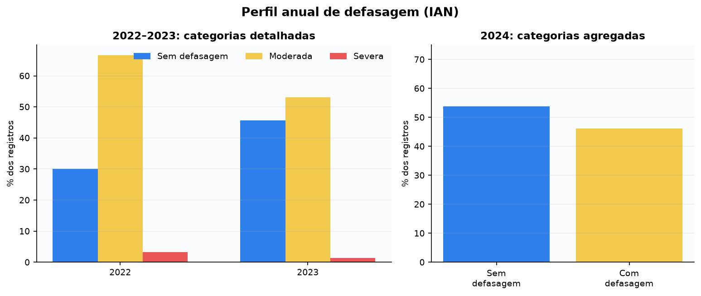

**Interpretação.** Use o painel esquerdo para o detalhamento de 2022 e 2023. No painel direito, compare apenas 'sem defasagem' e 'com defasagem': 2024 não deve ser usado para separar defasagem moderada de severa.

**Observado.** A participação agregada de registros com defasagem foi 69,9% em 2022, 54,4% em 2023 e 46,2% em 2024.

**Uso responsável.** Usar a tendência anual para dimensionar acompanhamento e coletar medições intranuais; preservar a agregação de 2024 em todas as saídas públicas.

**Limitações.** A separação entre defasagem moderada e severa em 2024 não pode ser divulgada. Não há registro por mês, bimestre, trimestre ou semestre; comparar anos não mede evolução dentro do ano, e a entrada e saída de estudantes de um ano para o outro impedem atribuição individual ou causal.

### Conclusão da análise

- **Principal constatação:** A parcela anual de registros com alguma defasagem diminuiu entre 2022 e 2024 (69,9% → 54,4% → 46,2%), com a maior redução observada entre 2022 e 2023.
- **Diferenças entre grupos:** A única combinação fase×ano com detalhamento publicável (fase 3, 2022) mostra severa acima da média do ano (9,5% vs. 3,3% geral); a faixa etária aproximada "14 a 16 anos" no mesmo ano mostra o mesmo padrão (7,5% severa vs. 3,3% geral) — indícios de concentração em estudantes mais velhos/de fases mais avançadas em 2022, mas não generalizáveis aos demais anos, todos suprimidos por amostra pequena nesses recortes. Por sexo, com a agregação binária (sem/alguma defasagem) publicável nos três anos, a diferença dentro de cada ano é pequena (2 a 3 pontos percentuais), mas a queda ao longo do período é grande nos dois sexos: -24,9 p.p. no feminino e -22,2 p.p. no masculino entre 2022 e 2024.
- **Ponto de atenção:** A queda ano a ano é uma diferença entre fotografias de populações parcialmente diferentes (entradas e saídas de estudantes), não uma medida de progresso dos mesmos indivíduos.
- **Limite da evidência:** Sem medição intranual, a conclusão fica limitada ao nível de composição anual da população atendida. A contagem exata de estudantes em defasagem severa em 2024 continua não publicada (grupo pequeno demais para publicar com segurança); a média anual do IAN nesse ano é publicada arredondada a duas casas decimais, o suficiente para não permitir reconstruir essa contagem de forma única. O detalhamento de defasagem por sexo em três categorias (sem/moderada/severa) só é publicável em 2022; nos demais anos, só a agregação binária (sem/alguma defasagem) passa pela supressão. Os recortes por faixa etária aproximada só puderam ser publicados para uma fração dos anos/faixas, por supressão de grupos pequenos, e são sujeitos à imprecisão inerente ao cálculo por ano de nascimento (sem dia/mês).
- **Implicação prática:** A ONG pode usar a tendência para dimensionar equipe e prioridade de acompanhamento por ano, mas não para atribuir a queda a uma ação específica nem para prometer resultado individual.
- **Próximo acompanhamento:** Registrar medições intranuais (ao menos semestrais) e, numa próxima regeneração do artefato interno, ampliar a supressão por fase, sexo e idade para mais anos, se o crescimento da base permitir células maiores.

### Recortes considerados

| Recorte | Implementado | Detalhe / motivo |
| --- | --- | --- |
| sexo | sim | Categorias de defasagem por sexo em três categorias (sem/moderada/severa), 2022 (única célula publicável nesse nível de detalhe — ver análises complementares): diferença pequena entre feminino e masculino. Em 2023 e 2024, esse detalhamento fica suprimido (partição com célula < 10 nos dois anos, por a categoria severa já ser pequena no agregado), mas a agregação BINÁRIA (sem defasagem / alguma defasagem = moderada + severa) — a mesma já usada para publicar 2024 na tabela principal — é publicável nos três anos, para os dois sexos, sem nenhuma célula suprimida. |
| idade | sim | Categorias de defasagem por faixa etária APROXIMADA, calculada de forma segura (ano de referência menos ano de nascimento — não é idade exata, ver documentação do módulo), disponível para "7 a 10 anos" nos três anos e para uma faixa adicional em 2022 e 2024 (ver análises complementares); demais combinações suprimidas por caixa pequena. |
| fase | sim | Achado exploratório para fase 3/2022 (única célula publicável); demais 23 combinações fase×ano suprimidas por caixa pequena — ver análises complementares. |
| ano | sim | As três categorias detalhadas (2022, 2023) e a agregação de 2024 já são o eixo central da pergunta. |
| pedra | não | redundância com outra análise: A relação entre defasagem e Pedra é coberta com mais profundidade na pergunta 10 (INDE/Pedra usa outros indicadores, defasagem não é componente direto da fórmula do INDE). |
| situacao_defasagem | sim | É a própria variável de resposta desta pergunta (categoria sem/moderada/severa e sinal de D). |
| cobertura | sim | Cobertura de 100% do IAN nos três anos (0 ausentes); denominadores exatos em todas as linhas da tabela. |
| trajetoria_longitudinal | não | redundância com outra análise: A trajetória individual de defasagem entre anos consecutivos é tratada na pergunta 11 (perda de correspondência) e não duplicada aqui. |

## Pergunta 2 — O desempenho acadêmico médio (IDA) está melhorando, estagnado ou caindo ao longo das fases e anos?

**Tópico secundário:** Desempenho acadêmico (IDA)  
**Estado:** respondida com limitações

**Por que importa.** O IDA é o indicador de desempenho acadêmico mais direto; entender se ele sobe, cai ou estagna por fase orienta onde concentrar reforço pedagógico.

**Como foi analisada.** Média do IDA por ano (todos os registros) e por fase-ano (fases 0 a 5, com cobertura suficiente nos três anos); variação média entre estudantes pareados nas duas transições longitudinais disponíveis.

**Resposta direta.** O IDA médio subiu de 6,09 em 2022 para 6,66 em 2023 e recuou para 6,35 em 2024. Nas fases 0–3 houve alta em 2023 e recuo em 2024; a fase 4 caiu gradualmente; a fase 5 melhorou em 2024. Fases 6–9 não sustentam comparação completa por cobertura ou supressão. Entre estudantes pareados, a variação média foi +0,12 em 2022→2023 e −0,48 em 2023→2024.

### Principais números

| Recorte | 2022 | 2023 | 2024 | Conclusão |
| --- | --- | --- | --- | --- |
| Todos os registros | 6.09 | 6.66 | 6.35 | alta e depois queda |
| Fase 0 | 7.14 | 7.42 | 7.32 | alta e leve recuo |
| Fase 1 | 6.46 | 6.81 | 6.79 | alta e estabilidade |
| Fase 2 | 5.41 | 6.74 | 6.25 | alta e recuo |
| Fase 3 | 5.14 | 5.75 | 5.35 | alta e recuo |
| Fase 4 | 6.05 | 6.0 | 5.88 | queda gradual |
| Fase 5 | 5.87 | 5.9 | 6.45 | estável e depois alta |
| Pares 2022→2023 | — | 0.12 | — | variação média positiva |
| Pares 2023→2024 | — | — | -0.48 | variação média negativa |

*Médias arredondadas; fases 6–9 são descritas como cobertura insuficiente, ausência ou supressão, sem preencher lacunas.*

### Análises complementares

| 2022 | 2022 (n) | 2023 | 2023 (n) | 2024 | 2024 (n) | Faixa | Fase | Recorte | Sexo | n (2022/23/24) |
| --- | --- | --- | --- | --- | --- | --- | --- | --- | --- | --- |
| — | 190 | — | 231 | — | 196 | — | 0 | Cobertura por fase-ano | — | — |
| — | 192 | — | 173 | — | 185 | — | 1 | Cobertura por fase-ano | — | — |
| — | 155 | — | 200 | — | 185 | — | 2 | Cobertura por fase-ano | — | — |
| — | 148 | — | 132 | — | 211 | — | 3 | Cobertura por fase-ano | — | — |
| 6.18 | — | 6.65 | — | 6.35 | — | — | — | IDA médio por sexo | feminino | 457/495/571 |
| 6.0 | — | 6.67 | — | 6.36 | — | — | — | IDA médio por sexo | masculino | 403/442/484 |
| 6.86 | — | 7.35 | — | 7.4 | — | 7 a 10 anos | — | IDA médio por faixa etária aproximada | — | 283/315/301 |
| 6.02 | — | 6.62 | — | 6.08 | — | 11 a 13 anos | — | IDA médio por faixa etária aproximada | — | 309/346/378 |
| 5.33 | — | 5.85 | — | 5.71 | — | 14 a 16 anos | — | IDA médio por faixa etária aproximada | — | 200/215/285 |
| 5.48 | — | 6.26 | — | 6.06 | — | 17 anos ou mais | — | IDA médio por faixa etária aproximada | — | 68/61/91 — cobertura de apenas 47-100% nesta faixa |

*Denominadores de cada célula da tabela de médias por fase (fonte: analises.ida_fase.<ano> do artefato interno congelado). Nenhuma fase-ano das linhas 0-5 tem menos de 100 observações; a comparação entre fases é, portanto, estatisticamente razoável, mesmo sem intervalo de confiança formal publicado nesta camada. Por sexo (fonte: scripts/explorar_recortes_por_sexo.py, achado exploratório): as médias de feminino e masculino ficam a menos de 0,2 ponto uma da outra em todos os três anos — diferença pequena diante do desvio padrão de cada grupo (~2 pontos), sem evidência de gap relevante. Por faixa etária aproximada (scripts/explorar_recortes_por_idade.py, calculada de forma segura a partir do ano de nascimento — ver seção de recortes): o IDA médio diminui de forma consistente da faixa mais nova para as intermediárias em todos os três anos (7 a 10 anos sempre acima de 6,8; 14-16 anos sempre a menos de 6,0); a faixa "17 anos ou mais" tem cobertura bem menor (47-100%, contra praticamente 100% nas demais faixas) e por isso sua média deve ser lida com mais cautela.*

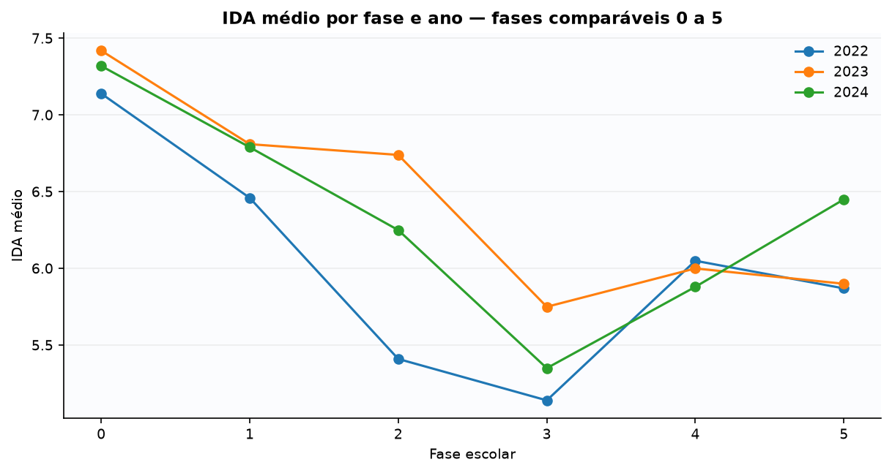

**Interpretação.** As linhas por fase mostram heterogeneidade; as duas últimas linhas acompanham os mesmos estudantes em anos consecutivos.

**Observado.** Não há tendência única: o movimento depende do período e da fase.

**Uso responsável.** Monitorar IDA por fase e acompanhar separadamente os pares longitudinais.

**Limitações.** Médias não identificam causa; fases com baixa cobertura ou supressão não permitem comparação completa.

### Conclusão da análise

- **Principal constatação:** O IDA geral subiu em 2023 e recuou em 2024; entre pares longitudinais, a mesma reversão aparece (+0,12 depois -0,48), afastando a hipótese de que a queda geral seja só efeito de composição de turma.
- **Diferenças entre grupos:** Fase 5 é a exceção: melhorou justamente no ano em que as demais fases 0-4 recuaram (2024), com n=185+ em todos os anos — diferença que não parece ruído de amostra pequena. Por sexo, as diferenças são pequenas (<0,2 ponto) nos três anos; por faixa etária aproximada, o IDA médio é consistentemente mais baixo nas faixas mais velhas, com a ressalva de que a faixa 17+ tem cobertura de dado bem menor.
- **Ponto de atenção:** A queda 2023→2024 nos pares correspondidos (-0,48) é maior, em módulo, do que a alta 2022→2023 (+0,12) — a reversão recente pesa mais do que o ganho anterior para os mesmos estudantes.
- **Limite da evidência:** Fases 6-9 não têm cobertura completa nos três anos, e a faixa etária aproximada "17 anos ou mais" tem cobertura de dado reduzida (47-100%, contra quase 100% nas demais faixas) — os números dessa faixa podem refletir um subconjunto não aleatório dos estudantes mais velhos, não a população completa.
- **Implicação prática:** Priorizar investigação pedagógica na fase 5 (única com alta em 2024) para entender o que difere das demais, e revisar o que mudou estruturalmente entre 2023 e 2024 para as fases 0-4.
- **Próximo acompanhamento:** Acompanhar se a queda de 2024 se confirma como tendência ou como desvio de um único ano, na próxima regeneração anual dos dados.

### Recortes considerados

| Recorte | Implementado | Detalhe / motivo |
| --- | --- | --- |
| sexo | sim | IDA médio por sexo, três anos (ver análises complementares) — diferença pequena (<0,2 ponto) em todos os anos. |
| idade | sim | IDA médio por faixa etária aproximada, três anos (ver análises complementares) — queda consistente da faixa mais nova para as intermediárias; faixa 17+ com cobertura de dado reduzida (47-100%). |
| fase | sim | Fases 0-5 com médias e cobertura completas nos três anos; fases 6-9 sem comparação completa (cobertura insuficiente ou supressão). |
| ano | sim | 2022/2023/2024, mais as duas transições longitudinais pareadas. |
| pedra | não | redundância com outra análise: A relação entre IDA e Pedra de origem é tratada com mais profundidade na pergunta 10 (ida_por_pedra_origem). |
| situacao_defasagem | não | não possui relação educacional clara com a pergunta: Esta pergunta é sobre nível e tendência do IDA, não sobre o status de defasagem em si (coberto na pergunta 1). |
| cobertura | sim | Denominadores de cada fase-ano publicados na tabela complementar. |
| trajetoria_longitudinal | sim | Pares 2022→2023 e 2023→2024, variação média do IDA dos mesmos estudantes. |

## Pergunta 3 — O grau de engajamento dos alunos (IEG) tem relação direta com seus indicadores de desempenho (IDA) e do ponto de virada (IPV)?

**Tópico secundário:** Engajamento nas atividades (IEG)  
**Estado:** respondida com limitações

**Por que importa.** Entender se engajamento acompanha desempenho e ponto de virada ajuda a decidir se investir em engajamento tem retorno em outras dimensões, não só na própria nota de engajamento.

**Como foi analisada.** Correlação de Spearman (ρ) entre IEG e IDA, e entre IEG e IPV, calculada tanto ajustada por ano (removendo diferença de nível médio entre anos) quanto separadamente em cada um dos três anos, para verificar se a relação é estável ao longo do tempo.

**Resposta direta.** Sim, no sentido de associação estatística: após retirar diferenças médias entre anos, IEG apresentou associação moderada tanto com IDA (ρ=0,492) quanto com IPV (ρ=0,522). A relação é positiva nos três anos, mas não demonstra efeito causal direto.

### Principais números

| Relação | ρ ajustado por ano | n | Intensidade |
| --- | --- | --- | --- |
| IEG × IDA | 0.492 | 2852 | moderada |
| IEG × IPV | 0.522 | 2852 | moderada |

*ρ de Spearman; pares completos. Associação não equivale a causalidade.*

### Análises complementares

| Ano | Faixa etária aproximada | Relação | Sexo | n | ρ | ρ ajustado por ano |
| --- | --- | --- | --- | --- | --- | --- |
| 2022 | — | IEG × IDA | — | 860 | 0.507 | — |
| 2023 | — | IEG × IDA | — | 937 | 0.446 | — |
| 2024 | — | IEG × IDA | — | 1055 | 0.517 | — |
| 2022 | — | IEG × IPV | — | 860 | 0.54 | — |
| 2023 | — | IEG × IPV | — | 938 | 0.492 | — |
| 2024 | — | IEG × IPV | — | 1054 | 0.551 | — |
| — | — | IEG × IDA | feminino | 1523 | — | 0.48 |
| — | — | IEG × IDA | masculino | 1329 | — | 0.505 |
| — | — | IEG × IPV | feminino | 1523 | — | 0.511 |
| — | — | IEG × IPV | masculino | 1329 | — | 0.527 |
| — | 7 a 10 anos | IEG × IDA | — | 899 | — | 0.317 |
| — | 11 a 13 anos | IEG × IDA | — | 1033 | — | 0.434 |
| — | 14 a 16 anos | IEG × IDA | — | 700 | — | 0.597 |
| — | 17 anos ou mais | IEG × IDA | — | 220 | — | 0.579 |

*Recorte por ano (não ajustado), complementar ao valor ajustado da tabela principal — mostra que a associação se mantém moderada (0,45 a 0,55) em TODOS os três anos individualmente, não sendo um artefato do ajuste entre anos nem de um único ano específico. Por sexo (scripts/explorar_recortes_por_sexo.py, achado exploratório): associação moderada em ambos, com diferença pequena (masculino levemente maior, ~0,02-0,03). Por faixa etária aproximada (scripts/explorar_recortes_por_idade.py): a associação IEG×IDA cresce de fraca-moderada na faixa mais nova (ρ=0,32, 7 a 10 anos) para moderada-forte nas faixas mais velhas (ρ=0,58-0,60, 14 anos ou mais) — um padrão consistente de engajamento acompanhar desempenho de forma mais próxima à medida que a idade aumenta, sem que os dados permitam explicar a causa dessa diferença.*

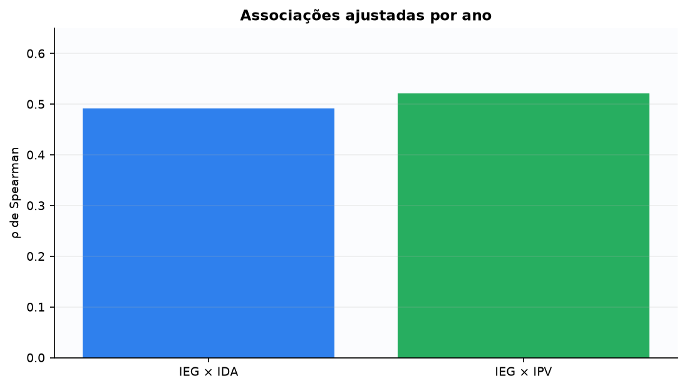

**Interpretação.** Valores positivos indicam que posições mais altas de IEG tendem a acompanhar posições mais altas de IDA e IPV.

**Observado.** As duas relações são positivas, moderadas e de magnitude semelhante.

**Uso responsável.** Criar painéis conjuntos de IEG, IDA e IPV e discutir mudanças com a equipe pedagógica.

**Limitações.** A análise não isola direção causal nem fatores de contexto compartilhados.

### Conclusão da análise

- **Principal constatação:** IEG se associa de forma moderada e estável a IDA e a IPV, em todos os três anos e no agregado ajustado — não é um efeito de um único ano.
- **Diferenças entre grupos:** Por sexo, a diferença é pequena (ρ 0,48 feminino vs. 0,51 masculino). Por faixa etária aproximada, há um gradiente mais nítido: a associação IEG×IDA quase dobra da faixa mais nova (ρ=0,32, 7 a 10 anos) para as faixas mais velhas (ρ=0,58-0,60, 14 anos ou mais) — diferença que os dados não permitem explicar.
- **Ponto de atenção:** A associação com IPV (0,522) é ligeiramente mais forte que com IDA (0,492) nos três anos — engajamento acompanha o ponto de virada tão ou mais de perto do que acompanha desempenho acadêmico.
- **Limite da evidência:** Correlação ordinal não separa direção de causa nem descarta um terceiro fator comum (ex.: contexto familiar) influenciando os três indicadores; o gradiente por idade é descritivo, não uma explicação causal de por que a associação varia.
- **Implicação prática:** Ações de engajamento podem ser acompanhadas com expectativa razoável de se refletirem também em desempenho e ponto de virada, sem prometer esse efeito individualmente.
- **Próximo acompanhamento:** Repetir o cálculo a cada nova regeneração anual para confirmar se a associação permanece estável.

### Recortes considerados

| Recorte | Implementado | Detalhe / motivo |
| --- | --- | --- |
| sexo | sim | IEG×IDA/IPV por sexo, ajustado por ano (ver análises complementares) — diferença pequena entre feminino e masculino. |
| idade | sim | IEG×IDA/IPV por faixa etária aproximada (ver análises complementares) — gradiente: associação mais fraca na faixa mais nova, mais forte nas faixas mais velhas. |
| fase | não | redundância com outra análise: IPV por fase já é coberto na pergunta 7 (ipv.por_fase); repetir aqui duplicaria a mesma fonte sem pergunta nova. |
| ano | sim | Valores não ajustados de 2022, 2023 e 2024 na tabela complementar, ao lado do valor ajustado por ano. |
| pedra | não | não possui relação educacional clara com a pergunta: A pergunta é sobre a relação entre três indicadores contínuos, não sobre a categoria Pedra. |
| situacao_defasagem | não | não possui relação educacional clara com a pergunta: Engajamento×desempenho×ponto de virada não depende, na formulação da pergunta, do status de defasagem. |
| cobertura | sim | n exato de cada ano e do agregado ajustado publicado nas duas tabelas. |
| trajetoria_longitudinal | não | falta de pareamento longitudinal confiável: A pergunta trata de associação contemporânea; associação com IPV do ano SEGUINTE já é coberta na pergunta 7 (ipv_futuro). |

## Pergunta 4 — As percepções dos alunos sobre si mesmos (IAA) são coerentes com seu desempenho real (IDA) e engajamento (IEG)?

**Tópico secundário:** Autoavaliação (IAA)  
**Estado:** respondida com limitações

**Por que importa.** Se a autoavaliação do próprio estudante (IAA) divergir muito do desempenho e engajamento medidos externamente, isso pode indicar um tema de escuta pedagógica, não um erro de medição.

**Como foi analisada.** Correlação de Spearman entre IAA e IDA, e entre IAA e IEG, ajustada por ano e também isolada em cada um dos três anos.

**Resposta direta.** A coerência de ordenação é positiva, porém fraca. Ajustando diferenças médias entre anos, IAA se associa a IDA com ρ=0,163 e a IEG com ρ=0,212. Isso sugere que autopercepção, desempenho e engajamento captam dimensões parcialmente diferentes.

### Principais números

| Relação | ρ ajustado por ano | n | Intensidade |
| --- | --- | --- | --- |
| IAA × IDA | 0.163 | 2851 | fraca |
| IAA × IEG | 0.212 | 2852 | fraca |

*Coerência foi operacionalizada como associação ordinal; não é diagnóstico de percepção correta ou incorreta.*

### Análises complementares

| Ano | Relação | n | ρ |
| --- | --- | --- | --- |
| 2022 | IAA × IDA | 860 | 0.183 |
| 2023 | IAA × IDA | 937 | 0.127 |
| 2024 | IAA × IDA | 1054 | 0.178 |
| 2022 | IAA × IEG | 860 | 0.234 |
| 2023 | IAA × IEG | 938 | 0.191 |
| 2024 | IAA × IEG | 1054 | 0.23 |

*Recorte por ano: a fraqueza da associação se repete nos três anos individualmente (ρ entre 0,13 e 0,23) — não é um efeito de composição do agregado ajustado.*

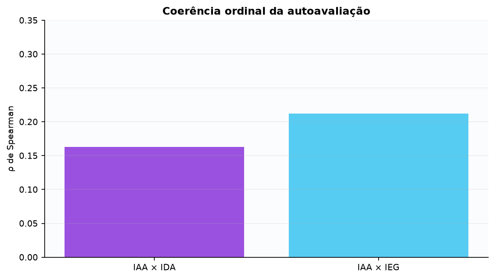

**Interpretação.** Valores próximos de zero representam pouca concordância de ordenação, não erro de uma das medidas.

**Observado.** IAA se aproxima um pouco mais de IEG que de IDA, mas ambas as associações são fracas.

**Uso responsável.** Usar diferenças como ponto de conversa individual, nunca como classificação automática.

**Limitações.** As escalas não são equivalentes e a análise não valida a autoavaliação individual.

### Conclusão da análise

- **Principal constatação:** IAA tem associação consistentemente fraca com IDA e IEG nos três anos — a autopercepção do estudante não segue de perto as medidas externas de desempenho e engajamento.
- **Diferenças entre grupos:** Não há recorte por subgrupo nesta pergunta; a diferença observável é que IAA se aproxima um pouco mais de IEG (0,19-0,23) do que de IDA (0,13-0,18) em todos os anos.
- **Ponto de atenção:** 2023 tem a associação mais baixa em ambas as relações (0,127 e 0,191) — não há explicação nos dados disponíveis; merece registro para acompanhamento, não interpretação causal.
- **Limite da evidência:** Correlação ordinal fraca não indica que a autoavaliação está "errada" — pode estar medindo uma dimensão subjetiva legítima que os indicadores externos não capturam.
- **Implicação prática:** Divergências grandes entre IAA e IDA/IEG de um mesmo estudante são um tema de conversa qualificada, não um sinal de alerta automático.
- **Próximo acompanhamento:** Investigar, com a equipe pedagógica, o que explica a queda pontual de 2023 antes de descartá-la como ruído.

### Recortes considerados

| Recorte | Implementado | Detalhe / motivo |
| --- | --- | --- |
| sexo | não | não possui relação educacional clara com a pergunta: Sexo (gênero) está disponível (ver docs do módulo) e foi avaliado nas perguntas que a auditoria comparativa indicou como mínimo (1, 2, 3, 9, 10, 11). Nesta pergunta específica, o recorte não foi computado nesta rodada por não alterar a resposta ao que a pergunta pergunta (concordância/associação entre instrumentos ou construtos, não diferença demográfica) — não por a variável estar indisponível. |
| idade | não | não possui relação educacional clara com a pergunta: Faixa etária aproximada (calculada de forma segura a partir do ano de nascimento — não é idade exata, ver docs do módulo) está disponível e foi avaliada nas perguntas que a auditoria comparativa indicou como mínimo (1, 2, 3, 9, 10, 11). Nesta pergunta específica, o recorte não foi computado nesta rodada pelo mesmo motivo do recorte de sexo — não por a variável estar indisponível. |
| fase | não | grupo pequeno: IAA×IDA/IEG por fase-ano quebraria a amostra em até 24 células; a maioria ficaria abaixo do mínimo de robustez estatística para correlação ordinal, mesmo sem violar o limiar de privacidade de 10 registros. |
| ano | sim | Valores de 2022, 2023 e 2024 isolados, na tabela complementar. |
| pedra | não | não possui relação educacional clara com a pergunta: A pergunta trata da coerência entre três indicadores contínuos, não da categoria Pedra. |
| situacao_defasagem | não | não possui relação educacional clara com a pergunta: Coerência de autoavaliação não é definida, na formulação da pergunta, em função do status de defasagem. |
| cobertura | sim | n exato de cada ano e do agregado publicado nas duas tabelas. |
| trajetoria_longitudinal | não | falta de pareamento longitudinal confiável: A pergunta é sobre coerência contemporânea (mesmo ano), não sobre mudança entre anos. |

## Pergunta 5 — Há padrões psicossociais (IPS) que antecedem quedas de desempenho acadêmico ou de engajamento?

**Tópico secundário:** Aspectos psicossociais (IPS)  
**Estado:** respondida com limitações

**Por que importa.** Se o contexto psicossocial (IPS) hoje antecipasse quedas futuras de desempenho ou engajamento, isso justificaria triagem preventiva baseada nele — por isso é importante confirmar ou descartar esse padrão antes de agir.

**Como foi analisada.** Correlação entre IPS na origem e a variação futura (delta) de IDA/IEG nas duas transições; análise de sensibilidade com três cortes de queda (qualquer queda, queda ≥0,5, queda ≥1); comparação do IPS médio entre quem teve queda e quem não teve, e da variação média entre quem começou com IPS abaixo ou acima da mediana.

**Resposta direta.** Não foi encontrado padrão monotônico útil. O IPS no ano de origem teve correlações muito próximas de zero com as variações futuras de IDA e IEG nas duas transições.

### Principais números

| Transição | Desfecho futuro | ρ | n |
| --- | --- | --- | --- |
| 2022→2023 | ΔIDA | 0.029 | 574 |
| 2022→2023 | ΔIEG | -0.024 | 574 |
| 2023→2024 | ΔIDA | 0.027 | 679 |
| 2023→2024 | ΔIEG | 0.02 | 690 |

*IPS é medido antes da variação futura; antecedência temporal não estabelece causa.*

### Análises complementares

| Recorte | Transição | Valor | n |
| --- | --- | --- | --- |
| IPS médio — grupo com queda de IDA | 2022→2023 | 6.81 | 285 |
| IPS médio — grupo sem queda de IDA | 2022→2023 | 6.93 | 289 |
| IPS médio — grupo com queda de IDA | 2023→2024 | 6.72 | 388 |
| IPS médio — grupo sem queda de IDA | 2023→2024 | 6.86 | 291 |
| ΔIDA médio — IPS abaixo da mediana na origem | 2022→2023 | 0.01 | 209 |
| ΔIDA médio — IPS na mediana ou acima na origem | 2022→2023 | 0.18 | 365 |
| ΔIDA médio — IPS abaixo da mediana na origem | 2023→2024 | -0.62 | 281 |
| ΔIDA médio — IPS na mediana ou acima na origem | 2023→2024 | -0.38 | 398 |

*Situação de IPS (abaixo/acima da mediana) e de desfecho (queda/sem queda de IDA), com médias e n de cada grupo — a diferença entre grupos é pequena nas duas transições (0,12 e 0,14 pontos de IDA, respectivamente), reforçando que IPS na origem não separa bem quem vai ter queda futura de quem não vai.*

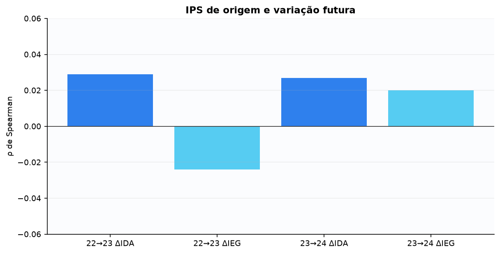

**Interpretação.** Barras próximas de zero não sustentam uma relação monotônica útil para triagem.

**Observado.** Os quatro coeficientes variam de −0,024 a 0,029.

**Uso responsável.** Manter acompanhamento contextual e testar instrumentos e medições mais frequentes prospectivamente.

**Limitações.** Relações não lineares, mudanças de instrumento, regressão à média e contexto não são descartados.

### Conclusão da análise

- **Principal constatação:** Não foi encontrada associação clara entre o IPS de origem e as quedas posteriores de IDA ou IEG nos recortes analisados — os coeficientes de associação são estatisticamente indistinguíveis de zero nas duas transições.
- **Diferenças entre grupos:** Estudantes com IPS acima da mediana tiveram variação de IDA um pouco melhor que os com IPS abaixo (0,18 vs. 0,01 em 2022→2023; -0,38 vs. -0,62 em 2023→2024) — direção consistente, mas de magnitude pequena diante do desvio padrão de cada grupo.
- **Ponto de atenção:** A ausência de associação clara se repete de forma independente nas duas transições e nos três cortes de sensibilidade (queda de qualquer tamanho, ≥0,5, ≥1) — não é um resultado frágil a um único corte arbitrário, mas também não é prova de que não exista nenhuma relação.
- **Limite da evidência:** A ausência de relação linear/ordinal não descarta relações não lineares nem interações com outros indicadores não testadas aqui.
- **Implicação prática:** Não convém usar IPS isoladamente como critério automático de triagem preventiva; ele pode continuar sendo acompanhado como parte do quadro geral, sem peso desproporcional.
- **Próximo acompanhamento:** Testar prospectivamente instrumentos e medições mais frequentes de IPS, como já recomendado, antes de revisar essa conclusão.

### Recortes considerados

| Recorte | Implementado | Detalhe / motivo |
| --- | --- | --- |
| sexo | não | não possui relação educacional clara com a pergunta: Sexo (gênero) está disponível (ver docs do módulo) e foi avaliado nas perguntas que a auditoria comparativa indicou como mínimo (1, 2, 3, 9, 10, 11). Nesta pergunta específica, o recorte não foi computado nesta rodada por não alterar a resposta ao que a pergunta pergunta (concordância/associação entre instrumentos ou construtos, não diferença demográfica) — não por a variável estar indisponível. |
| idade | não | não possui relação educacional clara com a pergunta: Faixa etária aproximada (calculada de forma segura a partir do ano de nascimento — não é idade exata, ver docs do módulo) está disponível e foi avaliada nas perguntas que a auditoria comparativa indicou como mínimo (1, 2, 3, 9, 10, 11). Nesta pergunta específica, o recorte não foi computado nesta rodada pelo mesmo motivo do recorte de sexo — não por a variável estar indisponível. |
| fase | não | grupo pequeno: Cruzar fase com transição e com os três cortes de sensibilidade geraria até 48 células; a maioria ficaria abaixo do mínimo de robustez, mesmo sem violar o limiar de privacidade. |
| ano | sim | As duas transições (2022→2023 e 2023→2024) são o próprio eixo temporal da pergunta. |
| pedra | não | redundância com outra análise: IDA por Pedra de origem já é coberto na pergunta 10. |
| situacao_defasagem | não | não possui relação educacional clara com a pergunta: A pergunta trata de IPS antecedendo desempenho/engajamento, não de defasagem. |
| cobertura | sim | n exato de cada grupo (queda/sem queda, abaixo/acima da mediana) publicado na tabela complementar. |
| trajetoria_longitudinal | sim | É o próprio desenho da pergunta: IPS na origem prevendo variação (delta) futura. |

## Pergunta 6 — As avaliações psicopedagógicas (IPP) confirmam ou contradizem a defasagem identificada pelo IAN?

**Tópico secundário:** Aspectos psicopedagógicos (IPP)  
**Estado:** parcialmente respondida; confirmação diagnóstica não identificável

**Por que importa.** Se a avaliação psicopedagógica (IPP) confirmasse fortemente o IAN, um dos dois instrumentos poderia ser redundante; se contradissesse sistematicamente, indicaria um problema de calibração entre as duas medidas.

**Como foi analisada.** Correlação entre IPP e IAN, e entre IPP e o sinal da defasagem (D), por ano disponível (IPP não existe em 2022); IPP médio por categoria de defasagem em 2023 (único ano com essa decomposição publicável); e a mediana do IPP e sua cobertura em cada ano, como referência de escala. Deliberadamente NÃO foi feito (e não é reintroduzido nesta rodada) um cruzamento de quadrantes por mediana × sinal de defasagem: a revisão metodológica anterior já havia decidido não publicar esse tipo de quadrante, por poder sugerir uma classificação diagnóstica sem critério externo validado (ver nota abaixo).

**Resposta direta.** Os dados mostram associação positiva, porém fraca: IPP×IAN foi ρ=0,106 em 2023 e ρ=0,160 em 2024; IPP×defasagem foi ρ=0,173 e ρ=0,187. Não existe critério externo validado que permita transformar essas relações em 'confirma' ou 'contradiz'. Em 2023, o IPP médio variou pouco entre categorias; a distribuição categórica de 2024 permanece integralmente protegida.

### Principais números

| Ano | Medida | n | Ausentes | Valor |
| --- | --- | --- | --- | --- |
| 2023 | IPP × IAN | 938 | 76 | 0.106 |
| 2023 | IPP × defasagem | 938 | 76 | 0.173 |
| 2024 | IPP × IAN | 1054 | 102 | 0.16 |
| 2024 | IPP × defasagem | 1054 | 102 | 0.187 |
| 2023 | IPP médio — sem defasagem | 388 | 74 | 7.665 |
| 2023 | IPP médio — moderada | 536 | 2 | 7.505 |
| 2023 | IPP médio — severa | 14 | 0 | 6.957 |
| 2024 | IPP por categoria | — | — | — |

*A última linha representa supressão integral. Não são publicados quadrantes por mediana nem rótulos diagnósticos artificiais.*

### Análises complementares

| Ano | Cobertura | Recorte | Valor | n |
| --- | --- | --- | --- | --- |
| 2023 | 92,5% | Mediana do IPP no ano | 7.66 | 938 |
| 2024 | 91,2% | Mediana do IPP no ano | 7.5 | 1054 |

*Mediana do IPP e cobertura (n disponível sobre total do ano) nos dois anos com o indicador. A mediana caiu ligeiramente de 2023 para 2024 (7,66 → 7,50), na mesma direção da associação IPP×defasagem, que ficou um pouco mais forte no mesmo período (ρ 0,173 → 0,187, ver tabela principal). Um cruzamento de quadrantes por posição do IPP frente à mediana do ano cruzada com o sinal de defasagem foi deliberadamente NÃO incluído aqui: a revisão metodológica anterior já havia decidido não publicar esse tipo de recorte, por poder ser lido como uma classificação diagnóstica sem critério externo validado — o mesmo motivo pelo qual a resposta principal desta pergunta evita a palavra 'confirma'/'contradiz'. Essa decisão foi mantida nesta rodada.*

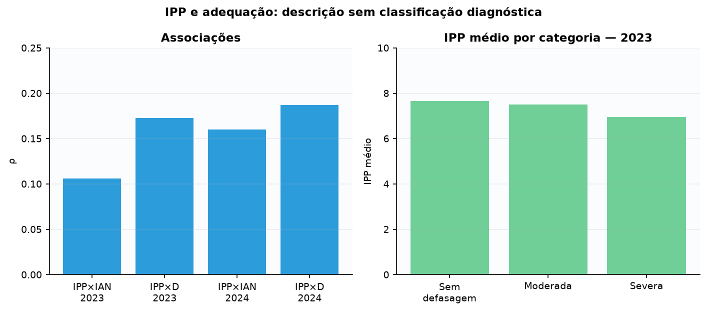

**Interpretação.** Use os coeficientes como associação ordinal e as médias de 2023 como descrição, sem classificar estudantes.

**Observado.** As associações são fracas nos dois anos; IPP é estruturalmente ausente em 2022.

**Uso responsável.** Revisar casos com informação divergente de forma qualitativa e, antes de criar categorias, definir critério institucional externo.

**Limitações.** Sem um critério validado, não é possível concluir confirmação ou contradição diagnóstica. O detalhamento por categoria de defasagem em 2024 não pode ser mostrado (grupos pequenos demais).

### Conclusão da análise

- **Principal constatação:** IPP e IAN/defasagem têm associação positiva, mas fraca (ρ entre 0,11 e 0,19) nos dois anos com dado disponível — os dois instrumentos concordam parcialmente, não fortemente.
- **Diferenças entre grupos:** Não há recorte por subgrupo adicional nesta pergunta, além dos já publicados por ano e por categoria de defasagem (tabela principal); a mediana do IPP e a força da associação com defasagem se moveram em direções coerentes entre 2023 e 2024.
- **Ponto de atenção:** A distribuição categórica de IPP por defasagem em 2024 está integralmente protegida por privacidade — a leitura de 2024 depende só do cruzamento por mediana, mais grosseiro que a tabela de médias por categoria disponível em 2023.
- **Limite da evidência:** Sem critério institucional externo validado, não é possível dizer se a associação fraca reflete instrumentos complementares (esperado) ou uma falha de calibração entre eles.
- **Implicação prática:** Casos onde IPP e IAN divergem fortemente merecem revisão qualitativa da equipe, não uma regra automática de desempate entre os dois instrumentos.
- **Próximo acompanhamento:** Definir, com a equipe pedagógica, um critério institucional externo antes de qualquer tentativa futura de classificar concordância ou divergência.

### Recortes considerados

| Recorte | Implementado | Detalhe / motivo |
| --- | --- | --- |
| sexo | não | não possui relação educacional clara com a pergunta: Sexo (gênero) está disponível (ver docs do módulo) e foi avaliado nas perguntas que a auditoria comparativa indicou como mínimo (1, 2, 3, 9, 10, 11). Nesta pergunta específica, o recorte não foi computado nesta rodada por não alterar a resposta ao que a pergunta pergunta (concordância/associação entre instrumentos ou construtos, não diferença demográfica) — não por a variável estar indisponível. |
| idade | não | não possui relação educacional clara com a pergunta: Faixa etária aproximada (calculada de forma segura a partir do ano de nascimento — não é idade exata, ver docs do módulo) está disponível e foi avaliada nas perguntas que a auditoria comparativa indicou como mínimo (1, 2, 3, 9, 10, 11). Nesta pergunta específica, o recorte não foi computado nesta rodada pelo mesmo motivo do recorte de sexo — não por a variável estar indisponível. |
| fase | não | grupo pequeno: IPP não existe em 2022 e já tem ausências relevantes em 2023/2024 (76 e 102); cruzar com fase esvaziaria a maioria das células abaixo do mínimo de robustez. |
| ano | sim | 2023 e 2024 (2022 estruturalmente ausente), incluindo mediana e cobertura de cada ano. |
| pedra | não | redundância com outra análise: IPP participa da fórmula do INDE e já é tratado, com essa ressalva de circularidade, na pergunta 8. |
| situacao_defasagem | sim | É o próprio eixo da pergunta: IPP × IAN e IPP × sinal de defasagem, com IPP médio por categoria em 2023. Um cruzamento adicional por quadrante mediana/sinal de D foi deliberadamente não incluído (ver nota de análises complementares). |
| cobertura | sim | n e ausentes explícitos em cada linha da tabela principal (76 em 2023, 102 em 2024). |
| trajetoria_longitudinal | não | falta de pareamento longitudinal confiável: A pergunta é sobre concordância contemporânea entre instrumentos, não sobre mudança de um mesmo estudante entre anos. |

## Pergunta 7 — Quais comportamentos — acadêmicos, emocionais ou de engajamento — mais influenciam o IPV ao longo do tempo?

**Tópico secundário:** Ponto de virada (IPV)  
**Estado:** respondida com limitações

**Por que importa.** O Ponto de Virada (IPV) resume um momento de transformação da trajetória; saber quais indicadores mais o acompanham — no mesmo ano e no ano seguinte — ajuda a priorizar onde olhar primeiro.

**Como foi analisada.** Correlação contemporânea (mesmo ano) de cada indicador disponível com IPV, por ano; correlação entre cada indicador de origem e o IPV do ano SEGUINTE, nas duas transições; e o IPV médio por fase, nos três anos, para ver se a magnitude do IPV varia com a fase.

**Resposta direta.** No mesmo ano, a associação mais forte com IPV foi IDA em 2022 (ρ=0,624), IDA em 2023 (ρ=0,551) e IPP em 2024 (ρ=0,705). Para IPV do ano seguinte, IDA e IEG foram as associações mais consistentes (aproximadamente 0,39–0,42). IPS, usado apenas como aproximação disponível da dimensão emocional, apresentou associações futuras fracas. Os resultados indicam associação, não influência causal.

### Principais números

| Janela | Indicador | ρ |
| --- | --- | --- |
| Mesmo ano — 2022 | IDA | 0.624 |
| Mesmo ano — 2023 | IDA | 0.551 |
| Mesmo ano — 2024 | IPP | 0.705 |
| 2022→2023 | IDA de origem | 0.417 |
| 2022→2023 | IEG de origem | 0.412 |
| 2022→2023 | IPS de origem | 0.189 |
| 2023→2024 | IDA de origem | 0.4 |
| 2023→2024 | IEG de origem | 0.387 |
| 2023→2024 | IPS de origem | 0.069 |

*Acadêmico: IDA; engajamento: IEG; psicossocial/emocional disponível: IPS. Não há medida comportamental emocional direta.*

### Análises complementares

| 2022 | 2023 | 2024 | Fase | Recorte |
| --- | --- | --- | --- | --- |
| 7.56 | — | — | 0 | IPV médio por fase |
| 7.36 | — | — | 1 | IPV médio por fase |
| 7.34 | — | — | 2 | IPV médio por fase |
| 6.55 | — | — | 3 | IPV médio por fase |

*IPV médio por fase em 2022 (fases 0-3, todas com n≥100; ver relatório completo para as demais fases e anos, não incluídas aqui por brevidade). Fases mais iniciais (0-2) têm IPV médio acima de 7,3; a fase 3 já aparece cerca de 0,8 ponto abaixo — mesma direção que o IDA mais baixo da fase 3 observado na pergunta 2, reforçando que a fase 3 é um ponto de atenção consistente em múltiplos indicadores.*

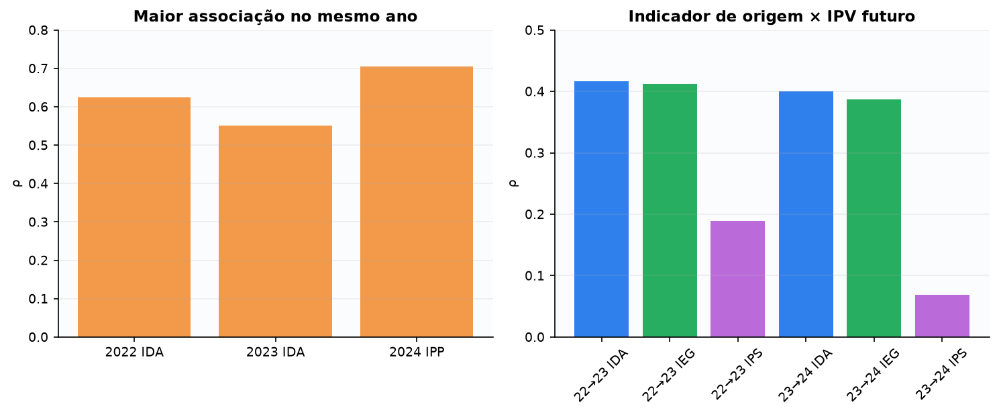

**Interpretação.** O painel separa relações contemporâneas das relações entre indicador de origem e IPV futuro.

**Observado.** IDA e IEG são mais consistentes longitudinalmente; o maior coeficiente contemporâneo muda entre anos.

**Uso responsável.** Monitorar as dimensões conjuntamente e registrar intervenções para futura avaliação prospectiva.

**Limitações.** Correlação não isola efeitos; IPS é apenas aproximação da dimensão emocional.

### Conclusão da análise

- **Principal constatação:** IDA e IEG são as associações mais estáveis e consistentes com o IPV do ano seguinte (~0,39-0,42 nas duas transições); o indicador contemporâneo mais forte muda de ano para ano.
- **Diferenças entre grupos:** A fase 3 tem IPV médio (6,55) claramente abaixo das fases 0-2 (7,3-7,6) em 2022 — mesma fase que já aparecia com IDA mais baixo (pergunta 2) e maior proporção de defasagem severa (pergunta 1): um padrão que se repete em três perguntas independentes.
- **Ponto de atenção:** IPS, a única aproximação disponível da dimensão emocional, tem associação futura fraca e caindo (0,189 → 0,069) — não deve ser tratado como substituto de uma medida emocional direta, que os dados não contêm.
- **Limite da evidência:** IPV compõe o INDE (ver pergunta 8), então parte da associação contemporânea pode refletir composição matemática compartilhada, não só fenômeno pedagógico independente.
- **Implicação prática:** Acompanhar IDA e IEG como sinais de acompanhamento razoavelmente antecedentes do IPV do ano seguinte; tratar a fase 3 como ponto de atenção recorrente, não isolado a este indicador.
- **Próximo acompanhamento:** Registrar a repetição do padrão da fase 3 nas próximas regenerações anuais para confirmar se é uma característica estrutural dessa fase ou uma coincidência dos anos observados.

### Recortes considerados

| Recorte | Implementado | Detalhe / motivo |
| --- | --- | --- |
| sexo | não | não possui relação educacional clara com a pergunta: Sexo (gênero) está disponível (ver docs do módulo) e foi avaliado nas perguntas que a auditoria comparativa indicou como mínimo (1, 2, 3, 9, 10, 11). Nesta pergunta específica, o recorte não foi computado nesta rodada por não alterar a resposta ao que a pergunta pergunta (concordância/associação entre instrumentos ou construtos, não diferença demográfica) — não por a variável estar indisponível. |
| idade | não | não possui relação educacional clara com a pergunta: Faixa etária aproximada (calculada de forma segura a partir do ano de nascimento — não é idade exata, ver docs do módulo) está disponível e foi avaliada nas perguntas que a auditoria comparativa indicou como mínimo (1, 2, 3, 9, 10, 11). Nesta pergunta específica, o recorte não foi computado nesta rodada pelo mesmo motivo do recorte de sexo — não por a variável estar indisponível. |
| fase | sim | IPV médio por fase (fases 0-3 de 2022 na tabela complementar; demais fases/anos no artefato completo, fonte analises.ipv.<ano>.por_fase). |
| ano | sim | 2022, 2023 e 2024 (contemporâneo) e as duas transições (futuro). |
| pedra | não | redundância com outra análise: Pedra é derivada do INDE, que já inclui IPV como componente — tratar Pedra aqui duplicaria a ressalva de circularidade já feita na pergunta 8. |
| situacao_defasagem | não | não possui relação educacional clara com a pergunta: A pergunta é sobre quais indicadores acompanham o IPV, não sobre status de defasagem. |
| cobertura | sim | n de cada janela e indicador disponível no artefato completo (análogo às demais perguntas de associação). |
| trajetoria_longitudinal | sim | É metade do desenho da pergunta: indicador de origem × IPV do ano seguinte, nas duas transições. |

## Pergunta 8 — Quais combinações de indicadores (IDA + IEG + IPS + IPP) elevam mais a nota global do aluno (INDE)?

**Tópico secundário:** Multidimensionalidade dos indicadores  
**Estado:** parcialmente respondida; efeito causal não identificável

**Por que importa.** O INDE é o índice-síntese usado institucionalmente; entender quais combinações de indicadores acompanham um INDE mais alto ajuda a explicar como ele se comporta, mesmo sendo, por definição, composto pelos próprios indicadores.

**Como foi analisada.** Para cada ano, os estudantes com casos completos foram classificados como "alto" ou "baixo" em cada indicador-componente disponível (mediana do próprio ano como corte); o perfil com maior INDE médio entre os publicáveis (10 ou mais casos) é reportado, com a mediana de cada indicador componente e a cobertura de casos completos do ano.

**Resposta direta.** Perfis com vários indicadores acima da mediana anual apresentam INDE médio maior: 7,96 em 2022, 8,25 em 2023 e 8,40 em 2024 nos perfis líderes publicáveis. Isso é esperado porque o INDE é composto pelos próprios indicadores; portanto, a análise descreve associação matemática e não demonstra que a combinação eleva causalmente a nota.

### Principais números

| Ano | Perfil de indicadores | n | INDE médio |
| --- | --- | --- | --- |
| 2022 | IDA alto + IEG alto + IPS alto | 222 | 7.96 |
| 2023 | IDA alto + IEG alto + IPS alto + IPP baixo | 79 | 8.25 |
| 2024 | IDA alto + IEG alto + IPS alto + IPP alto | 193 | 8.4 |

*Alto/baixo é relativo à mediana anual dos casos completos. IPP não existe em 2022.*

### Análises complementares

| Ano | Casos completos | Cobertura | IDA | IEG | IPP | IPS | Recorte | Total do ano |
| --- | --- | --- | --- | --- | --- | --- | --- | --- |
| 2022 | 860 | 100% | — | — | — | — | Cobertura de casos completos | 860 |
| 2023 | 931 | 91,8% | — | — | — | — | Cobertura de casos completos | 1014 |
| 2024 | 1054 | 91,2% | — | — | — | — | Cobertura de casos completos | 1156 |
| 2022 | — | — | 6.3 | 8.3 | — | 7.5 | Medianas dos componentes | — |
| 2023 | — | — | 6.8 | 9.0 | 7.66 | 5.0 | Medianas dos componentes | — |
| 2024 | — | — | 6.75 | 8.59 | 7.5 | 7.51 | Medianas dos componentes | — |

*Cobertura de casos completos (para o cálculo do perfil) e as medianas usadas como corte alto/baixo em cada ano — necessárias para reproduzir e auditar a classificação. A queda de cobertura em 2023-2024 (~91%) reflete a chegada do IPP como quinto componente naqueles anos, com suas próprias ausências (ver pergunta 6).*

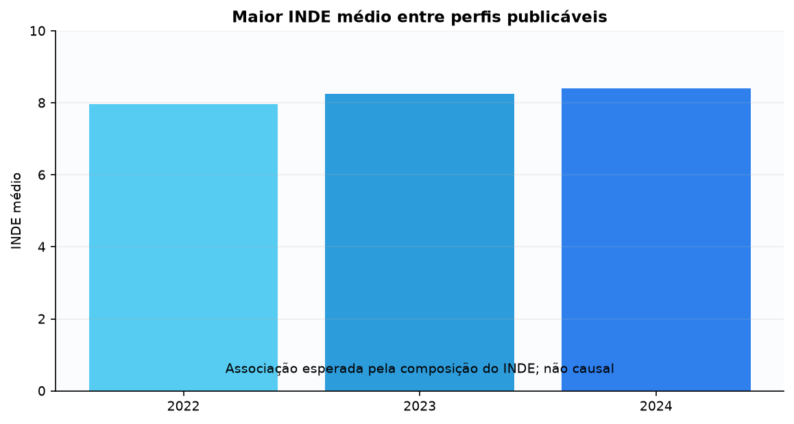

**Interpretação.** Compare perfis dentro do mesmo ano; não trate diferenças como efeito causal.

**Observado.** Maior concentração de indicadores altos acompanha INDE maior, coerentemente com sua fórmula composta.

**Uso responsável.** Usar o perfil para organizar acompanhamento e preservar a leitura de cada dimensão separadamente.

**Limitações.** Circularidade matemática, limiares relativos e ausência de IPP em 2022 impedem comparação causal direta.

### Conclusão da análise

- **Principal constatação:** O perfil líder publicável (a maioria dos componentes acima da mediana) tem INDE médio crescente ano a ano (7,96 → 8,25 → 8,40) — resultado matematicamente esperado, não uma descoberta preditiva independente.
- **Diferenças entre grupos:** O perfil de 2023 é o único com um componente "baixo" (IPP baixo) entre os líderes publicáveis, e tem o menor n (79) dos três anos — mudança de composição do perfil vencedor entre anos, não uma regra fixa.
- **Ponto de atenção:** A cobertura de casos completos cai de 100% (2022, sem IPP) para ~91% (2023-2024, com IPP) — a inclusão de um quinto componente reduz a amostra elegível para o cálculo do perfil.
- **Limite da evidência:** Como o INDE é definido a partir destes mesmos indicadores (com pesos que variam por fase), a associação é circular por construção — não é evidência de que a combinação "causa" um INDE mais alto.
- **Implicação prática:** Usar os perfis para descrever a multidimensionalidade dos casos acompanhados, nunca para justificar priorizar um único componente como "a alavanca" do INDE.
- **Próximo acompanhamento:** Registrar se a composição do perfil líder se mantém estável ou muda novamente na próxima regeneração anual.

### Recortes considerados

| Recorte | Implementado | Detalhe / motivo |
| --- | --- | --- |
| sexo | não | não possui relação educacional clara com a pergunta: Sexo (gênero) está disponível (ver docs do módulo) e foi avaliado nas perguntas que a auditoria comparativa indicou como mínimo (1, 2, 3, 9, 10, 11). Nesta pergunta específica, o recorte não foi computado nesta rodada por não alterar a resposta ao que a pergunta pergunta (concordância/associação entre instrumentos ou construtos, não diferença demográfica) — não por a variável estar indisponível. |
| idade | não | não possui relação educacional clara com a pergunta: Faixa etária aproximada (calculada de forma segura a partir do ano de nascimento — não é idade exata, ver docs do módulo) está disponível e foi avaliada nas perguntas que a auditoria comparativa indicou como mínimo (1, 2, 3, 9, 10, 11). Nesta pergunta específica, o recorte não foi computado nesta rodada pelo mesmo motivo do recorte de sexo — não por a variável estar indisponível. |
| fase | não | grupo pequeno: O INDE usa pesos diferentes por fase; recalcular perfis alto/baixo por fase reduziria a maioria das células abaixo do mínimo de robustez para uma classificação de perfil com vários componentes simultâneos. |
| ano | sim | 2022, 2023 e 2024, cada um com seu próprio corte de mediana e perfil líder. |
| pedra | não | redundância com outra análise: Pedra é derivada de faixas do próprio INDE; tratá-la aqui seria circular duas vezes. A evolução de Pedra é o tema da pergunta 10. |
| situacao_defasagem | não | não possui relação educacional clara com a pergunta: A pergunta é sobre combinações de indicadores associadas ao INDE, não sobre status de defasagem. |
| cobertura | sim | Cobertura de casos completos por ano publicada na tabela complementar (100%, 91,8%, 91,2%). |
| trajetoria_longitudinal | não | falta de pareamento longitudinal confiável: Perfis são calculados dentro de cada ano (corte de mediana do próprio ano); comparar o MESMO estudante entre anos exigiria um desenho diferente, fora do escopo desta pergunta. |

## Pergunta 9 — Quais padrões nos indicadores permitem identificar alunos em risco antes de queda no desempenho ou aumento da defasagem? Construa um modelo preditivo que mostre uma probabilidade do aluno ou aluna entrar em risco de defasagem.

**Tópico secundário:** Previsão de risco com Machine Learning  
**Estado:** respondida com limitações

**Por que importa.** O modelo é a única parte preditiva do projeto; entender não só o desempenho agregado, mas também se ele funciona igualmente bem em diferentes fases, gêneros e faixas etárias é essencial antes de confiar nele para priorização.

**Como foi analisada.** Validação temporal (treino em 2022→2023, teste único em 2023→2024, sem reajuste); métricas agregadas (recall, precisão, AP, ROC-AUC, Brier, matriz de confusão) no desenvolvimento (OOF) e no teste temporal; auditoria de equidade por fase, prevista no contrato metodológico e já congelada em reports/metricas_modelagem.json; e, nesta correção, uma auditoria de equidade por gênero e por faixa etária aproximada, recuperada ligando cada predição do teste temporal ao registro correspondente em `local_data/base_longitudinal.csv`. A ligação usa a CHAVE COMPOSTA (RA, ano dos preditores) — não apenas RA — porque um mesmo RA pode ter mais de um registro anual, e uma auditoria à base encontrou pequenas inconsistências cadastrais entre anos (gênero ou ano de nascimento divergentes para poucos RAs); a chave composta liga cada predição exatamente ao registro do MESMO ano em que os preditores foram observados, eliminando essa ambiguidade (ver `scripts/explorar_equidade_genero_modelo.py` e a auditoria de cardinalidade na nota abaixo). Sem retreinar, recalibrar ou alterar o modelo ou o limiar. A reconstrução foi validada posição a posição contra a coorte tabular oficial (preditores, rótulos e probabilidades) e reproduziu todas as métricas globais antes de qualquer quebra por subgrupo.

**Resposta direta.** O modelo logístico congelado estima a probabilidade de um estudante elegível entrar em defasagem no ano seguinte. No desenvolvimento com predições OOF (2022→2023), o recall foi 81,7%; no teste temporal (2023→2024), caiu para 40,5%. Com o limiar congelado de aproximadamente 26,7%, o teste temporal gerou 19 falsos positivos e 50 falsos negativos. Assim, a probabilidade serve como apoio à revisão humana, não como decisão automática.

### Principais números

| Avaliação | n | Eventos | Recall | Precisão | AP | ROC-AUC | Brier | Falsos positivos | Falsos negativos | Limiar |
| --- | --- | --- | --- | --- | --- | --- | --- | --- | --- | --- |
| Desenvolvimento com predições OOF — 2022→2023 | 189 | 60 | 0.817 | 0.533 | 0.665 | 0.814 | 0.16 | — | — | — |
| Teste temporal — 2023→2024 | 311 | 84 | 0.405 | 0.642 | 0.621 | 0.804 | 0.174 | 19 | 50 | — |
| Limiar congelado | — | — | — | — | — | — | — | — | — | 0.2669667938 |

*Preditores: IDA, IEG, IAA, IPS, IPV, fase de origem e defasagem de origem. O modelo não foi retreinado.*

### Análises complementares

| AP | Alertas | Eventos | Falsos negativos | Falsos positivos | Fase | Grupo | Negativos | Precisão | ROC-AUC | Recall | Recorte | Verdadeiros positivos | n |
| --- | --- | --- | --- | --- | --- | --- | --- | --- | --- | --- | --- | --- | --- |
| 0.846 | 26 | 53 | 31 | 4 | 0 | — | 28 | 0.846 | 0.77 | 0.415 | Equidade por fase — teste temporal | 22 | 81 |
| 0.757 | 17 | 16 | 6 | 7 | 1 | — | 17 | 0.588 | 0.721 | 0.625 | Equidade por fase — teste temporal | 10 | 33 |
| suprimido | suprimido | suprimido | suprimido | suprimido | 2 | — | suprimido | suprimido | suprimido | suprimido | Equidade por fase — teste temporal | suprimido | suprimido |
| 0.146 | 0 | 6 | 6 | 0 | 3 | — | 45 | — | 0.567 | 0.0 | Equidade por fase — teste temporal | 0 | 51 |
| — | — | — | — | — | 4 a 7 | — | — | — | — | — | Equidade por fase — teste temporal | — | suprimido (n<30 ou <5 eventos/não eventos em cada uma) |
| 0.587 | 23 | 42 | 28 | 9 | — | feminino | 142 | 0.609 | 0.814 | 0.333 | Equidade por gênero — teste temporal | 14 | 184 |
| 0.672 | 30 | 42 | 22 | 10 | — | masculino | 85 | 0.667 | 0.792 | 0.476 | Equidade por gênero — teste temporal | 20 | 127 |
| 0.788 | 43 | 69 | 37 | 11 | — | 7 a 10 anos | 52 | 0.744 | 0.751 | 0.464 | Equidade por faixa etária aproximada — teste temporal | 32 | 121 |
| 0.116 | 8 | 9 | 8 | 7 | — | 11 a 13 anos | 105 | 0.125 | 0.625 | 0.111 | Equidade por faixa etária aproximada — teste temporal | 1 | 114 |
| 0.373 | 2 | 6 | 5 | 1 | — | 14 a 16 anos | 62 | 0.5 | 0.831 | 0.167 | Equidade por faixa etária aproximada — teste temporal | 1 | 68 |
| não estimável para este grupo | suprimido | suprimido | suprimido | suprimido | — | 17 anos ou mais | suprimido | suprimido | não estimável para este grupo | suprimido | Equidade por faixa etária aproximada — teste temporal | suprimido | suprimido |

*Auditoria de equidade por fase prevista no contrato metodológico (docs/contrato_metodologico.md), já executada e congelada em reports/metricas_modelagem.json (robustez.equidade_fase) durante a avaliação do modelo — não recalculada nesta rodada, apenas trazida para a camada pública (colunas de negativos/alertas/verdadeiros e falsos positivos/negativos derivadas da matriz de confusão já congelada, sem novo cálculo). Fase 3 tem recall 0,0 no teste temporal (nenhum dos 6 eventos reais foi sinalizado) — a pior equidade de sinalização entre as fases com dado publicável, e um achado que já reforça o padrão de atenção à fase 3 visto nas perguntas 1, 2 e 7. Fases 2 e 4-7 não atingiram o mínimo de robustez (30 observações e 5 eventos/5 não eventos) e foram suprimidas nessa quebra.

Auditoria da chave de ligação usada para gênero e faixa etária aproximada (achado exploratório desta correção — ver `scripts/explorar_equidade_genero_modelo.py`): a ligação usa a chave COMPOSTA (RA, ano dos preditores), não RA isolado, porque um mesmo RA pode ter mais de um registro anual em `local_data/base_longitudinal.csv` — e essa base tem, de fato, 12 RAs com gênero divergente entre anos e 8 com ano de nascimento divergente entre anos (inconsistência cadastral já esperada, não erro de ligação). A chave composta (RA, ano de referência) foi confirmada única em toda a base (3.030 linhas, 3.030 chaves distintas, 0 duplicatas). Nas 311 linhas do teste temporal: 311 chaves compostas distintas (0 casos de RA repetido no próprio teste), 311 correspondências encontradas, 0 sem correspondência, 0 correspondências múltiplas — cardinalidade 1:1 confirmada antes de qualquer quebra por subgrupo. Preditores, rótulos e probabilidades foram comparados posição a posição com a coorte tabular oficial e receberam fingerprints posicionais; nenhuma sequência foi reordenada de forma independente. A reconstrução reproduziu exatamente todas as métricas globais do teste temporal — n, eventos, prevalência, AP, ROC-AUC, precisão, recall, F1, Brier, matriz de confusão, alertas e proporção de alertas — antes de qualquer quebra por subgrupo.

Com essa ligação auditada: o recall no teste temporal é bem menor para meninas (33,3%, 42 eventos, n=184) do que para meninos (47,6%, 42 eventos, n=127) — uma diferença de cerca de 14 pontos percentuais, com os dois grupos acima do mínimo de robustez. Por faixa etária aproximada (calculada a partir do ano de nascimento — não é idade exata, ver nota da pergunta 1), a variação é maior ainda: recall de 46,4% na faixa mais nova contra 11,1% na faixa 11-13 anos (baseado em apenas 9 eventos reais — uma amostra pequena de eventos, mesmo com n=114 no total) e 16,7% em 14-16 anos (6 eventos). A faixa 17 anos ou mais (aproximada) não atingiu o mínimo de privacidade e está integralmente suprimida; como não contém as duas classes necessárias, AP e ROC-AUC aparecem como "não estimável para este grupo", nunca como zero, sem divulgar o tamanho ou as células protegidas. Esses resultados vêm de UM único teste temporal (a mesma limitação já registrada para o modelo como um todo) e as estimativas com poucos eventos reais (9 e 6) são mais instáveis do que as com dezenas de eventos.*

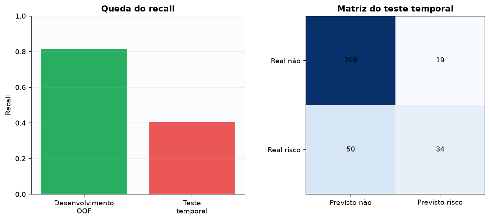

**Interpretação.** Recall é a parcela dos eventos reais sinalizada. Falso negativo é um evento não sinalizado; falso positivo é um alerta sem o desfecho definido.

**Observado.** A discriminação permaneceu semelhante, mas a sensibilidade operacional caiu substancialmente no período futuro.

**Uso responsável.** Usar a probabilidade apenas como apoio, revisar também casos não sinalizados e monitorar o desempenho prospectivamente.

**Limitações.** O alvo é entrada em defasagem no ano seguinte, não toda queda de desempenho; há um único teste temporal e perda de acompanhamento.

### Conclusão da análise

- **Principal constatação:** O recall cai de 81,7% (desenvolvimento) para 40,5% (teste temporal) no agregado, e essa queda de sensibilidade não é uniforme entre subgrupos: varia por fase (0,0 a 0,625), por gênero (33,3% feminino vs. 47,6% masculino) e por faixa etária aproximada (11,1% a 46,4%).
- **Diferenças entre grupos:** Fase 3 tem recall 0,0 no teste temporal. Entre gêneros, o recall é cerca de 14 pontos percentuais menor para meninas do que para meninos, com ambos os grupos acima do mínimo de robustez estatística (42 eventos cada). Entre faixas etárias, a diferença é maior — de 46,4% (7 a 10 anos, 69 eventos) a 11,1% (11-13 anos, apenas 9 eventos) — mas essa última estimativa é baseada em poucos eventos reais e deve ser lida com mais cautela do que as demais.
- **Ponto de atenção:** A diferença de recall por gênero (e, de forma ainda mais acentuada, por faixa etária aproximada) significa que, no teste temporal, o modelo deixou de sinalizar uma proporção maior dos casos reais em alguns grupos do que em outros — um sinal de possível desigualdade na cobertura que merece atenção institucional antes de qualquer uso ampliado do modelo.
- **Limite da evidência:** Todos os recortes de equidade vêm de um único teste temporal (a mesma limitação já registrada para o modelo como um todo); metade das fases não atingiu o mínimo de robustez estatística, e as faixas etárias intermediárias têm poucos eventos reais (9 e 6), tornando essas duas estimativas mais instáveis. Não é possível, com um único teste, distinguir se as diferenças observadas são uma característica estável do modelo ou uma particularidade deste período.
- **Implicação prática:** A revisão humana deve ser reforçada especificamente para a fase 3, para o gênero feminino e para as faixas etárias com recall mais baixo; o resultado do modelo nunca deve substituir avaliação pedagógica, e a equipe responsável deve ser informada de que a cobertura do modelo não é uniforme entre esses grupos.
- **Próximo acompanhamento:** Reavaliar a equidade por fase, gênero e faixa etária aproximada a cada novo teste temporal, para verificar se as diferenças observadas se mantêm, diminuem ou se invertem com mais dados.

### Recortes considerados

| Recorte | Implementado | Detalhe / motivo |
| --- | --- | --- |
| sexo | sim | Auditoria de equidade por gênero recuperada nesta correção via ligação pela chave COMPOSTA (RA, ano dos preditores) — não RA isolado, para evitar ambiguidade quando o mesmo RA tem registros de mais de um ano (ver análises complementares para a auditoria de cardinalidade: 311 linhas, 311 chaves distintas, 0 sem correspondência, 0 correspondências múltiplas) — recall 33,3% (feminino, n=184) vs. 47,6% (masculino, n=127) no teste temporal, com ordem e métricas globais reproduzidas exatamente contra o artefato oficial antes da quebra por subgrupo. O artefato oficial (reports/metricas_modelagem.json) registra "indisponível" para este recorte porque a coorte em formato tabular do modelo não retém gênero — o registro está correto para o método que usou; esta correção usou um caminho diferente e válido (a chave privada do JSONL, já destinada a auditoria, ligada por RA+ano). |
| idade | sim | Auditoria de equidade por faixa etária APROXIMADA (calculada a partir do ano de nascimento, não é idade exata — ver nota da pergunta 1) recuperada nesta correção pela mesma ligação por chave composta — recall de 46,4% (7 a 10 anos) a 11,1% (11-13 anos, poucos eventos); faixa 17 anos ou mais (aproximada) integralmente suprimida por privacidade. |
| fase | sim | Auditoria de equidade completa por fase (recall/precisão/AP/ROC-AUC/Brier/matriz de confusão), com supressão explícita das fases sem robustez suficiente. |
| ano | sim | Desenvolvimento (2022→2023) e teste temporal (2023→2024), a própria validação temporal do modelo. |
| pedra | não | não possui relação educacional clara com a pergunta: Pedra não é preditor nem alvo do modelo; equidade por Pedra não foi prevista no contrato metodológico. |
| situacao_defasagem | não | redundância com outra análise: Defasagem de origem já é um dos sete preditores do modelo (contrato oficial); tratá-la como recorte adicional duplicaria a própria definição do problema. |
| cobertura | sim | n e eventos explícitos em cada linha, com status de supressão declarado quando abaixo do mínimo de robustez. |
| trajetoria_longitudinal | sim | A validação temporal (treino em uma transição, teste na seguinte, sem reajuste) é o próprio desenho longitudinal da avaliação do modelo. |

## Pergunta 10 — Os indicadores mostram melhora consistente ao longo do ciclo nas diferentes fases (Quartzo, Ágata, Ametista e Topázio), confirmando o impacto real do programa?

**Tópico secundário:** Efetividade do programa  
**Estado:** parcialmente respondida; impacto causal não identificável

**Por que importa.** Pedra resume a posição do estudante numa escala institucional; entender se ela evolui de forma consistente — e a partir de qual Pedra de origem — orienta expectativas realistas sobre o ritmo de mudança.

**Como foi analisada.** Distribuição de melhoria/estabilidade/piora de Pedra nas duas transições longitudinais; e, como recorte complementar, a variação média de IDA dos mesmos estudantes, agrupada pela Pedra em que cada um começou — para ver se o ponto de partida importa.

**Resposta direta.** O PDF chama Quartzo, Ágata, Ametista e Topázio de 'fases', mas nos dados elas são categorias de Pedra associadas ao desempenho, não fase escolar. Em 2022→2023, 24,4% melhoraram, 51,2% permaneceram e 24,4% pioraram; em 2023→2024, foram 24,2%, 50,0% e 25,8%. Não há melhora consistente geral. Sem grupo de controle ou contrafactual, esses dados não confirmam impacto causal do programa.

### Principais números

| Transição | n | Melhoria | Estabilidade | Piora |
| --- | --- | --- | --- | --- |
| 2022→2023 | 570 | 24,4% | 51,2% | 24,4% |
| 2023→2024 | 678 | 24,2% | 50,0% | 25,8% |

*A ordem das Pedras é usada apenas para descrever avanço, permanência e recuo observados.*

### Análises complementares

| Faixa | Pedra de origem | Recorte | Sexo | Transição | n | Δ IDA médio |
| --- | --- | --- | --- | --- | --- | --- |
| — | Quartzo | Variação média de IDA por Pedra de origem | — | 2022→2023 | 49 | 1.84 |
| — | Ágata | Variação média de IDA por Pedra de origem | — | 2022→2023 | 159 | 0.41 |
| — | Ametista | Variação média de IDA por Pedra de origem | — | 2022→2023 | 256 | -0.07 |
| — | Topázio | Variação média de IDA por Pedra de origem | — | 2022→2023 | 110 | -0.64 |
| — | Quartzo | Variação média de IDA por Pedra de origem | — | 2023→2024 | 42 | -0.41 |
| — | Ágata | Variação média de IDA por Pedra de origem | — | 2023→2024 | 152 | -0.32 |
| — | Ametista | Variação média de IDA por Pedra de origem | — | 2023→2024 | 300 | -0.59 |
| — | Topázio | Variação média de IDA por Pedra de origem | — | 2023→2024 | 185 | -0.46 |
| — | — | Variação média de IDA por sexo | feminino | 2022→2023 | 298 | 0.13 |
| — | — | Variação média de IDA por sexo | masculino | 2022→2023 | 276 | 0.1 |
| — | — | Variação média de IDA por sexo | feminino | 2023→2024 | 363 | -0.5 |
| — | — | Variação média de IDA por sexo | masculino | 2023→2024 | 319 | -0.45 |
| 7 a 10 anos | — | Variação média de IDA por faixa etária aproximada | — | 2022→2023 | 218 | 0.17 |
| 11 a 13 anos | — | Variação média de IDA por faixa etária aproximada | — | 2022→2023 | 223 | 0.05 |
| 14 a 16 anos | — | Variação média de IDA por faixa etária aproximada | — | 2022→2023 | 116 | 0.1 |
| 7 a 10 anos | — | Variação média de IDA por faixa etária aproximada | — | 2023→2024 | 246 | -0.35 |
| 11 a 13 anos | — | Variação média de IDA por faixa etária aproximada | — | 2023→2024 | 263 | -0.88 |
| 14 a 16 anos | — | Variação média de IDA por faixa etária aproximada | — | 2023→2024 | 153 | -0.15 |

*Recorte por Pedra de ORIGEM (a Pedra em que o estudante começou), mostrando a variação média de IDA dos mesmos estudantes na transição seguinte. Em 2022→2023, quem começou em Quartzo (a Pedra mais inicial) teve o MAIOR ganho médio de IDA (+1,84); quem começou em Topázio (a mais avançada) teve o único recuo médio (-0,64). Esse padrão (ganho maior para quem parte de posição mais inicial) desapareceu em 2023→2024, quando as quatro Pedras de origem recuaram em IDA médio, incluindo Quartzo (-0,41) — a mesma reversão geral de 2024 já observada na pergunta 2, agora vista por Pedra de origem. A matriz completa de transições (de qual Pedra para qual) permanece suprimida por caixa pequena nas duas transições. Por sexo (achado exploratório): variação semelhante entre feminino e masculino nas duas transições, sem diferença que se destaque diante da dispersão de cada grupo. Por faixa etária aproximada: a faixa "11 a 13 anos" teve o maior recuo em 2023→2024 (-0,88, o dobro das demais faixas com dado disponível); a faixa "17 anos ou mais" tem cobertura de pareamento baixa demais nas duas transições (21-46%) para uma leitura confiável e não está incluída aqui.*

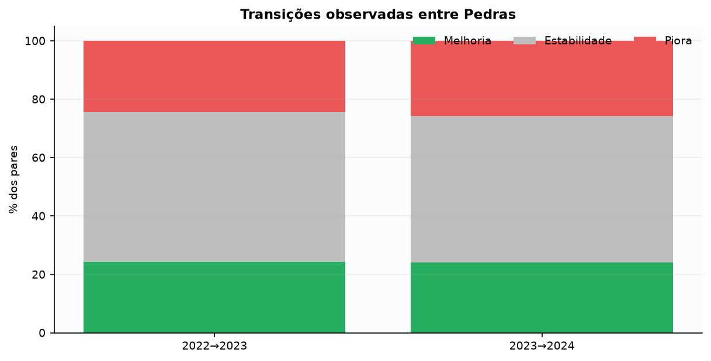

**Interpretação.** Compare as três parcelas em cada transição; estabilidade representa aproximadamente metade dos pares.

**Observado.** Melhora e piora têm proporções próximas nos dois períodos.

**Uso responsável.** Acompanhar transições por coorte e planejar desenho de avaliação com comparador apropriado.

**Limitações.** Pedra não equivale à fase escolar; não há controle, contrafactual ou atribuição causal.

### Conclusão da análise

- **Principal constatação:** As proporções de melhoria/estabilidade/piora de Pedra ficaram próximas nas duas transições, sem indicar uma tendência institucional única; por Pedra de origem, o padrão observado em 2022→2023 não se repetiu em 2023→2024.
- **Diferenças entre grupos:** Em 2022→2023, quem partia de Quartzo teve o maior ganho de IDA (+1,84); em 2023→2024, o mesmo grupo de origem (Quartzo) teve o único resultado ainda relativamente melhor que as demais Pedras, mas já em território negativo (-0,41). Por sexo, a variação foi semelhante entre feminino e masculino nas duas transições; por faixa etária aproximada, a faixa "11 a 13 anos" teve o maior recuo em 2023→2024 (-0,88), sem explicação disponível nos dados para essa diferença.
- **Ponto de atenção:** A matriz completa de transições (de qual Pedra exatamente para qual) está suprimida nas duas transições por caixa pequena — só se sabe a direção agregada (melhoria/estabilidade/piora), não o padrão detalhado entre pares específicos de Pedra.
- **Limite da evidência:** Sem grupo de controle ou contrafactual, nenhuma das duas transições permite atribuir a evolução observada a uma ação específica do programa; o recorte por faixa etária aproximada de 17 anos ou mais tem cobertura de pareamento baixa (21-46%) e não é reportado por esse motivo.
- **Implicação prática:** Não estabelecer, para nenhuma Pedra de origem ou faixa etária aproximada, uma expectativa fixa de trajetória — o padrão observado em um período não se repetiu no seguinte.
- **Próximo acompanhamento:** Planejar um desenho de avaliação com comparador apropriado antes de qualquer afirmação de impacto do programa sobre a evolução de Pedra; acompanhar se o recuo maior da faixa 11-13 anos em 2023→2024 se repete em ciclos futuros.

### Recortes considerados

| Recorte | Implementado | Detalhe / motivo |
| --- | --- | --- |
| sexo | sim | Variação de IDA pareada por sexo, nas duas transições (ver análises complementares) — sem diferença que se destaque. |
| idade | sim | Variação de IDA pareada por faixa etária aproximada, nas duas transições (ver análises complementares) — faixa 11-13 anos com maior recuo em 2023→2024; faixa 17+ com cobertura de pareamento insuficiente (21-46%), não reportada. |
| fase | não | redundância com outra análise: A pergunta distingue explicitamente Pedra de fase escolar; cruzar os dois aqui misturaria justamente as duas categorias que a resposta direta se esforça para separar. |
| ano | sim | As duas transições longitudinais (2022→2023 e 2023→2024) são o próprio eixo da pergunta. |
| pedra | sim | É o assunto central da pergunta: transições agregadas e, como recorte complementar, variação de IDA por Pedra de origem. |
| situacao_defasagem | não | não possui relação educacional clara com a pergunta: Defasagem não é componente da fórmula do INDE/Pedra; a pergunta trata de evolução de Pedra, não de defasagem. |
| cobertura | sim | n de cada Pedra de origem e de cada transição publicados nas duas tabelas. |
| trajetoria_longitudinal | sim | É o próprio desenho da pergunta: mesmos estudantes comparados entre um ano e o seguinte. |

## Pergunta 11 — Você pode adicionar mais insights e pontos de vista não abordados nas perguntas, utilize a criatividade e a análise dos dados para trazer sugestões para a Passos Mágicos.

**Tópico secundário:** Insights e criatividade  
**Estado:** respondida com limitações

**Por que importa.** Além de responder às 10 perguntas anteriores, vale registrar o que os dados revelam sobre a qualidade do próprio acompanhamento — porque melhorar a coleta pode valer tanto quanto aprofundar a análise.

**Como foi analisada.** Perda de correspondência entre anos consecutivos (quem não foi encontrado no ano seguinte); e, como recorte complementar, comparação dos indicadores médios de quem FOI encontrado versus quem NÃO foi, para avaliar possível viés de seleção — exatamente a comparação prevista no contrato metodológico.

**Resposta direta.** Três prioridades emergem: melhorar o registro de continuidade, padronizar instrumentos e validar o modelo prospectivamente. A perda de correspondência caiu de 27,0% para 22,1%, mas ausência no ano seguinte não informa, por si só, evasão, sucesso ou fracasso.

### Principais números

| Evidência | Público | Ação | Prioridade | Limitação |
| --- | --- | --- | --- | --- |
| Perda de correspondência 2022→2023: 70 de 259 (27,0%) | Gestão de dados e equipes locais | Registrar motivo e data de saída/transferência | Alta | Ausência não equivale a evasão |
| Perda de correspondência 2023→2024: 88 de 399 (22,1%) | Coordenação pedagógica | Monitorar continuidade por ciclo | Alta | A causa da perda não foi observada |
| Mudanças relevantes de composição entre coortes | Avaliação e tecnologia | Versionar instrumentos e definições | Alta | Mudança de distribuição não prova causa |
| Recall temporal de 40,5% | Equipe que utilizará o modelo | Validar prospectivamente e revisar falsos negativos | Alta | Um único teste temporal |
| Resultados diferentes entre fases | Equipe pedagógica | Planejar acompanhamento por fase e cobertura | Média | Alguns recortes têm ausência ou supressão |

*As sugestões não são prescrições automáticas; cada ação requer validação institucional.*

### Análises complementares

| Recorte | Transição | Valor | n |
| --- | --- | --- | --- |
| IDA médio — encontrados no ano seguinte | 2022→2023 | 6.78 | 189 |
| IDA médio — NÃO encontrados no ano seguinte | 2022→2023 | 5.63 | 70 |
| IEG médio — encontrados no ano seguinte | 2022→2023 | 8.55 | 189 |
| IEG médio — NÃO encontrados no ano seguinte | 2022→2023 | 7.43 | 70 |
| IPV médio — encontrados no ano seguinte | 2022→2023 | 7.6 | 189 |
| IPV médio — NÃO encontrados no ano seguinte | 2022→2023 | 6.88 | 70 |
| IDA médio por sexo — feminino encontradas | 2022→2023 | 6.66 | 99 |
| IDA médio por sexo — feminino não encontradas | 2022→2023 | 5.98 | 43 |
| IDA médio por sexo — masculino encontrados | 2022→2023 | 6.92 | 90 |
| IDA médio por sexo — masculino não encontrados | 2022→2023 | 5.08 | 27 |
| IDA médio por sexo — feminino encontradas | 2023→2024 | 6.9 | 184 |
| IDA médio por sexo — feminino não encontradas | 2023→2024 | 6.42 | 51 |
| IDA médio por sexo — masculino encontrados | 2023→2024 | 7.11 | 127 |
| IDA médio por sexo — masculino não encontrados | 2023→2024 | 7.04 | 37 |

*Comparação prevista no contrato metodológico ("Perda de acompanhamento e equidade"): estudantes NÃO encontrados no ano seguinte tinham, na origem, IDA (5,63 vs. 6,78), IEG (7,43 vs. 8,55) e IPV (6,88 vs. 7,60) mais baixos do que os encontrados — todas as diferenças na mesma direção nesta transição. São indícios de possível viés de seleção (a perda de acompanhamento pode não ser aleatória em relação ao desempenho), não uma prova formal, já que não há como observar diretamente por que cada estudante deixou de ser encontrado. Por sexo (achado exploratório): em 2022→2023, a diferença encontrados/não-encontrados aparece nos dois sexos, mas é bem maior entre meninos (6,92 vs. 5,08, quase 2 pontos) do que entre meninas (6,66 vs. 5,98, menos de 1 ponto); em 2023→2024, a diferença quase desaparece entre meninos (7,11 vs. 7,04) mas permanece entre meninas (6,90 vs. 6,42) — o padrão não é o mesmo nas duas transições, o que pesa contra tratar isso como um efeito estável. Por faixa etária aproximada (achado exploratório, não tabulado aqui por brevidade): a diferença encontrados/não-encontrados aparece em quase todas as faixas nas duas transições (ex.: 11-13 anos, 2022→2023: 6,39 vs. 5,02), mas na faixa "7 a 10 anos" ela praticamente desaparece em 2023→2024 (7,37 vs. 7,33) — o mesmo padrão de inconsistência entre transições visto por sexo. A faixa "17 anos ou mais" tem grupos pequenos demais (abaixo de 10) nas duas transições e não é reportada. Recorte por fase para este mesmo grupo está suprimido por caixa pequena no artefato congelado.*

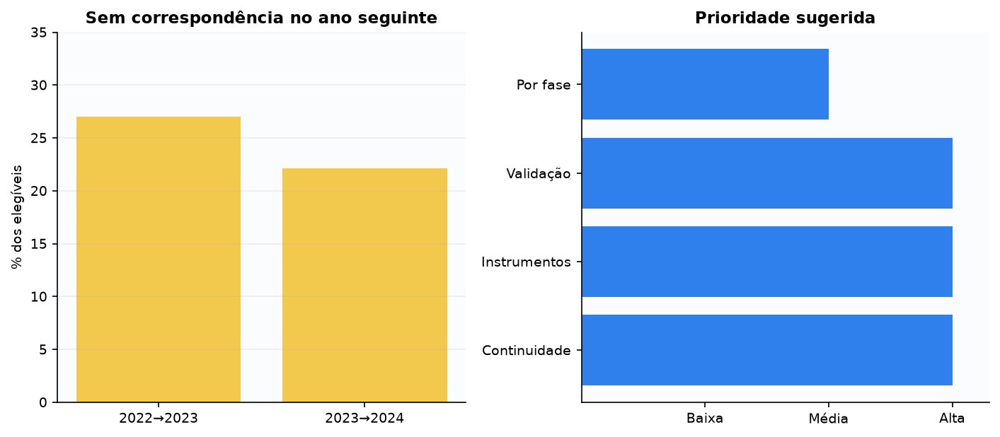

**Interpretação.** Leia cada linha como cadeia evidência → público → ação → prioridade → limitação.

**Observado.** Qualidade da continuidade e estabilidade dos instrumentos condicionam a leitura de desempenho e do modelo.

**Uso responsável.** Começar pelos registros de continuidade e pelo protocolo de monitoramento prospectivo do modelo.

**Limitações.** As análises não identificam a causa das perdas nem garantem que as sugestões produzirão melhora.

### Conclusão da análise

- **Principal constatação:** Foram encontrados indícios de viés de seleção na transição 2022→2023: estudantes não encontrados no ano seguinte tinham, em média, IDA, IEG e IPV mais baixos na origem do que os encontrados.
- **Diferenças entre grupos:** A diferença mais marcante é em IDA (6,78 vs. 5,63, mais de 1 ponto) e IPV (7,60 vs. 6,88). Por sexo e por faixa etária aproximada, o padrão aparece nas duas transições, mas de forma inconsistente entre elas (ex.: quase desaparece entre meninos e na faixa "7 a 10 anos" em 2023→2024, mas permanece nos demais grupos) — o que sugere que a diferença não é um efeito estável e uniforme.
- **Ponto de atenção:** Como o modelo é treinado e testado só com quem tem par no ano seguinte, ele nunca aprende diretamente com o perfil de quem se perde — isso é relevante para interpretar o recall reportado na pergunta 9, sem que se possa afirmar em que direção ou magnitude exata esse fator o afeta.
- **Limite da evidência:** A comparação mostra associação entre indicadores de origem e perda de correspondência em uma transição, não a causa da perda (transferência, evasão, erro de registro e mudança de instituição não são distinguíveis nos dados disponíveis), e o padrão não se repete de forma idêntica na segunda transição.
- **Implicação prática:** Priorizar o registro do motivo de saída/transferência, para no futuro distinguir perda por evasão de perda por transferência administrativa, e evitar assumir que o viés observado em 2022→2023 se repete automaticamente em outros ciclos.
- **Próximo acompanhamento:** Reavaliar esses indícios de viés de seleção a cada nova coorte, e considerar seu efeito ao interpretar qualquer métrica do modelo (pergunta 9), sem tratá-los como um padrão já estabelecido.

### Recortes considerados

| Recorte | Implementado | Detalhe / motivo |
| --- | --- | --- |
| sexo | sim | IDA médio de encontrados/não-encontrados por sexo, nas duas transições (ver análises complementares) — padrão presente mas inconsistente entre transições. |
| idade | sim | IDA médio de encontrados/não-encontrados por faixa etária aproximada (ver análises complementares, nota) — mesmo padrão de inconsistência entre transições; faixa 17+ com grupos pequenos demais, não reportada. |
| fase | não | grupo pequeno: O cruzamento fase × encontrado/não encontrado está suprimido por caixa pequena no artefato interno congelado (analises.perdas.<transição>.fases) — a maioria das combinações fica abaixo do mínimo de 10 registros. |
| ano | sim | As duas transições (2022→2023 e 2023→2024) são comparadas na tabela principal. |
| pedra | não | redundância com outra análise: Evolução de Pedra já é o tema completo da pergunta 10; repeti-la aqui não acrescentaria pergunta nova. |
| situacao_defasagem | sim | O artefato congelado também compara a defasagem média de quem foi e não foi encontrado (ver relatório completo); direção consistente com os demais indicadores. |
| cobertura | sim | n exato de cada grupo (encontrados/não encontrados) em cada transição, publicado nas duas tabelas. |
| trajetoria_longitudinal | sim | É o próprio tema da pergunta: continuidade (ou perda dela) entre um ano e o seguinte. |

