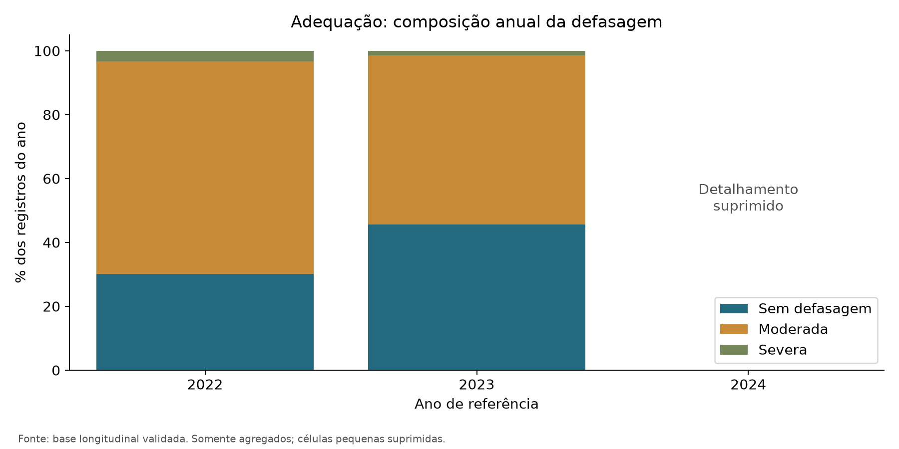
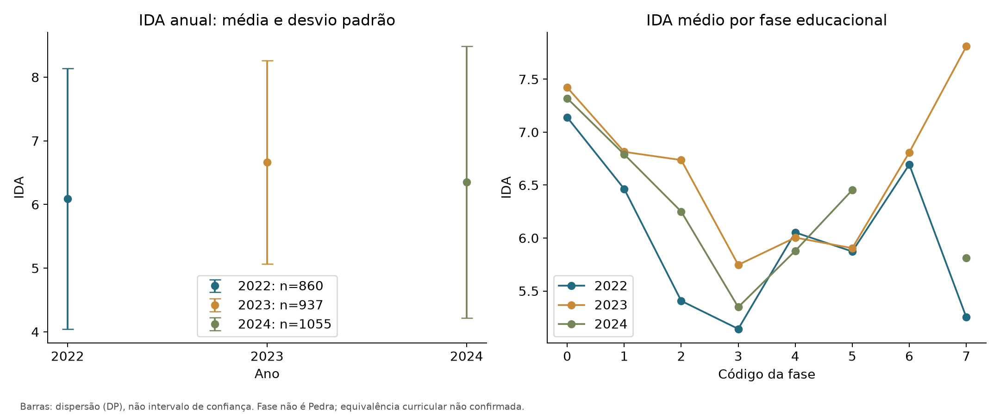
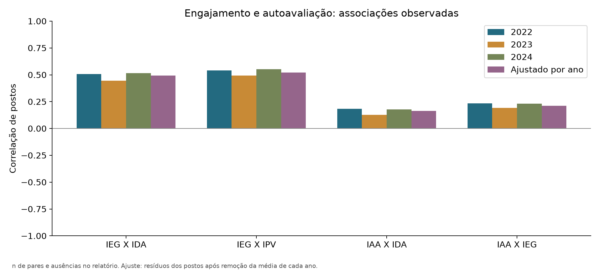
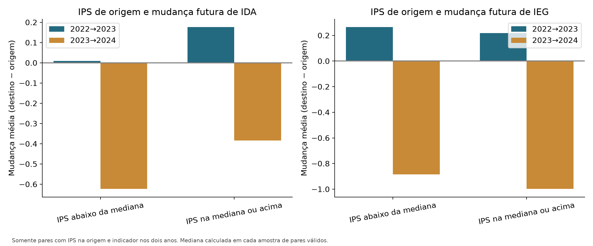
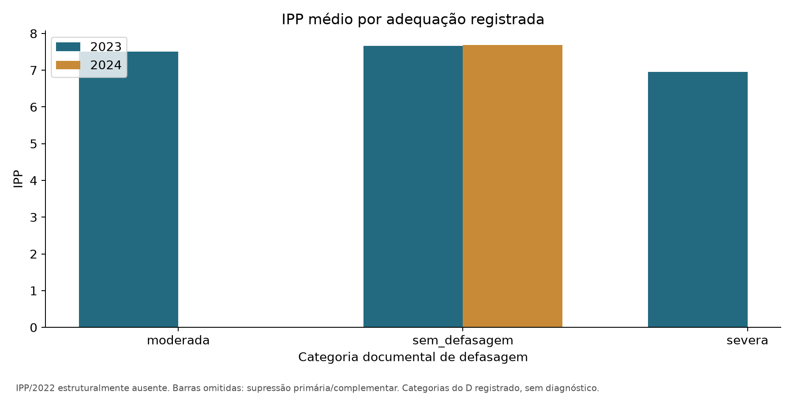
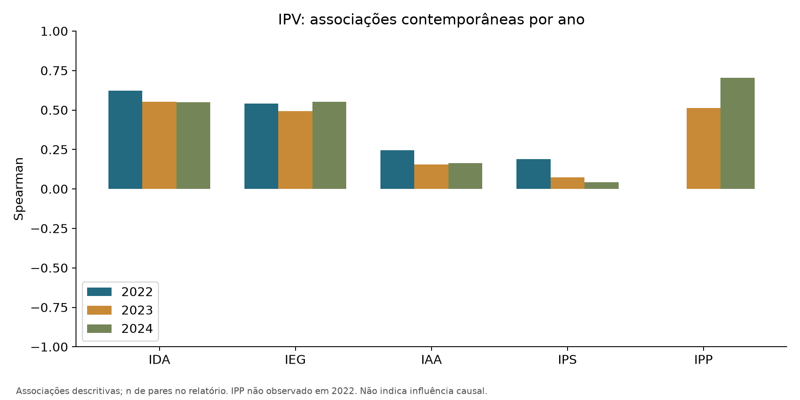
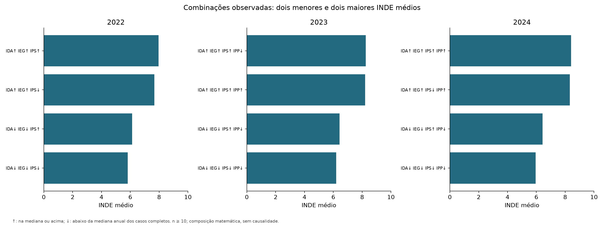
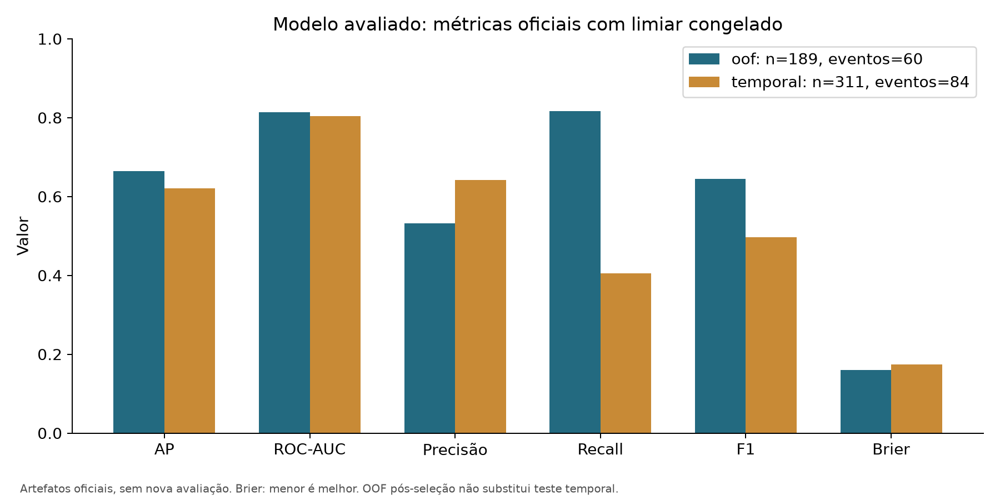
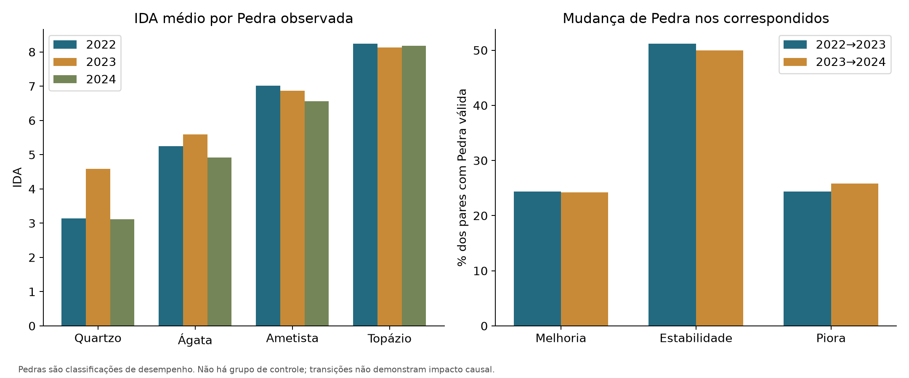
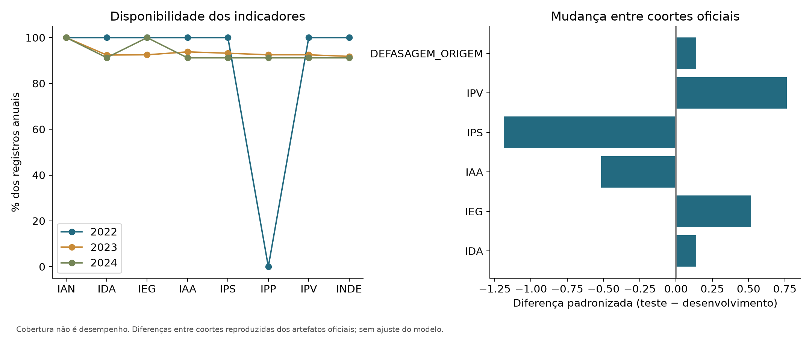

# Análises das perguntas de negócio — FIAP Datathon Fase 5

Documento regenerável por `python src/analises_negocio.py`. Base: registros anuais de 2022–2024; os totais anuais não representam alunos únicos. A leitura, os estados de ausência, os indicadores, as fases e a defasagem são os da preparação validada. Nenhum indicador foi recomposto.

As análises são observacionais: sem grupo de controle ou contrafactual, não identificam efeito causal. “Ao longo do ano” é interpretado como comparação entre anos de referência. Fase educacional e Pedra são variáveis distintas. Códigos 8 e 9 permanecem nas descrições, com limitações de aplicabilidade e equivalência curricular.

Privacidade: perfis e correlações requerem pelo menos 10 observações válidas. Uma partição com célula não vazia menor que 10 é integralmente suprimida, inclusive margens. Médias, medianas, quartis e desvio padrão usam somente valores disponíveis; zero observado é preservado. Não há imputação. DP descreve dispersão, não incerteza da média. Detalhes complementares estão em [métricas estruturadas](metricas_analises_negocio.json).

Spearman usa pares completos, postos médios para empates e informa n. Intensidade descritiva: |ρ| < 0,3 fraca; 0,3–<0,6 moderada; ≥0,6 forte. Esses cortes não são testes de hipótese. O agregado ajustado por ano correlaciona resíduos de postos globais após retirar a média dos postos de cada ano; não é média das correlações anuais. A repetição de estudantes e comparações exploratórias impedem tratar associações como evidência independente ou causal. Não foram calculados p-valores ou novos intervalos.

## 1. Qual é o perfil de defasagem e como evolui?

**Pergunta.** Qual é o perfil de defasagem e como evolui?

**Método.** Distribuições anuais; D≥0 sem defasagem, −2≤D<0 moderada, D<−2 severa. IAN esperado: 10, 5 e 2,5, respectivamente, conforme regra documental já aplicada.

**Evidências quantitativas.**

| Grupo | Categoria | n | Denominador | % |
| --- | --- | --- | --- | --- |
| 2022 | sem_defasagem | 259 | 860 | 30.116 |
| 2022 | moderada | 573 | 860 | 66.628 |
| 2022 | severa | 28 | 860 | 3.256 |
| 2022 | Ausente | 0 | 860 | 0.000 |
| 2023 | sem_defasagem | 462 | 1014 | 45.562 |
| 2023 | moderada | 538 | 1014 | 53.057 |
| 2023 | severa | 14 | 1014 | 1.381 |
| 2023 | Ausente | 0 | 1014 | 0.000 |
| 2024 | suprimido: particao com celula < 10 | — | — | — |

| Grupo | Categoria | n | Denominador | % |
| --- | --- | --- | --- | --- |
| 2022 | D<0 | 601 | 860 | 69.884 |
| 2022 | D=0 | 247 | 860 | 28.721 |
| 2022 | D>0 | 12 | 860 | 1.395 |
| 2022 | Ausente | 0 | 860 | 0.000 |
| 2023 | D<0 | 552 | 1014 | 54.438 |
| 2023 | D=0 | 420 | 1014 | 41.420 |
| 2023 | D>0 | 42 | 1014 | 4.142 |
| 2023 | Ausente | 0 | 1014 | 0.000 |
| 2024 | D<0 | 534 | 1156 | 46.194 |
| 2024 | D=0 | 485 | 1156 | 41.955 |
| 2024 | D>0 | 137 | 1156 | 11.851 |
| 2024 | Ausente | 0 | 1156 | 0.000 |

| Grupo | Categoria | n | Denominador | % |
| --- | --- | --- | --- | --- |
| 2022 | 2.5 | 28 | 860 | 3.256 |
| 2022 | 5.0 | 573 | 860 | 66.628 |
| 2022 | 10.0 | 259 | 860 | 30.116 |
| 2022 | Outros valores | 0 | 860 | 0.000 |
| 2022 | Ausente | 0 | 860 | 0.000 |
| 2023 | 2.5 | 14 | 1014 | 1.381 |
| 2023 | 5.0 | 538 | 1014 | 53.057 |
| 2023 | 10.0 | 462 | 1014 | 45.562 |
| 2023 | Outros valores | 0 | 1014 | 0.000 |
| 2023 | Ausente | 0 | 1014 | 0.000 |
| 2024 | suprimido: particao com celula < 10 | — | — | — |

Divergência IAN registrado versus esperado (True = divergente):

| Grupo | Categoria | n | Denominador | % |
| --- | --- | --- | --- | --- |
| 2022 | True | 0 | 860 | 0.000 |
| 2022 | False | 860 | 860 | 100.000 |
| 2022 | Indisponível | 0 | 860 | 0.000 |
| 2023 | True | 0 | 1014 | 0.000 |
| 2023 | False | 1014 | 1014 | 100.000 |
| 2023 | Indisponível | 0 | 1014 | 0.000 |
| 2024 | True | 0 | 1156 | 0.000 |
| 2024 | False | 1156 | 1156 | 100.000 |
| 2024 | Indisponível | 0 | 1156 | 0.000 |

**Interpretação.** 2022: 66.6% moderada e 3.3% severa; 2023: 53.1% moderada e 1.4% severa. Anos com detalhamento suprimido não autorizam concluir ausência de defasagem severa.

**Limitação.** IAN incorpora D; sua associação com adequação é matemática. Divergências são sinalizadas, sem correção. Mudanças de composição impedem inferir evolução individual pelas proporções.

**Recomendação.** Priorizar acompanhamento pedagógico da defasagem e revisar divergências na origem, mantendo o valor registrado.

## 2. O IDA melhora, permanece estável ou cai entre fases e anos?

**Pergunta.** O IDA melhora, permanece estável ou cai entre fases e anos?

**Método.** Média, mediana, DP e quartis por ano, fase e ano × fase. Mudanças individuais apenas nos pares com IDA nos dois anos.

**Evidências quantitativas.**

| Grupo | Total | n observado | Ausentes | Cobertura | Média | Mediana | DP | Q25 | Q75 | Estado |
| --- | --- | --- | --- | --- | --- | --- | --- | --- | --- | --- |
| 2022 | 860 | 860 | 0 | 1.000 | 6.093 | 6.300 | 2.046 | 4.800 | 7.600 | disponivel |
| 2023 | 1014 | 937 | 77 | 0.924 | 6.663 | 6.800 | 1.595 | 5.700 | 7.900 | disponivel |
| 2024 | 1156 | 1055 | 101 | 0.913 | 6.351 | 6.750 | 2.132 | 4.917 | 8.000 | disponivel |

| Grupo | Total | n observado | Ausentes | Cobertura | Média | Mediana | DP | Q25 | Q75 | Estado |
| --- | --- | --- | --- | --- | --- | --- | --- | --- | --- | --- |
| 2022 / fase 0 | 190 | 190 | 0 | 1.000 | 7.140 | 7.300 | 1.675 | 6.100 | 8.375 | disponivel |
| 2022 / fase 1 | 192 | 192 | 0 | 1.000 | 6.464 | 6.800 | 2.062 | 5.300 | 7.800 | disponivel |
| 2022 / fase 2 | 155 | 155 | 0 | 1.000 | 5.406 | 5.500 | 1.998 | 4.000 | 7.050 | disponivel |
| 2022 / fase 3 | 148 | 148 | 0 | 1.000 | 5.142 | 5.200 | 1.929 | 3.800 | 6.600 | disponivel |
| 2022 / fase 4 | 76 | 76 | 0 | 1.000 | 6.053 | 6.100 | 1.547 | 5.150 | 7.300 | disponivel |
| 2022 / fase 5 | 60 | 60 | 0 | 1.000 | 5.873 | 6.550 | 2.293 | 4.450 | 7.500 | disponivel |
| 2022 / fase 6 | 18 | 18 | 0 | 1.000 | 6.694 | 6.850 | 1.556 | 5.950 | 8.000 | disponivel |
| 2022 / fase 7 | 21 | 21 | 0 | 1.000 | 5.252 | 5.000 | 2.182 | 3.800 | 7.300 | disponivel |
| 2023 / fase 0 | 231 | 231 | 0 | 1.000 | 7.422 | 7.800 | 1.522 | 6.500 | 8.550 | disponivel |
| 2023 / fase 1 | 173 | 173 | 0 | 1.000 | 6.814 | 6.900 | 1.489 | 6.000 | 7.900 | disponivel |
| 2023 / fase 2 | 200 | 199 | 1 | 0.995 | 6.737 | 6.800 | 1.597 | 5.750 | 7.900 | disponivel |
| 2023 / fase 3 | 132 | 132 | 0 | 1.000 | 5.747 | 5.700 | 1.524 | 4.700 | 6.925 | disponivel |
| 2023 / fase 4 | 94 | 94 | 0 | 1.000 | 6.004 | 6.100 | 1.247 | 5.125 | 6.975 | disponivel |
| 2023 / fase 5 | 65 | 65 | 0 | 1.000 | 5.905 | 6.000 | 1.390 | 5.000 | 7.100 | disponivel |
| 2023 / fase 6 | 33 | 33 | 0 | 1.000 | 6.809 | 6.800 | 1.185 | 6.200 | 7.700 | disponivel |
| 2023 / fase 7 | 23 | 10 | 13 | 0.435 | 7.810 | 7.800 | 0.684 | 7.550 | 7.975 | disponivel |
| 2023 / fase 8 | 63 | 0 | 63 | 0.000 | — | — | — | — | — | sem_observacoes |
| 2024 / fase 0 | 196 | 196 | 0 | 1.000 | 7.320 | 7.750 | 1.944 | 6.188 | 8.750 | disponivel |
| 2024 / fase 1 | 185 | 185 | 0 | 1.000 | 6.791 | 7.250 | 1.973 | 6.000 | 8.000 | disponivel |
| 2024 / fase 2 | 185 | 185 | 0 | 1.000 | 6.250 | 6.500 | 2.009 | 4.750 | 7.750 | disponivel |
| 2024 / fase 3 | 211 | 211 | 0 | 1.000 | 5.348 | 5.000 | 1.981 | 4.000 | 6.833 | disponivel |
| 2024 / fase 4 | 115 | 115 | 0 | 1.000 | 5.879 | 5.667 | 2.012 | 4.500 | 7.500 | disponivel |
| 2024 / fase 5 | 100 | 100 | 0 | 1.000 | 6.453 | 6.750 | 2.128 | 5.000 | 8.208 | disponivel |
| 2024 / fase 6 | — | — | — | — | — | — | — | — | — | suprimido: complemento de privacidade |
| 2024 / fase 7 | 37 | 37 | 0 | 1.000 | 5.810 | 7.067 | 3.057 | 5.483 | 7.667 | disponivel |
| 2024 / fase 8 | — | — | — | — | — | — | — | — | — | suprimido: n < 10 |
| 2024 / fase 9 | 38 | 0 | 38 | 0.000 | — | — | — | — | — | sem_observacoes |
| agregado / fase 0 | 617 | 617 | 0 | 1.000 | 7.303 | 7.500 | 1.713 | 6.300 | 8.500 | disponivel |
| agregado / fase 1 | 550 | 550 | 0 | 1.000 | 6.684 | 7.000 | 1.872 | 5.800 | 8.000 | disponivel |
| agregado / fase 2 | 540 | 539 | 1 | 0.998 | 6.187 | 6.300 | 1.937 | 4.900 | 7.500 | disponivel |
| agregado / fase 3 | 491 | 491 | 0 | 1.000 | 5.393 | 5.300 | 1.864 | 4.000 | 6.817 | disponivel |
| agregado / fase 4 | 285 | 285 | 0 | 1.000 | 5.967 | 6.000 | 1.665 | 4.833 | 7.200 | disponivel |
| agregado / fase 5 | 225 | 225 | 0 | 1.000 | 6.140 | 6.333 | 2.004 | 4.800 | 7.667 | disponivel |
| agregado / fase 6 | 76 | 76 | 0 | 1.000 | 6.920 | 7.167 | 1.262 | 6.150 | 7.900 | disponivel |
| agregado / fase 7 | 81 | 68 | 13 | 0.840 | 5.932 | 6.967 | 2.681 | 4.550 | 7.800 | disponivel |
| agregado / fase 8 | — | — | — | — | — | — | — | — | — | suprimido: n < 10 |
| agregado / fase 9 | — | — | — | — | — | — | — | — | — | suprimido: complemento de privacidade |

Mudança do mesmo estudante (destino − origem):

| Grupo | Total | n observado | Ausentes | Cobertura | Média | Mediana | DP | Q25 | Q75 | Estado |
| --- | --- | --- | --- | --- | --- | --- | --- | --- | --- | --- |
| 2022→2023 | 600 | 574 | 26 | 0.957 | 0.115 | 0.000 | 1.567 | -0.900 | 1.000 | disponivel |
| 2023→2024 | 765 | 682 | 83 | 0.892 | -0.478 | -0.300 | 1.875 | -1.646 | 0.733 | disponivel |

**Interpretação.** IDA médio anual: 2022: 6.09; 2023: 6.66; 2024: 6.35. Nos pares: 2022→2023: mudança média +0.12 (n=574); 2023→2024: mudança média -0.48 (n=682).

**Limitação.** Fases agregadas misturam anos e estudantes repetidos. Códigos não provam equivalência curricular; dispersão não é intervalo de confiança.

**Recomendação.** Monitorar IDA e cobertura por fase, distinguindo composição da turma e progresso dos acompanhados.

## 3. Qual a associação de IEG com IDA e IPV?

**Pergunta.** Qual a associação de IEG com IDA e IPV?

**Método.** Spearman anual e ajustado por ano; para IAA, diferenças assinadas entre escalas, sem corte diagnóstico.

**Evidências quantitativas.**

| Grupo / associação | n pares | Total | Ausentes no par | Spearman | Direção | Intensidade | Estado |
| --- | --- | --- | --- | --- | --- | --- | --- |
| 2022 / ieg x ida | 860 | 860 | 0 | 0.507 | positiva | moderada | estimada |
| 2022 / ieg x ipv | 860 | 860 | 0 | 0.540 | positiva | moderada | estimada |
| 2023 / ieg x ida | 937 | 1014 | 77 | 0.446 | positiva | moderada | estimada |
| 2023 / ieg x ipv | 938 | 1014 | 76 | 0.492 | positiva | moderada | estimada |
| 2024 / ieg x ida | 1055 | 1156 | 101 | 0.517 | positiva | moderada | estimada |
| 2024 / ieg x ipv | 1054 | 1156 | 102 | 0.551 | positiva | moderada | estimada |
| ajustado_ano / ieg x ida | 2852 | 3030 | 178 | 0.492 | positiva | moderada | estimada |
| ajustado_ano / ieg x ipv | 2852 | 3030 | 178 | 0.522 | positiva | moderada | estimada |

**Interpretação.** ajustado_ano / ieg x ida: ρ=0.49 (moderada, n=2852); ajustado_ano / ieg x ipv: ρ=0.52 (moderada, n=2852).

**Limitação.** Associação contemporânea pode refletir contexto comum e mecanismos de avaliação.

**Recomendação.** Acompanhar engajamento junto ao desempenho, sem usar correlação como efeito de intervenção.

## 4. A autoavaliação IAA é coerente com IDA e IEG?

**Pergunta.** A autoavaliação IAA é coerente com IDA e IEG?

**Método.** Spearman anual e ajustado por ano; para IAA, diferenças assinadas entre escalas, sem corte diagnóstico.

**Evidências quantitativas.**

| Grupo / associação | n pares | Total | Ausentes no par | Spearman | Direção | Intensidade | Estado |
| --- | --- | --- | --- | --- | --- | --- | --- |
| 2022 / iaa x ida | 860 | 860 | 0 | 0.183 | positiva | fraca | estimada |
| 2022 / iaa x ieg | 860 | 860 | 0 | 0.234 | positiva | fraca | estimada |
| 2023 / iaa x ida | 937 | 1014 | 77 | 0.127 | positiva | fraca | estimada |
| 2023 / iaa x ieg | 938 | 1014 | 76 | 0.191 | positiva | fraca | estimada |
| 2024 / iaa x ida | 1054 | 1156 | 102 | 0.178 | positiva | fraca | estimada |
| 2024 / iaa x ieg | 1054 | 1156 | 102 | 0.230 | positiva | fraca | estimada |
| ajustado_ano / iaa x ida | 2851 | 3030 | 179 | 0.163 | positiva | fraca | estimada |
| ajustado_ano / iaa x ieg | 2852 | 3030 | 178 | 0.212 | positiva | fraca | estimada |

| Grupo | Total | n observado | Ausentes | Cobertura | Média | Mediana | DP | Q25 | Q75 | Estado |
| --- | --- | --- | --- | --- | --- | --- | --- | --- | --- | --- |
| 2022 / iaa - ida | 860 | 860 | 0 | 1.000 | 2.182 | 2.200 | 2.586 | 0.700 | 3.700 | disponivel |
| 2022 / iaa - ieg | 860 | 860 | 0 | 1.000 | 0.383 | 0.400 | 2.182 | -0.600 | 1.600 | disponivel |
| 2023 / iaa - ida | 1014 | 937 | 77 | 0.924 | 0.255 | 1.200 | 3.768 | -0.700 | 2.800 | disponivel |
| 2023 / iaa - ieg | 1014 | 938 | 76 | 0.925 | -1.788 | -0.500 | 3.569 | -2.100 | 0.400 | disponivel |
| 2024 / iaa - ida | 1156 | 1054 | 102 | 0.912 | 2.194 | 2.002 | 2.318 | 0.749 | 3.668 | disponivel |
| 2024 / iaa - ieg | 1156 | 1054 | 102 | 0.912 | 0.455 | 0.213 | 2.031 | -0.694 | 1.471 | disponivel |

**Interpretação.** ajustado_ano / iaa x ida: ρ=0.16 (fraca, n=2851); ajustado_ano / iaa x ieg: ρ=0.21 (fraca, n=2852). Coerência é descrita por ordenação e diferença assinada IAA − indicador; não há classificação de alunos como coerentes/incoerentes.

**Limitação.** Indicadores não medem o mesmo construto; diferença de pontos não é erro de percepção ou diagnóstico.

**Recomendação.** Usar discrepâncias como tema de escuta pedagógica e revisar a comparabilidade dos instrumentos.

## 5. Existem padrões de IPS que antecedem quedas futuras de IDA ou IEG?

**Pergunta.** Existem padrões de IPS que antecedem quedas futuras de IDA ou IEG?

**Método.** RA único nos dois anos. IPS na origem versus Δ = destino − origem. Definição prévia: queda Δ<0; sensibilidade Δ<−0,5 e Δ<−1 ponto. Cada taxa exige IPS e indicador nos dois anos.

**Evidências quantitativas.**

| Grupo / associação | n pares | Total | Ausentes no par | Spearman | Direção | Intensidade | Estado |
| --- | --- | --- | --- | --- | --- | --- | --- |
| 2022→2023 / IPS → ΔIDA | 574 | 600 | 26 | 0.029 | positiva | fraca | estimada |
| 2022→2023 / IPS → ΔIEG | 574 | 600 | 26 | -0.024 | negativa | fraca | estimada |
| 2023→2024 / IPS → ΔIDA | 679 | 765 | 86 | 0.027 | positiva | fraca | estimada |
| 2023→2024 / IPS → ΔIEG | 690 | 765 | 75 | 0.020 | positiva | fraca | estimada |

| Grupo | Total | n observado | Ausentes | Cobertura | Média | Mediana | DP | Q25 | Q75 | Estado |
| --- | --- | --- | --- | --- | --- | --- | --- | --- | --- | --- |
| 2022→2023 / ΔIDA | 600 | 574 | 26 | 0.957 | 0.115 | 0.000 | 1.567 | -0.900 | 1.000 | disponivel |
| 2022→2023 / ΔIEG | 600 | 574 | 26 | 0.957 | 0.235 | 0.200 | 1.132 | -0.400 | 0.800 | disponivel |
| 2023→2024 / ΔIDA | 765 | 682 | 83 | 0.892 | -0.478 | -0.300 | 1.875 | -1.646 | 0.733 | disponivel |
| 2023→2024 / ΔIEG | 765 | 693 | 72 | 0.906 | -0.947 | -0.400 | 1.847 | -1.678 | 0.137 | disponivel |

| Grupo | Categoria | n | Denominador | % |
| --- | --- | --- | --- | --- |
| 2022→2023 / IDA / Δ < −0 | queda | 285 | 574 | 49.652 |
| 2022→2023 / IDA / Δ < −0 | sem_queda | 289 | 574 | 50.348 |
| 2022→2023 / IDA / Δ < −0.5 | queda | 201 | 574 | 35.017 |
| 2022→2023 / IDA / Δ < −0.5 | sem_queda | 373 | 574 | 64.983 |
| 2022→2023 / IDA / Δ < −1 | queda | 132 | 574 | 22.997 |
| 2022→2023 / IDA / Δ < −1 | sem_queda | 442 | 574 | 77.003 |
| 2022→2023 / IEG / Δ < −0 | queda | 213 | 574 | 37.108 |
| 2022→2023 / IEG / Δ < −0 | sem_queda | 361 | 574 | 62.892 |
| 2022→2023 / IEG / Δ < −0.5 | queda | 120 | 574 | 20.906 |
| 2022→2023 / IEG / Δ < −0.5 | sem_queda | 454 | 574 | 79.094 |
| 2022→2023 / IEG / Δ < −1 | queda | 57 | 574 | 9.930 |
| 2022→2023 / IEG / Δ < −1 | sem_queda | 517 | 574 | 90.070 |
| 2023→2024 / IDA / Δ < −0 | queda | 388 | 679 | 57.143 |
| 2023→2024 / IDA / Δ < −0 | sem_queda | 291 | 679 | 42.857 |
| 2023→2024 / IDA / Δ < −0.5 | queda | 303 | 679 | 44.624 |
| 2023→2024 / IDA / Δ < −0.5 | sem_queda | 376 | 679 | 55.376 |
| 2023→2024 / IDA / Δ < −1 | queda | 242 | 679 | 35.641 |
| 2023→2024 / IDA / Δ < −1 | sem_queda | 437 | 679 | 64.359 |
| 2023→2024 / IEG / Δ < −0 | queda | 461 | 690 | 66.812 |
| 2023→2024 / IEG / Δ < −0 | sem_queda | 229 | 690 | 33.188 |
| 2023→2024 / IEG / Δ < −0.5 | queda | 326 | 690 | 47.246 |
| 2023→2024 / IEG / Δ < −0.5 | sem_queda | 364 | 690 | 52.754 |
| 2023→2024 / IEG / Δ < −1 | queda | 241 | 690 | 34.928 |
| 2023→2024 / IEG / Δ < −1 | sem_queda | 449 | 690 | 65.072 |

| Grupo | Total | n observado | Ausentes | Cobertura | Média | Mediana | DP | Q25 | Q75 | Estado |
| --- | --- | --- | --- | --- | --- | --- | --- | --- | --- | --- |
| 2022→2023 / IDA / corte 0 / queda | 285 | 285 | 0 | 1.000 | 6.815 | 7.500 | 1.103 | 5.600 | 7.500 | disponivel |
| 2022→2023 / IDA / corte 0 / sem_queda | 289 | 289 | 0 | 1.000 | 6.926 | 7.500 | 1.016 | 6.300 | 7.500 | disponivel |
| 2022→2023 / IDA / corte 0.5 / queda | 201 | 201 | 0 | 1.000 | 6.844 | 7.500 | 1.099 | 5.600 | 7.500 | disponivel |
| 2022→2023 / IDA / corte 0.5 / sem_queda | 373 | 373 | 0 | 1.000 | 6.885 | 7.500 | 1.041 | 5.600 | 7.500 | disponivel |
| 2022→2023 / IDA / corte 1 / queda | 132 | 132 | 0 | 1.000 | 6.803 | 7.500 | 1.120 | 5.600 | 7.500 | disponivel |
| 2022→2023 / IDA / corte 1 / sem_queda | 442 | 442 | 0 | 1.000 | 6.891 | 7.500 | 1.043 | 5.775 | 7.500 | disponivel |
| 2022→2023 / IEG / corte 0 / queda | 213 | 213 | 0 | 1.000 | 6.906 | 7.500 | 1.035 | 6.300 | 7.500 | disponivel |
| 2022→2023 / IEG / corte 0 / sem_queda | 361 | 361 | 0 | 1.000 | 6.850 | 7.500 | 1.076 | 5.600 | 7.500 | disponivel |
| 2022→2023 / IEG / corte 0.5 / queda | 120 | 120 | 0 | 1.000 | 6.918 | 7.500 | 1.021 | 6.300 | 7.500 | disponivel |
| 2022→2023 / IEG / corte 0.5 / sem_queda | 454 | 454 | 0 | 1.000 | 6.858 | 7.500 | 1.072 | 5.600 | 7.500 | disponivel |
| 2022→2023 / IEG / corte 1 / queda | 57 | 57 | 0 | 1.000 | 6.709 | 7.500 | 1.163 | 5.600 | 7.500 | disponivel |
| 2022→2023 / IEG / corte 1 / sem_queda | 517 | 517 | 0 | 1.000 | 6.889 | 7.500 | 1.048 | 6.300 | 7.500 | disponivel |
| 2023→2024 / IDA / corte 0 / queda | 388 | 388 | 0 | 1.000 | 5.173 | 5.000 | 2.090 | 2.520 | 7.520 | disponivel |
| 2023→2024 / IDA / corte 0 / sem_queda | 291 | 291 | 0 | 1.000 | 5.135 | 5.000 | 2.101 | 2.520 | 7.520 | disponivel |
| 2023→2024 / IDA / corte 0.5 / queda | 303 | 303 | 0 | 1.000 | 5.108 | 5.000 | 2.078 | 2.520 | 7.520 | disponivel |
| 2023→2024 / IDA / corte 0.5 / sem_queda | 376 | 376 | 0 | 1.000 | 5.196 | 5.000 | 2.107 | 2.520 | 7.520 | disponivel |
| 2023→2024 / IDA / corte 1 / queda | 242 | 242 | 0 | 1.000 | 5.074 | 5.000 | 2.050 | 2.520 | 7.520 | disponivel |
| 2023→2024 / IDA / corte 1 / sem_queda | 437 | 437 | 0 | 1.000 | 5.203 | 5.000 | 2.118 | 2.520 | 7.520 | disponivel |
| 2023→2024 / IEG / corte 0 / queda | 461 | 461 | 0 | 1.000 | 5.139 | 5.000 | 2.076 | 2.520 | 7.520 | disponivel |
| 2023→2024 / IEG / corte 0 / sem_queda | 229 | 229 | 0 | 1.000 | 5.249 | 5.020 | 2.105 | 2.520 | 7.520 | disponivel |
| 2023→2024 / IEG / corte 0.5 / queda | 326 | 326 | 0 | 1.000 | 5.245 | 5.000 | 2.040 | 3.140 | 7.520 | disponivel |
| 2023→2024 / IEG / corte 0.5 / sem_queda | 364 | 364 | 0 | 1.000 | 5.113 | 5.000 | 2.125 | 2.520 | 7.520 | disponivel |
| 2023→2024 / IEG / corte 1 / queda | 241 | 241 | 0 | 1.000 | 5.156 | 5.000 | 2.051 | 2.520 | 7.520 | disponivel |
| 2023→2024 / IEG / corte 1 / sem_queda | 449 | 449 | 0 | 1.000 | 5.185 | 5.000 | 2.105 | 2.520 | 7.520 | disponivel |

**Interpretação.** 2022→2023, ΔIDA: ρ=0.03; 2022→2023, ΔIEG: ρ=-0.02; 2023→2024, ΔIDA: ρ=0.03; 2023→2024, ΔIEG: ρ=0.02. Os cortes complementam a mudança contínua e não definem queda clinicamente relevante. As correlações contínuas próximas de zero não sustentam um padrão monotônico útil de antecedência nesta base; isso não exclui relações não lineares ou dependentes do contexto.

**Limitação.** Antecedência temporal não estabelece causa; regressão à média, cobertura, contexto e instrumentos podem explicar mudanças. Cortes são descritivos.

**Recomendação.** Acompanhar IPS e mudanças futuras em conjunto, registrar alterações de instrumento e não criar triagem automática pelo IPS.

## 6. IPP confirma ou contradiz a defasagem identificada por IAN?

**Pergunta.** IPP confirma ou contradiz a defasagem identificada por IAN?

**Método.** Somente 2023/2024. Contraste descritivo: IPP abaixo da mediana e D<0, ou IPP na mediana/acima e D≥0, são perfis alinhados; as combinações restantes são contrastantes. Não há padrão clínico de referência.

**Evidências quantitativas.**

| Grupo / associação | n pares | Total | Ausentes no par | Spearman | Direção | Intensidade | Estado |
| --- | --- | --- | --- | --- | --- | --- | --- |
| 2023 / ipp x ian | 938 | 1014 | 76 | 0.106 | positiva | fraca | estimada |
| 2023 / ipp x d | 938 | 1014 | 76 | 0.173 | positiva | fraca | estimada |
| 2024 / ipp x ian | 1054 | 1156 | 102 | 0.160 | positiva | fraca | estimada |
| 2024 / ipp x d | 1054 | 1156 | 102 | 0.187 | positiva | fraca | estimada |

| Grupo | Total | n observado | Ausentes | Cobertura | Média | Mediana | DP | Q25 | Q75 | Estado |
| --- | --- | --- | --- | --- | --- | --- | --- | --- | --- | --- |
| 2023 / moderada | 538 | 536 | 2 | 0.996 | 7.505 | 7.500 | 0.992 | 6.875 | 8.125 | disponivel |
| 2023 / sem_defasagem | 462 | 388 | 74 | 0.840 | 7.665 | 7.812 | 0.952 | 7.292 | 8.281 | disponivel |
| 2023 / severa | 14 | 14 | 0 | 1.000 | 6.957 | 7.578 | 1.228 | 6.419 | 7.891 | disponivel |
| 2024 / moderada | — | — | — | — | — | — | — | — | — | suprimido: complemento de privacidade |
| 2024 / sem_defasagem | 622 | 520 | 102 | 0.836 | 7.688 | 7.708 | 0.843 | 7.292 | 8.250 | disponivel |
| 2024 / severa | — | — | — | — | — | — | — | — | — | suprimido: n < 10 |

| Grupo | Categoria | n | Denominador | % |
| --- | --- | --- | --- | --- |
| 2023 | IPP abaixo da mediana / D<0 | 287 | 938 | 30.597 |
| 2023 | IPP abaixo da mediana / D>=0 | 164 | 938 | 17.484 |
| 2023 | IPP na mediana ou acima / D<0 | 263 | 938 | 28.038 |
| 2023 | IPP na mediana ou acima / D>=0 | 224 | 938 | 23.881 |
| 2024 | IPP abaixo da mediana / D<0 | 213 | 1054 | 20.209 |
| 2024 | IPP abaixo da mediana / D>=0 | 149 | 1054 | 14.137 |
| 2024 | IPP na mediana ou acima / D<0 | 321 | 1054 | 30.455 |
| 2024 | IPP na mediana ou acima / D>=0 | 371 | 1054 | 35.199 |

Medianas anuais de IPP nos pares com D: 2023: 7.656; 2024: 7.500.

**Interpretação.** 2023, IPP × IAN: ρ=0.11; 2024, IPP × IAN: ρ=0.16. Não se exige concordância perfeita entre adequação escolar e avaliação psicopedagógica.

**Limitação.** IPP/2022 é ausência estrutural, nunca zero. Mediana é relativa ao ano; alinhamento não valida diagnóstico. IAN e D têm relação matemática.

**Recomendação.** Investigar perfis contrastantes com a equipe pedagógica e preservar cobertura e contexto de avaliação.

## 7. Quais indicadores estão mais associados ao IPV?

**Pergunta.** Quais indicadores estão mais associados ao IPV?

**Método.** Spearman por ano e indicadores na origem versus IPV no destino; contexto por fase. Sem regressão explicativa adicional.

**Evidências quantitativas.**

| Grupo / associação | n pares | Total | Ausentes no par | Spearman | Direção | Intensidade | Estado |
| --- | --- | --- | --- | --- | --- | --- | --- |
| 2022 / IDA × IPV | 860 | 860 | 0 | 0.624 | positiva | forte | estimada |
| 2022 / IEG × IPV | 860 | 860 | 0 | 0.540 | positiva | moderada | estimada |
| 2022 / IAA × IPV | 860 | 860 | 0 | 0.245 | positiva | fraca | estimada |
| 2022 / IPS × IPV | 860 | 860 | 0 | 0.190 | positiva | fraca | estimada |
| 2023 / IDA × IPV | 937 | 1014 | 77 | 0.551 | positiva | moderada | estimada |
| 2023 / IEG × IPV | 938 | 1014 | 76 | 0.492 | positiva | moderada | estimada |
| 2023 / IAA × IPV | 938 | 1014 | 76 | 0.155 | positiva | fraca | estimada |
| 2023 / IPS × IPV | 932 | 1014 | 82 | 0.072 | positiva | fraca | estimada |
| 2023 / IPP × IPV | 938 | 1014 | 76 | 0.512 | positiva | moderada | estimada |
| 2024 / IDA × IPV | 1054 | 1156 | 102 | 0.548 | positiva | moderada | estimada |
| 2024 / IEG × IPV | 1054 | 1156 | 102 | 0.551 | positiva | moderada | estimada |
| 2024 / IAA × IPV | 1054 | 1156 | 102 | 0.163 | positiva | fraca | estimada |
| 2024 / IPS × IPV | 1054 | 1156 | 102 | 0.042 | positiva | fraca | estimada |
| 2024 / IPP × IPV | 1054 | 1156 | 102 | 0.705 | positiva | forte | estimada |

| Grupo | Total | n observado | Ausentes | Cobertura | Média | Mediana | DP | Q25 | Q75 | Estado |
| --- | --- | --- | --- | --- | --- | --- | --- | --- | --- | --- |
| 2022 / fase 0 / IPV | 190 | 190 | 0 | 1.000 | 7.558 | 7.500 | 0.834 | 7.167 | 8.000 | disponivel |
| 2022 / fase 1 / IPV | 192 | 192 | 0 | 1.000 | 7.361 | 7.333 | 0.939 | 6.937 | 7.917 | disponivel |
| 2022 / fase 2 / IPV | 155 | 155 | 0 | 1.000 | 7.340 | 7.500 | 0.867 | 6.833 | 7.861 | disponivel |
| 2022 / fase 3 / IPV | 148 | 148 | 0 | 1.000 | 6.549 | 6.562 | 1.315 | 5.687 | 7.386 | disponivel |
| 2022 / fase 4 / IPV | 76 | 76 | 0 | 1.000 | 7.206 | 7.417 | 1.125 | 6.500 | 7.844 | disponivel |
| 2022 / fase 5 / IPV | 60 | 60 | 0 | 1.000 | 7.261 | 7.285 | 1.269 | 6.261 | 8.031 | disponivel |
| 2022 / fase 6 / IPV | 18 | 18 | 0 | 1.000 | 8.216 | 8.694 | 1.550 | 7.292 | 9.528 | disponivel |
| 2022 / fase 7 / IPV | 21 | 21 | 0 | 1.000 | 7.181 | 7.222 | 0.862 | 6.778 | 7.556 | disponivel |
| 2023 / fase 0 / IPV | 231 | 231 | 0 | 1.000 | 8.319 | 8.500 | 1.288 | 7.505 | 9.340 | disponivel |
| 2023 / fase 1 / IPV | 173 | 173 | 0 | 1.000 | 8.099 | 8.167 | 0.636 | 7.780 | 8.503 | disponivel |
| 2023 / fase 2 / IPV | 200 | 200 | 0 | 1.000 | 8.210 | 8.283 | 0.820 | 7.616 | 8.783 | disponivel |
| 2023 / fase 3 / IPV | 132 | 132 | 0 | 1.000 | 7.575 | 7.585 | 0.696 | 7.173 | 7.973 | disponivel |
| 2023 / fase 4 / IPV | 94 | 94 | 0 | 1.000 | 7.949 | 7.941 | 0.827 | 7.391 | 8.492 | disponivel |
| 2023 / fase 5 / IPV | 65 | 65 | 0 | 1.000 | 7.452 | 7.588 | 0.704 | 6.963 | 7.878 | disponivel |
| 2023 / fase 6 / IPV | 33 | 33 | 0 | 1.000 | 7.728 | 7.630 | 0.438 | 7.465 | 7.840 | disponivel |
| 2023 / fase 7 / IPV | 23 | 10 | 13 | 0.435 | 7.881 | 8.131 | 0.940 | 7.378 | 8.622 | disponivel |
| 2023 / fase 8 / IPV | 63 | 0 | 63 | 0.000 | — | — | — | — | — | sem_observacoes |
| 2024 / fase 0 / IPV | 196 | 196 | 0 | 1.000 | 7.283 | 7.500 | 0.939 | 6.936 | 7.830 | disponivel |
| 2024 / fase 1 / IPV | 185 | 185 | 0 | 1.000 | 7.502 | 7.835 | 1.118 | 6.915 | 8.170 | disponivel |
| 2024 / fase 2 / IPV | 185 | 185 | 0 | 1.000 | 7.214 | 7.383 | 1.150 | 6.607 | 7.915 | disponivel |
| 2024 / fase 3 / IPV | 211 | 211 | 0 | 1.000 | 6.953 | 6.966 | 1.039 | 6.249 | 7.546 | disponivel |
| 2024 / fase 4 / IPV | 115 | 115 | 0 | 1.000 | 7.843 | 8.000 | 0.949 | 7.392 | 8.541 | disponivel |
| 2024 / fase 5 / IPV | 100 | 100 | 0 | 1.000 | 7.557 | 7.479 | 0.890 | 6.930 | 8.347 | disponivel |
| 2024 / fase 6 / IPV | 25 | 25 | 0 | 1.000 | 7.758 | 7.872 | 0.668 | 7.266 | 8.200 | disponivel |
| 2024 / fase 7 / IPV | 37 | 37 | 0 | 1.000 | 7.642 | 7.500 | 0.598 | 7.500 | 7.500 | disponivel |
| 2024 / fase 8 / IPV | 64 | 0 | 64 | 0.000 | — | — | — | — | — | sem_observacoes |
| 2024 / fase 9 / IPV | 38 | 0 | 38 | 0.000 | — | — | — | — | — | sem_observacoes |

| Grupo / associação | n pares | Total | Ausentes no par | Spearman | Direção | Intensidade | Estado |
| --- | --- | --- | --- | --- | --- | --- | --- |
| 2022→2023 / IDA origem × IPV destino | 574 | 600 | 26 | 0.417 | positiva | moderada | estimada |
| 2022→2023 / IEG origem × IPV destino | 574 | 600 | 26 | 0.412 | positiva | moderada | estimada |
| 2022→2023 / IAA origem × IPV destino | 574 | 600 | 26 | 0.181 | positiva | fraca | estimada |
| 2022→2023 / IPS origem × IPV destino | 574 | 600 | 26 | 0.189 | positiva | fraca | estimada |
| 2023→2024 / IDA origem × IPV destino | 681 | 765 | 84 | 0.400 | positiva | moderada | estimada |
| 2023→2024 / IEG origem × IPV destino | 681 | 765 | 84 | 0.387 | positiva | moderada | estimada |
| 2023→2024 / IAA origem × IPV destino | 692 | 765 | 73 | 0.113 | positiva | fraca | estimada |
| 2023→2024 / IPS origem × IPV destino | 689 | 765 | 76 | 0.069 | positiva | fraca | estimada |
| 2023→2024 / IPP origem × IPV destino | 681 | 765 | 84 | 0.354 | positiva | moderada | estimada |

**Interpretação.** 2022: maior |ρ| contemporâneo em IDA; 2023: maior |ρ| contemporâneo em IDA; 2024: maior |ρ| contemporâneo em IPP. O ranking é descritivo e pode mudar entre anos e no horizonte futuro.

**Limitação.** As correlações não isolam efeitos próprios dos indicadores nem ajustam todas as diferenças por fase. IPV também integra o INDE.

**Recomendação.** Monitorar os indicadores associados em conjunto e avaliar mudanças de instrumento antes de interpretar tendências.

## 8. Quais combinações de IDA, IEG, IPS e IPP se associam a maior INDE?

**Pergunta.** Quais combinações de IDA, IEG, IPS e IPP se associam a maior INDE?

**Método.** Perfis binários anuais em casos completos, com pelo menos 10 observações; todos os perfis publicáveis no quadro.

**Evidências quantitativas.**

Alto/baixo usa mediana dos casos completos do ano; empates pertencem ao grupo alto. IPP omitido somente em 2022.

Ano 2022: 860/860 casos completos. Medianas: IDA=6.300, IEG=8.300, IPS=7.500.

| Grupo | Total | n observado | Ausentes | Cobertura | Média | Mediana | DP | Q25 | Q75 | Estado |
| --- | --- | --- | --- | --- | --- | --- | --- | --- | --- | --- |
| IDA alto / IEG alto / IPS alto | 222 | 222 | 0 | 1.000 | 7.956 | 7.943 | 0.474 | 7.597 | 8.263 | disponivel |
| IDA alto / IEG alto / IPS baixo | 92 | 92 | 0 | 1.000 | 7.670 | 7.591 | 0.534 | 7.283 | 8.125 | disponivel |
| IDA alto / IEG baixo / IPS alto | 82 | 82 | 0 | 1.000 | 7.335 | 7.423 | 0.487 | 7.004 | 7.672 | disponivel |
| IDA alto / IEG baixo / IPS baixo | 55 | 55 | 0 | 1.000 | 7.102 | 7.022 | 0.478 | 6.843 | 7.444 | disponivel |
| IDA baixo / IEG alto / IPS alto | 78 | 78 | 0 | 1.000 | 7.135 | 7.116 | 0.490 | 6.801 | 7.407 | disponivel |
| IDA baixo / IEG alto / IPS baixo | 51 | 51 | 0 | 1.000 | 6.821 | 6.731 | 0.552 | 6.482 | 7.140 | disponivel |
| IDA baixo / IEG baixo / IPS alto | 172 | 172 | 0 | 1.000 | 6.129 | 6.258 | 0.832 | 5.594 | 6.722 | disponivel |
| IDA baixo / IEG baixo / IPS baixo | 108 | 108 | 0 | 1.000 | 5.819 | 5.869 | 0.936 | 5.300 | 6.667 | disponivel |

Ano 2023: 931/1014 casos completos. Medianas: IDA=6.800, IEG=9.000, IPS=5.000, IPP=7.656.

| Grupo | Total | n observado | Ausentes | Cobertura | Média | Mediana | DP | Q25 | Q75 | Estado |
| --- | --- | --- | --- | --- | --- | --- | --- | --- | --- | --- |
| IDA alto / IEG alto / IPS alto / IPP alto | 107 | 107 | 0 | 1.000 | 8.207 | 8.228 | 0.573 | 7.940 | 8.550 | disponivel |
| IDA alto / IEG alto / IPS alto / IPP baixo | 79 | 79 | 0 | 1.000 | 8.252 | 8.285 | 0.543 | 7.831 | 8.667 | disponivel |
| IDA alto / IEG alto / IPS baixo / IPP alto | 87 | 87 | 0 | 1.000 | 7.917 | 7.935 | 0.500 | 7.620 | 8.292 | disponivel |
| IDA alto / IEG alto / IPS baixo / IPP baixo | 37 | 37 | 0 | 1.000 | 7.626 | 7.769 | 0.734 | 7.122 | 8.193 | disponivel |
| IDA alto / IEG baixo / IPS alto / IPP alto | 59 | 59 | 0 | 1.000 | 7.725 | 7.840 | 0.655 | 7.380 | 8.131 | disponivel |
| IDA alto / IEG baixo / IPS alto / IPP baixo | 44 | 44 | 0 | 1.000 | 7.503 | 7.497 | 0.715 | 7.014 | 8.056 | disponivel |
| IDA alto / IEG baixo / IPS baixo / IPP alto | 26 | 26 | 0 | 1.000 | 7.432 | 7.469 | 0.376 | 7.239 | 7.710 | disponivel |
| IDA alto / IEG baixo / IPS baixo / IPP baixo | 31 | 31 | 0 | 1.000 | 6.968 | 7.017 | 0.453 | 6.745 | 7.282 | disponivel |
| IDA baixo / IEG alto / IPS alto / IPP alto | 42 | 42 | 0 | 1.000 | 7.703 | 7.746 | 0.626 | 7.264 | 8.177 | disponivel |
| IDA baixo / IEG alto / IPS alto / IPP baixo | 51 | 51 | 0 | 1.000 | 7.270 | 7.376 | 0.511 | 6.958 | 7.657 | disponivel |
| IDA baixo / IEG alto / IPS baixo / IPP alto | 48 | 48 | 0 | 1.000 | 7.301 | 7.340 | 0.487 | 7.094 | 7.687 | disponivel |
| IDA baixo / IEG alto / IPS baixo / IPP baixo | 23 | 23 | 0 | 1.000 | 6.971 | 6.965 | 0.593 | 6.565 | 7.540 | disponivel |
| IDA baixo / IEG baixo / IPS alto / IPP alto | 60 | 60 | 0 | 1.000 | 6.950 | 6.948 | 0.634 | 6.444 | 7.466 | disponivel |
| IDA baixo / IEG baixo / IPS alto / IPP baixo | 105 | 105 | 0 | 1.000 | 6.429 | 6.521 | 0.632 | 6.085 | 6.846 | disponivel |
| IDA baixo / IEG baixo / IPS baixo / IPP alto | 53 | 53 | 0 | 1.000 | 6.648 | 6.781 | 0.572 | 6.250 | 7.075 | disponivel |
| IDA baixo / IEG baixo / IPS baixo / IPP baixo | 79 | 79 | 0 | 1.000 | 6.204 | 6.271 | 0.765 | 5.714 | 6.747 | disponivel |

Ano 2024: 1054/1156 casos completos. Medianas: IDA=6.750, IEG=8.592, IPS=7.510, IPP=7.500.

| Grupo | Total | n observado | Ausentes | Cobertura | Média | Mediana | DP | Q25 | Q75 | Estado |
| --- | --- | --- | --- | --- | --- | --- | --- | --- | --- | --- |
| IDA alto / IEG alto / IPS alto / IPP alto | 193 | 193 | 0 | 1.000 | 8.404 | 8.397 | 0.466 | 8.052 | 8.744 | disponivel |
| IDA alto / IEG alto / IPS alto / IPP baixo | 26 | 26 | 0 | 1.000 | 7.892 | 7.896 | 0.395 | 7.581 | 8.188 | disponivel |
| IDA alto / IEG alto / IPS baixo / IPP alto | 128 | 128 | 0 | 1.000 | 8.320 | 8.279 | 0.403 | 8.045 | 8.621 | disponivel |
| IDA alto / IEG alto / IPS baixo / IPP baixo | 22 | 22 | 0 | 1.000 | 7.649 | 7.681 | 0.444 | 7.372 | 7.921 | disponivel |
| IDA alto / IEG baixo / IPS alto / IPP alto | 76 | 76 | 0 | 1.000 | 7.817 | 7.859 | 0.465 | 7.590 | 8.143 | disponivel |
| IDA alto / IEG baixo / IPS alto / IPP baixo | 29 | 29 | 0 | 1.000 | 7.335 | 7.430 | 0.466 | 6.883 | 7.622 | disponivel |
| IDA alto / IEG baixo / IPS baixo / IPP alto | 31 | 31 | 0 | 1.000 | 7.439 | 7.419 | 0.574 | 7.056 | 7.799 | disponivel |
| IDA alto / IEG baixo / IPS baixo / IPP baixo | 26 | 26 | 0 | 1.000 | 6.842 | 6.980 | 0.731 | 6.430 | 7.354 | disponivel |
| IDA baixo / IEG alto / IPS alto / IPP alto | 73 | 73 | 0 | 1.000 | 7.722 | 7.641 | 0.398 | 7.400 | 8.044 | disponivel |
| IDA baixo / IEG alto / IPS alto / IPP baixo | 25 | 25 | 0 | 1.000 | 7.313 | 7.341 | 0.519 | 6.942 | 7.685 | disponivel |
| IDA baixo / IEG alto / IPS baixo / IPP alto | 36 | 36 | 0 | 1.000 | 7.448 | 7.499 | 0.431 | 7.245 | 7.768 | disponivel |
| IDA baixo / IEG alto / IPS baixo / IPP baixo | 24 | 24 | 0 | 1.000 | 6.933 | 7.044 | 0.635 | 6.509 | 7.464 | disponivel |
| IDA baixo / IEG baixo / IPS alto / IPP alto | 100 | 100 | 0 | 1.000 | 6.790 | 6.883 | 0.716 | 6.565 | 7.247 | disponivel |
| IDA baixo / IEG baixo / IPS alto / IPP baixo | 109 | 109 | 0 | 1.000 | 6.430 | 6.564 | 0.641 | 6.036 | 6.848 | disponivel |
| IDA baixo / IEG baixo / IPS baixo / IPP alto | 55 | 55 | 0 | 1.000 | 6.510 | 6.712 | 0.825 | 6.312 | 7.051 | disponivel |
| IDA baixo / IEG baixo / IPS baixo / IPP baixo | 101 | 101 | 0 | 1.000 | 5.953 | 5.900 | 0.782 | 5.458 | 6.594 | disponivel |

**Interpretação.** 2022: maior média publicável 7.96, perfil IDA alto / IEG alto / IPS alto; 2023: maior média publicável 8.25, perfil IDA alto / IEG alto / IPS alto / IPP baixo; 2024: maior média publicável 8.40, perfil IDA alto / IEG alto / IPS alto / IPP alto.

**Limitação.** Circularidade: INDE combina esses indicadores com IAN, IAA e IPV; pesos/aplicabilidade diferem por fase. Não se recalcula a fórmula, nem se interpreta associação como descoberta causal. Perfis anuais não são diretamente equivalentes.

**Recomendação.** Usar perfis para descrição multidimensional; evitar priorizar um componente apenas por sua associação matemática ao INDE.

## 9. Como o modelo avaliado apoia a previsão de risco?

**Pergunta.** Como o modelo avaliado apoia a previsão de risco?

**Método.** Leitura exclusiva das métricas, relatório, schema e configuração oficiais; sem treino, novas previsões ou reabertura da avaliação. ICs oficiais: bootstrap percentil, 2.000 reamostragens, semente 42, unidade transição/aluno do teste, pipeline e limiar fixos.

**Evidências quantitativas.**

| População | n | Eventos | AP | ROC-AUC | Precisão | Recall | F1 | Brier |
| --- | --- | --- | --- | --- | --- | --- | --- | --- |
| oof | 189 | 60 | 0.665 | 0.814 | 0.533 | 0.817 | 0.645 | 0.160 |
| temporal | 311 | 84 | 0.621 | 0.804 | 0.642 | 0.405 | 0.496 | 0.174 |

| Métrica | IC95% temporal inferior | Superior |
| --- | --- | --- |
| average_precision | 0.519 | 0.725 |
| roc_auc | 0.751 | 0.854 |
| precisao | 0.509 | 0.767 |
| recall | 0.302 | 0.512 |
| f1 | 0.388 | 0.597 |
| brier | 0.141 | 0.209 |

Modelo: **logistica**; limiar congelado: **0.26696679375725973**. Preditores: `ida`, `ieg`, `iaa`, `ips`, `ipv`, `fase_origem`, `defasagem_origem`.

Matriz temporal [[VN, FP], [FN, VP]]: `[[208, 19], [50, 34]]`. AP/ROC-AUC/Brier usam todos os observados; recall usa eventos, precisão usa sinalizados e F1 combina precisão/recall.

| Preditor numérico | Coeficiente log-odds por DP do desenvolvimento |
| --- | --- |
| ida | -0.244 |
| ieg | 0.405 |
| iaa | -0.022 |
| ips | 0.474 |
| ipv | -1.133 |
| defasagem_origem | -0.948 |

Coeficientes oficiais condicionais: valores positivos se associam a maior escore e negativos a menor escore, mantendo as demais variáveis do modelo. Não demonstram causas; correlação entre preditores limita sua interpretação isolada. Fase é categórica e não tem coeficiente numérico único.

**Interpretação.** Recall cai de 81.7% no OOF para 40.5% no teste (-41.2 pontos percentuais). A meta interna não se mantém no ano seguinte.

**Limitação.** Desenvolvimento pequeno, único teste temporal, perdas e sobreposição de estudantes. OOF após seleção tem otimismo. O alvo é entrada em defasagem entre elegíveis, não qualquer queda de desempenho.

**Recomendação.** Usar como apoio à revisão humana, monitorando cobertura e falsos negativos. Modelo operacional futuro terá identificação própria; não foi criado nesta etapa.

## 10. O que os indicadores mostram sobre evolução nas Pedras?

**Pergunta.** O que os indicadores mostram sobre evolução nas Pedras?

**Método.** Pedras observadas na ordem Quartzo, Ágata, Ametista, Topázio; normalização apenas das grafias Ágata/agata. Não se recalculam faixas. Transições exigem classificação reconhecida nos dois anos.

**Evidências quantitativas.**

| Grupo | Categoria | n | Denominador | % |
| --- | --- | --- | --- | --- |
| 2022 | Quartzo | 132 | 860 | 15.349 |
| 2022 | Ágata | 250 | 860 | 29.070 |
| 2022 | Ametista | 348 | 860 | 40.465 |
| 2022 | Topázio | 130 | 860 | 15.116 |
| 2022 | Indisponível | 0 | 860 | 0.000 |
| 2023 | Quartzo | 72 | 1014 | 7.101 |
| 2023 | Ágata | 246 | 1014 | 24.260 |
| 2023 | Ametista | 381 | 1014 | 37.574 |
| 2023 | Topázio | 232 | 1014 | 22.880 |
| 2023 | Indisponível | 83 | 1014 | 8.185 |
| 2024 | Quartzo | 112 | 1156 | 9.689 |
| 2024 | Ágata | 225 | 1156 | 19.464 |
| 2024 | Ametista | 391 | 1156 | 33.824 |
| 2024 | Topázio | 326 | 1156 | 28.201 |
| 2024 | Indisponível | 102 | 1156 | 8.824 |

| Grupo | Total | n observado | Ausentes | Cobertura | Média | Mediana | DP | Q25 | Q75 | Estado |
| --- | --- | --- | --- | --- | --- | --- | --- | --- | --- | --- |
| 2022 / Ametista / IAN | 348 | 348 | 0 | 1.000 | 6.674 | 5.000 | 2.442 | 5.000 | 10.000 | disponivel |
| 2022 / Ametista / IDA | 348 | 348 | 0 | 1.000 | 7.011 | 7.100 | 1.206 | 6.275 | 7.800 | disponivel |
| 2022 / Ametista / IEG | 348 | 348 | 0 | 1.000 | 8.619 | 8.800 | 0.887 | 8.100 | 9.300 | disponivel |
| 2022 / Ametista / IAA | 348 | 348 | 0 | 1.000 | 8.732 | 9.000 | 0.983 | 8.225 | 9.500 | disponivel |
| 2022 / Ametista / IPS | 348 | 348 | 0 | 1.000 | 7.070 | 7.500 | 0.981 | 6.900 | 7.500 | disponivel |
| 2022 / Ametista / IPP | 348 | 0 | 348 | 0.000 | — | — | — | — | — | sem_observacoes |
| 2022 / Ametista / IPV | 348 | 348 | 0 | 1.000 | 7.630 | 7.583 | 0.645 | 7.250 | 8.000 | disponivel |
| 2022 / Ametista / INDE | 348 | 348 | 0 | 1.000 | 7.528 | 7.509 | 0.276 | 7.303 | 7.745 | disponivel |
| 2022 / Quartzo / IAN | 132 | 132 | 0 | 1.000 | 5.246 | 5.000 | 1.901 | 5.000 | 5.000 | disponivel |
| 2022 / Quartzo / IDA | 132 | 132 | 0 | 1.000 | 3.142 | 3.050 | 1.466 | 2.300 | 4.100 | disponivel |
| 2022 / Quartzo / IEG | 132 | 132 | 0 | 1.000 | 5.259 | 5.300 | 1.474 | 4.175 | 6.200 | disponivel |
| 2022 / Quartzo / IAA | 132 | 132 | 0 | 1.000 | 6.420 | 7.900 | 3.541 | 5.400 | 9.000 | disponivel |
| 2022 / Quartzo / IPS | 132 | 132 | 0 | 1.000 | 6.552 | 7.500 | 1.169 | 5.000 | 7.500 | disponivel |
| 2022 / Quartzo / IPP | 132 | 0 | 132 | 0.000 | — | — | — | — | — | sem_observacoes |
| 2022 / Quartzo / IPV | 132 | 132 | 0 | 1.000 | 5.804 | 5.938 | 1.089 | 5.000 | 6.677 | disponivel |
| 2022 / Quartzo / INDE | 132 | 132 | 0 | 1.000 | 5.243 | 5.418 | 0.604 | 4.936 | 5.678 | disponivel |
| 2022 / Topázio / IAN | 130 | 130 | 0 | 1.000 | 8.385 | 10.000 | 2.347 | 5.000 | 10.000 | disponivel |
| 2022 / Topázio / IDA | 130 | 130 | 0 | 1.000 | 8.248 | 8.200 | 0.889 | 7.700 | 9.000 | disponivel |
| 2022 / Topázio / IEG | 130 | 130 | 0 | 1.000 | 9.284 | 9.300 | 0.558 | 9.000 | 9.700 | disponivel |
| 2022 / Topázio / IAA | 130 | 130 | 0 | 1.000 | 9.173 | 9.500 | 0.804 | 8.575 | 10.000 | disponivel |
| 2022 / Topázio / IPS | 130 | 130 | 0 | 1.000 | 7.345 | 7.500 | 0.943 | 7.500 | 7.500 | disponivel |
| 2022 / Topázio / IPP | 130 | 0 | 130 | 0.000 | — | — | — | — | — | sem_observacoes |
| 2022 / Topázio / IPV | 130 | 130 | 0 | 1.000 | 8.425 | 8.417 | 0.708 | 7.917 | 8.944 | disponivel |
| 2022 / Topázio / INDE | 130 | 130 | 0 | 1.000 | 8.367 | 8.274 | 0.277 | 8.152 | 8.511 | disponivel |
| 2022 / Ágata / IAN | 250 | 250 | 0 | 1.000 | 5.680 | 5.000 | 1.803 | 5.000 | 5.000 | disponivel |
| 2022 / Ágata / IDA | 250 | 250 | 0 | 1.000 | 5.252 | 5.200 | 1.395 | 4.400 | 6.200 | disponivel |
| 2022 / Ágata / IEG | 250 | 250 | 0 | 1.000 | 7.544 | 7.500 | 1.145 | 6.800 | 8.400 | disponivel |
| 2022 / Ágata / IAA | 250 | 250 | 0 | 1.000 | 8.149 | 8.500 | 1.969 | 7.900 | 9.200 | disponivel |
| 2022 / Ágata / IPS | 250 | 250 | 0 | 1.000 | 6.633 | 7.500 | 1.075 | 5.600 | 7.500 | disponivel |
| 2022 / Ágata / IPP | 250 | 0 | 250 | 0.000 | — | — | — | — | — | sem_observacoes |
| 2022 / Ágata / IPV | 250 | 250 | 0 | 1.000 | 6.886 | 6.944 | 0.706 | 6.417 | 7.417 | disponivel |
| 2022 / Ágata / INDE | 250 | 250 | 0 | 1.000 | 6.606 | 6.657 | 0.287 | 6.365 | 6.847 | disponivel |
| 2023 / Ametista / IAN | 381 | 381 | 0 | 1.000 | 7.119 | 5.000 | 2.484 | 5.000 | 10.000 | disponivel |
| 2023 / Ametista / IDA | 381 | 381 | 0 | 1.000 | 6.869 | 6.800 | 1.085 | 6.200 | 7.600 | disponivel |
| 2023 / Ametista / IEG | 381 | 381 | 0 | 1.000 | 8.946 | 9.100 | 0.768 | 8.500 | 9.500 | disponivel |
| 2023 / Ametista / IAA | 381 | 381 | 0 | 1.000 | 7.520 | 8.500 | 2.991 | 7.500 | 9.200 | disponivel |
| 2023 / Ametista / IPS | 381 | 381 | 0 | 1.000 | 4.958 | 5.000 | 2.056 | 2.520 | 7.520 | disponivel |
| 2023 / Ametista / IPP | 381 | 381 | 0 | 1.000 | 7.632 | 7.812 | 0.934 | 7.188 | 8.281 | disponivel |
| 2023 / Ametista / IPV | 381 | 381 | 0 | 1.000 | 8.142 | 8.170 | 0.716 | 7.713 | 8.590 | disponivel |
| 2023 / Ametista / INDE | 381 | 381 | 0 | 1.000 | 7.511 | 7.541 | 0.283 | 7.266 | 7.749 | disponivel |
| 2023 / Quartzo / IAN | 72 | 72 | 0 | 1.000 | 5.312 | 5.000 | 1.826 | 5.000 | 5.000 | disponivel |
| 2023 / Quartzo / IDA | 72 | 72 | 0 | 1.000 | 4.593 | 4.400 | 1.253 | 3.750 | 5.425 | disponivel |
| 2023 / Quartzo / IEG | 72 | 72 | 0 | 1.000 | 7.122 | 7.300 | 1.272 | 6.475 | 7.950 | disponivel |
| 2023 / Quartzo / IAA | 72 | 72 | 0 | 1.000 | 2.251 | 0.000 | 3.615 | 0.000 | 5.800 | disponivel |
| 2023 / Quartzo / IPS | 72 | 72 | 0 | 1.000 | 4.131 | 3.140 | 1.968 | 2.520 | 5.172 | disponivel |
| 2023 / Quartzo / IPP | 72 | 72 | 0 | 1.000 | 6.679 | 6.875 | 1.028 | 6.250 | 7.500 | disponivel |
| 2023 / Quartzo / IPV | 72 | 72 | 0 | 1.000 | 6.861 | 6.918 | 0.833 | 6.489 | 7.338 | disponivel |
| 2023 / Quartzo / INDE | 72 | 72 | 0 | 1.000 | 5.550 | 5.681 | 0.452 | 5.334 | 5.889 | disponivel |
| 2023 / Topázio / IAN | 232 | 232 | 0 | 1.000 | 8.491 | 10.000 | 2.300 | 5.000 | 10.000 | disponivel |
| 2023 / Topázio / IDA | 232 | 232 | 0 | 1.000 | 8.134 | 8.300 | 0.929 | 7.500 | 8.800 | disponivel |
| 2023 / Topázio / IEG | 232 | 232 | 0 | 1.000 | 9.426 | 9.500 | 0.512 | 9.200 | 9.800 | disponivel |
| 2023 / Topázio / IAA | 232 | 232 | 0 | 1.000 | 8.961 | 9.000 | 1.007 | 8.500 | 9.500 | disponivel |
| 2023 / Topázio / IPS | 232 | 232 | 0 | 1.000 | 6.203 | 7.520 | 1.938 | 5.000 | 7.520 | disponivel |
| 2023 / Topázio / IPP | 232 | 232 | 0 | 1.000 | 8.060 | 8.125 | 0.799 | 7.500 | 8.750 | disponivel |
| 2023 / Topázio / IPV | 232 | 232 | 0 | 1.000 | 8.809 | 8.814 | 0.736 | 8.297 | 9.300 | disponivel |
| 2023 / Topázio / INDE | 232 | 232 | 0 | 1.000 | 8.441 | 8.381 | 0.320 | 8.191 | 8.653 | disponivel |
| 2023 / Ágata / IAN | 246 | 246 | 0 | 1.000 | 6.067 | 5.000 | 2.144 | 5.000 | 5.000 | disponivel |
| 2023 / Ágata / IDA | 246 | 246 | 0 | 1.000 | 5.587 | 5.550 | 1.422 | 4.725 | 6.500 | disponivel |
| 2023 / Ágata / IEG | 246 | 246 | 0 | 1.000 | 8.104 | 8.200 | 1.061 | 7.500 | 8.900 | disponivel |
| 2023 / Ágata / IAA | 246 | 246 | 0 | 1.000 | 5.382 | 7.500 | 4.135 | 0.000 | 9.000 | disponivel |
| 2023 / Ágata / IPS | 246 | 246 | 0 | 1.000 | 4.695 | 5.000 | 1.921 | 2.520 | 6.270 | disponivel |
| 2023 / Ágata / IPP | 246 | 246 | 0 | 1.000 | 7.252 | 7.344 | 0.917 | 6.875 | 7.812 | disponivel |
| 2023 / Ágata / IPV | 246 | 246 | 0 | 1.000 | 7.474 | 7.503 | 0.767 | 7.085 | 7.947 | disponivel |
| 2023 / Ágata / INDE | 246 | 246 | 0 | 1.000 | 6.569 | 6.597 | 0.273 | 6.350 | 6.805 | disponivel |
| 2024 / Ametista / IAN | 391 | 391 | 0 | 1.000 | 7.187 | 5.000 | 2.483 | 5.000 | 10.000 | disponivel |
| 2024 / Ametista / IDA | 391 | 391 | 0 | 1.000 | 6.566 | 6.750 | 1.492 | 5.500 | 7.667 | disponivel |
| 2024 / Ametista / IEG | 391 | 391 | 0 | 1.000 | 8.461 | 8.675 | 1.114 | 7.777 | 9.318 | disponivel |
| 2024 / Ametista / IAA | 391 | 391 | 0 | 1.000 | 8.711 | 8.751 | 0.832 | 8.168 | 9.502 | disponivel |
| 2024 / Ametista / IPS | 391 | 391 | 0 | 1.000 | 6.938 | 7.510 | 1.260 | 6.260 | 7.510 | disponivel |
| 2024 / Ametista / IPP | 391 | 391 | 0 | 1.000 | 7.576 | 7.500 | 0.638 | 7.219 | 7.969 | disponivel |
| 2024 / Ametista / IPV | 391 | 391 | 0 | 1.000 | 7.439 | 7.500 | 0.676 | 7.057 | 7.836 | disponivel |
| 2024 / Ametista / INDE | 391 | 391 | 0 | 1.000 | 7.534 | 7.550 | 0.286 | 7.300 | 7.787 | disponivel |
| 2024 / Quartzo / IAN | 112 | 112 | 0 | 1.000 | 6.362 | 5.000 | 2.273 | 5.000 | 10.000 | disponivel |
| 2024 / Quartzo / IDA | 112 | 112 | 0 | 1.000 | 3.112 | 3.167 | 1.826 | 2.000 | 4.188 | disponivel |
| 2024 / Quartzo / IEG | 112 | 112 | 0 | 1.000 | 5.042 | 5.226 | 1.910 | 4.086 | 6.252 | disponivel |
| 2024 / Quartzo / IAA | 112 | 112 | 0 | 1.000 | 7.224 | 8.334 | 3.032 | 7.063 | 9.002 | disponivel |
| 2024 / Quartzo / IPS | 112 | 112 | 0 | 1.000 | 5.960 | 6.260 | 1.866 | 5.010 | 7.510 | disponivel |
| 2024 / Quartzo / IPP | 112 | 112 | 0 | 1.000 | 6.470 | 6.667 | 1.077 | 6.042 | 7.500 | disponivel |
| 2024 / Quartzo / IPV | 112 | 112 | 0 | 1.000 | 5.838 | 6.019 | 1.107 | 5.176 | 6.730 | disponivel |
| 2024 / Quartzo / INDE | 112 | 112 | 0 | 1.000 | 5.400 | 5.491 | 0.484 | 5.079 | 5.801 | disponivel |
| 2024 / Topázio / IAN | 326 | 326 | 0 | 1.000 | 8.804 | 10.000 | 2.136 | 10.000 | 10.000 | disponivel |
| 2024 / Topázio / IDA | 326 | 326 | 0 | 1.000 | 8.187 | 8.250 | 1.058 | 7.500 | 8.883 | disponivel |
| 2024 / Topázio / IEG | 326 | 326 | 0 | 1.000 | 9.395 | 9.543 | 0.626 | 9.089 | 9.885 | disponivel |
| 2024 / Topázio / IAA | 326 | 326 | 0 | 1.000 | 9.003 | 9.168 | 0.801 | 8.502 | 9.585 | disponivel |
| 2024 / Topázio / IPS | 326 | 326 | 0 | 1.000 | 7.085 | 7.510 | 1.257 | 6.260 | 7.510 | disponivel |
| 2024 / Topázio / IPP | 326 | 326 | 0 | 1.000 | 8.186 | 8.125 | 0.654 | 7.633 | 8.594 | disponivel |
| 2024 / Topázio / IPV | 326 | 326 | 0 | 1.000 | 8.216 | 8.170 | 0.589 | 7.830 | 8.655 | disponivel |
| 2024 / Topázio / INDE | 326 | 326 | 0 | 1.000 | 8.468 | 8.407 | 0.338 | 8.191 | 8.696 | disponivel |
| 2024 / Ágata / IAN | 225 | 225 | 0 | 1.000 | 6.533 | 5.000 | 2.347 | 5.000 | 10.000 | disponivel |
| 2024 / Ágata / IDA | 225 | 225 | 0 | 1.000 | 4.924 | 4.833 | 1.392 | 4.000 | 6.000 | disponivel |
| 2024 / Ágata / IEG | 225 | 225 | 0 | 1.000 | 7.066 | 7.205 | 1.293 | 6.136 | 7.909 | disponivel |
| 2024 / Ágata / IAA | 225 | 225 | 0 | 1.000 | 8.243 | 8.502 | 1.565 | 7.917 | 9.002 | disponivel |
| 2024 / Ágata / IPS | 225 | 225 | 0 | 1.000 | 6.703 | 7.510 | 1.514 | 6.260 | 7.510 | disponivel |
| 2024 / Ágata / IPP | 225 | 225 | 0 | 1.000 | 7.113 | 7.188 | 0.718 | 6.719 | 7.500 | disponivel |
| 2024 / Ágata / IPV | 225 | 225 | 0 | 1.000 | 6.713 | 6.773 | 0.778 | 6.163 | 7.247 | disponivel |
| 2024 / Ágata / INDE | 225 | 225 | 0 | 1.000 | 6.600 | 6.650 | 0.274 | 6.412 | 6.822 | disponivel |

| Grupo | Categoria | n | Denominador | % |
| --- | --- | --- | --- | --- |
| 2022→2023 | melhoria | 139 | 570 | 24.386 |
| 2022→2023 | estabilidade | 292 | 570 | 51.228 |
| 2022→2023 | piora | 139 | 570 | 24.386 |
| 2023→2024 | melhoria | 164 | 678 | 24.189 |
| 2023→2024 | estabilidade | 339 | 678 | 50.000 |
| 2023→2024 | piora | 175 | 678 | 25.811 |

| Grupo | Categoria | n | Denominador | % |
| --- | --- | --- | --- | --- |
| 2022→2023 | suprimido: particao com celula < 10 | — | — | — |
| 2023→2024 | suprimido: particao com celula < 10 | — | — | — |

| Grupo | Total | n observado | Ausentes | Cobertura | Média | Mediana | DP | Q25 | Q75 | Estado |
| --- | --- | --- | --- | --- | --- | --- | --- | --- | --- | --- |
| 2022→2023 / Quartzo / ΔIDA | 53 | 49 | 4 | 0.925 | 1.845 | 1.800 | 1.607 | 0.700 | 2.900 | disponivel |
| 2022→2023 / Ágata / ΔIDA | 165 | 159 | 6 | 0.964 | 0.405 | 0.200 | 1.569 | -0.700 | 1.300 | disponivel |
| 2022→2023 / Ametista / ΔIDA | 264 | 256 | 8 | 0.970 | -0.073 | -0.100 | 1.415 | -1.000 | 0.800 | disponivel |
| 2022→2023 / Topázio / ΔIDA | 118 | 110 | 8 | 0.932 | -0.635 | -0.550 | 1.181 | -1.375 | 0.000 | disponivel |
| 2023→2024 / Quartzo / ΔIDA | 42 | 42 | 0 | 1.000 | -0.408 | -0.183 | 1.682 | -1.513 | 0.692 | disponivel |
| 2023→2024 / Ágata / ΔIDA | 153 | 152 | 1 | 0.993 | -0.323 | -0.075 | 2.137 | -1.612 | 1.000 | disponivel |
| 2023→2024 / Ametista / ΔIDA | 308 | 300 | 8 | 0.974 | -0.588 | -0.400 | 1.948 | -1.875 | 0.762 | disponivel |
| 2023→2024 / Topázio / ΔIDA | 187 | 185 | 2 | 0.989 | -0.460 | -0.300 | 1.548 | -1.300 | 0.500 | disponivel |

**Interpretação.** 2022→2023: melhoria de Pedra 24.4%, piora 24.4%; 2023→2024: melhoria de Pedra 24.2%, piora 25.8%.

**Limitação.** Sem controle ou contrafactual, evolução não confirma impacto do programa. Pedra deriva do desempenho/INDE; faixas documentais divergem. Matriz detalhada pode ser suprimida por células pequenas.

**Recomendação.** Acompanhar permanência, regressões e avanços junto à cobertura, sem confundir Pedra com fase escolar.

## 11. Quais insights adicionais orientam coleta e monitoramento?

**Pergunta.** Quais insights adicionais orientam coleta e monitoramento?

**Método.** Perdas entre elegíveis da origem, perfis encontrados/não encontrados, cobertura anual, heterogeneidade por fase (pergunta 2) e distribuição das coortes oficiais.

**Evidências quantitativas.**

| Grupo | Categoria | n | Denominador | % |
| --- | --- | --- | --- | --- |
| 2022→2023 | encontrados | 189 | 259 | 72.973 |
| 2022→2023 | nao_encontrados | 70 | 259 | 27.027 |
| 2023→2024 | encontrados | 311 | 399 | 77.945 |
| 2023→2024 | nao_encontrados | 88 | 399 | 22.055 |

| Grupo | Categoria | n | Denominador | % |
| --- | --- | --- | --- | --- |
| 2022→2023 | destino_ausente | 70 | 259 | 27.027 |
| 2022→2023 | destino_sem_defasagem_valida | 0 | 259 | 0.000 |
| 2022→2023 | desfecho_observado | 189 | 259 | 72.973 |
| 2023→2024 | destino_ausente | 88 | 399 | 22.055 |
| 2023→2024 | destino_sem_defasagem_valida | 0 | 399 | 0.000 |
| 2023→2024 | desfecho_observado | 311 | 399 | 77.945 |

| Grupo | Total | n observado | Ausentes | Cobertura | Média | Mediana | DP | Q25 | Q75 | Estado |
| --- | --- | --- | --- | --- | --- | --- | --- | --- | --- | --- |
| 2022→2023 / encontrados / IDA | 189 | 189 | 0 | 1.000 | 6.784 | 7.000 | 1.582 | 5.800 | 7.900 | disponivel |
| 2022→2023 / encontrados / IEG | 189 | 189 | 0 | 1.000 | 8.546 | 8.800 | 1.176 | 8.100 | 9.400 | disponivel |
| 2022→2023 / encontrados / IAA | 189 | 189 | 0 | 1.000 | 8.566 | 9.000 | 1.680 | 8.000 | 9.500 | disponivel |
| 2022→2023 / encontrados / IPS | 189 | 189 | 0 | 1.000 | 6.949 | 7.500 | 1.062 | 6.300 | 7.500 | disponivel |
| 2022→2023 / encontrados / IPV | 189 | 189 | 0 | 1.000 | 7.596 | 7.500 | 0.879 | 7.167 | 8.222 | disponivel |
| 2022→2023 / nao_encontrados / IDA | 70 | 70 | 0 | 1.000 | 5.631 | 5.650 | 2.044 | 4.725 | 6.800 | disponivel |
| 2022→2023 / nao_encontrados / IEG | 70 | 70 | 0 | 1.000 | 7.434 | 7.900 | 1.735 | 6.450 | 8.800 | disponivel |
| 2022→2023 / nao_encontrados / IAA | 70 | 70 | 0 | 1.000 | 7.943 | 8.800 | 2.644 | 7.900 | 9.500 | disponivel |
| 2022→2023 / nao_encontrados / IPS | 70 | 70 | 0 | 1.000 | 6.920 | 7.500 | 1.135 | 6.300 | 7.500 | disponivel |
| 2022→2023 / nao_encontrados / IPV | 70 | 70 | 0 | 1.000 | 6.877 | 7.007 | 1.252 | 6.031 | 7.653 | disponivel |
| 2023→2024 / encontrados / IDA | 311 | 300 | 11 | 0.965 | 6.990 | 7.050 | 1.392 | 6.100 | 7.900 | disponivel |
| 2023→2024 / encontrados / IEG | 311 | 300 | 11 | 0.965 | 9.075 | 9.300 | 0.838 | 8.700 | 9.700 | disponivel |
| 2023→2024 / encontrados / IAA | 311 | 311 | 0 | 1.000 | 7.173 | 8.500 | 3.424 | 7.100 | 9.350 | disponivel |
| 2023→2024 / encontrados / IPS | 311 | 311 | 0 | 1.000 | 4.927 | 5.000 | 2.162 | 2.520 | 7.520 | disponivel |
| 2023→2024 / encontrados / IPV | 311 | 300 | 11 | 0.965 | 8.258 | 8.289 | 0.855 | 7.741 | 8.840 | disponivel |
| 2023→2024 / nao_encontrados / IDA | 88 | 88 | 0 | 1.000 | 6.681 | 7.000 | 1.831 | 5.375 | 8.325 | disponivel |
| 2023→2024 / nao_encontrados / IEG | 88 | 88 | 0 | 1.000 | 8.331 | 8.400 | 1.076 | 7.675 | 9.100 | disponivel |
| 2023→2024 / nao_encontrados / IAA | 88 | 88 | 0 | 1.000 | 6.610 | 8.300 | 3.652 | 6.175 | 9.050 | disponivel |
| 2023→2024 / nao_encontrados / IPS | 88 | 87 | 1 | 0.989 | 5.347 | 5.000 | 2.113 | 3.145 | 7.520 | disponivel |
| 2023→2024 / nao_encontrados / IPV | 88 | 88 | 0 | 1.000 | 7.913 | 8.045 | 0.986 | 7.359 | 8.591 | disponivel |

| Grupo | Total | n observado | Ausentes | Cobertura | Média | Mediana | DP | Q25 | Q75 | Estado |
| --- | --- | --- | --- | --- | --- | --- | --- | --- | --- | --- |
| 2022→2023 / encontrados / D origem | 189 | 189 | 0 | 1.000 | 0.074 | 0.000 | 0.318 | 0.000 | 0.000 | disponivel |
| 2022→2023 / nao_encontrados / D origem | 70 | 70 | 0 | 1.000 | 0.014 | 0.000 | 0.120 | 0.000 | 0.000 | disponivel |
| 2023→2024 / encontrados / D origem | 311 | 311 | 0 | 1.000 | 0.122 | 0.000 | 0.374 | 0.000 | 0.000 | disponivel |
| 2023→2024 / nao_encontrados / D origem | 88 | 88 | 0 | 1.000 | 0.080 | 0.000 | 0.272 | 0.000 | 0.000 | disponivel |

| Grupo | Categoria | n | Denominador | % |
| --- | --- | --- | --- | --- |
| 2022→2023 / encontrados / fase | suprimido: particao com celula < 10 | — | — | — |
| 2022→2023 / nao_encontrados / fase | suprimido: particao com celula < 10 | — | — | — |
| 2023→2024 / encontrados / fase | suprimido: particao com celula < 10 | — | — | — |
| 2023→2024 / nao_encontrados / fase | suprimido: particao com celula < 10 | — | — | — |

| Grupo | Total | n observado | Ausentes | Cobertura | Média | Mediana | DP | Q25 | Q75 | Estado |
| --- | --- | --- | --- | --- | --- | --- | --- | --- | --- | --- |
| 2022 / IAN | 860 | 860 | 0 | 1.000 | 6.424 | 5.000 | 2.390 | 5.000 | 10.000 | disponivel |
| 2022 / IDA | 860 | 860 | 0 | 1.000 | 6.093 | 6.300 | 2.046 | 4.800 | 7.600 | disponivel |
| 2022 / IEG | 860 | 860 | 0 | 1.000 | 7.891 | 8.300 | 1.638 | 7.000 | 9.100 | disponivel |
| 2022 / IAA | 860 | 860 | 0 | 1.000 | 8.274 | 8.800 | 2.065 | 7.900 | 9.500 | disponivel |
| 2022 / IPS | 860 | 860 | 0 | 1.000 | 6.905 | 7.500 | 1.071 | 6.300 | 7.500 | disponivel |
| 2022 / IPP | 860 | 0 | 860 | 0.000 | — | — | — | — | — | sem_observacoes |
| 2022 / IPV | 860 | 860 | 0 | 1.000 | 7.254 | 7.333 | 1.093 | 6.722 | 7.917 | disponivel |
| 2022 / INDE | 860 | 860 | 0 | 1.000 | 7.036 | 7.197 | 1.018 | 6.486 | 7.751 | disponivel |
| 2023 / IAN | 1014 | 1014 | 0 | 1.000 | 7.244 | 5.000 | 2.540 | 5.000 | 10.000 | disponivel |
| 2023 / IDA | 1014 | 937 | 77 | 0.924 | 6.663 | 6.800 | 1.595 | 5.700 | 7.900 | disponivel |
| 2023 / IEG | 1014 | 938 | 76 | 0.925 | 8.699 | 9.000 | 1.084 | 8.100 | 9.500 | disponivel |
| 2023 / IAA | 1014 | 951 | 63 | 0.938 | 6.903 | 8.500 | 3.590 | 6.700 | 9.200 | disponivel |
| 2023 / IPS | 1014 | 945 | 69 | 0.932 | 5.120 | 5.000 | 2.090 | 2.520 | 7.520 | disponivel |
| 2023 / IPP | 1014 | 938 | 76 | 0.925 | 7.563 | 7.656 | 0.984 | 7.083 | 8.125 | disponivel |
| 2023 / IPV | 1014 | 938 | 76 | 0.925 | 8.028 | 8.045 | 0.945 | 7.463 | 8.669 | disponivel |
| 2023 / INDE | 1014 | 931 | 83 | 0.918 | 7.342 | 7.408 | 0.902 | 6.724 | 7.996 | disponivel |
| 2024 / IAN | 1156 | 1156 | 0 | 1.000 | 7.684 | 10.000 | 2.504 | 5.000 | 10.000 | disponivel |
| 2024 / IDA | 1156 | 1055 | 101 | 0.913 | 6.351 | 6.750 | 2.132 | 4.917 | 8.000 | disponivel |
| 2024 / IEG | 1156 | 1156 | 0 | 1.000 | 7.375 | 8.333 | 2.847 | 6.464 | 9.439 | disponivel |
| 2024 / IAA | 1156 | 1054 | 102 | 0.912 | 8.544 | 8.751 | 1.491 | 8.002 | 9.502 | disponivel |
| 2024 / IPS | 1156 | 1054 | 102 | 0.912 | 6.830 | 7.510 | 1.428 | 6.260 | 7.510 | disponivel |
| 2024 / IPP | 1156 | 1054 | 102 | 0.912 | 7.548 | 7.500 | 0.897 | 7.188 | 8.125 | disponivel |
| 2024 / IPV | 1156 | 1054 | 102 | 0.912 | 7.354 | 7.500 | 1.049 | 6.791 | 8.085 | disponivel |
| 2024 / INDE | 1156 | 1054 | 102 | 0.912 | 7.397 | 7.540 | 1.014 | 6.768 | 8.140 | disponivel |

| Preditor | Média desenvolvimento | Média teste | Diferença padronizada | Ausentes desenvolvimento | Ausentes teste |
| --- | --- | --- | --- | --- | --- |
| ida | 6.784 | 6.990 | 0.138 | 0 | 11 |
| ieg | 8.546 | 9.075 | 0.518 | 0 | 11 |
| iaa | 8.566 | 7.173 | -0.516 | 0 | 0 |
| ips | 6.949 | 4.927 | -1.187 | 0 | 0 |
| ipv | 7.596 | 8.258 | 0.763 | 0 | 11 |
| defasagem_origem | 0.074 | 0.122 | 0.139 | 0 | 0 |

**Interpretação.** 2022→2023: 70/259 elegíveis sem correspondência futura; 2023→2024: 88/399 elegíveis sem correspondência futura. Maior deslocamento padronizado absoluto entre coortes em IPS. Em 2024, as médias publicáveis de IDA variam de 5.35 na fase 3 a 7.32 na fase 0, indicando heterogeneidade descritiva, sem comparação causal entre fases.

**Limitação.** Ausência de correspondência não prova evasão, sucesso ou fracasso. Mudanças de distribuição não demonstram a causa da queda de recall. Indicadores e composição podem ter mudado.

**Recomendação.** Registrar motivo de saída e calendário de avaliação; padronizar instrumentos e definições por fase; monitorar disponibilidade e perdas a cada ciclo. Revisar casos com a equipe e planejar validação prospectiva separada, sem ajustar retroativamente o modelo.

## Matriz de síntese

| Pergunta | Evidência principal | Conclusão responsável | Limitação | Recomendação |
| --- | --- | --- | --- | --- |
| 1 | 2022: 66.6% moderada e 3.3% severa; 2023: 53.1% moderada e 1.4% severa. Anos com detalhamento suprimido não autorizam concluir ausência de defasagem severa. | Evolução/associação observada; sem inferência causal. | IAN incorpora D; sua associação com adequação é matemática. Divergências são sinalizadas, sem correção. Mudanças de composição impedem inferir evolução individual pelas proporções. | Priorizar acompanhamento pedagógico da defasagem e revisar divergências na origem, mantendo o valor registrado. |
| 2 | IDA médio anual: 2022: 6.09; 2023: 6.66; 2024: 6.35. Nos pares: 2022→2023: mudança média +0.12 (n=574); 2023→2024: mudança média -0.48 (n=682). | Evolução/associação observada; sem inferência causal. | Fases agregadas misturam anos e estudantes repetidos. Códigos não provam equivalência curricular; dispersão não é intervalo de confiança. | Monitorar IDA e cobertura por fase, distinguindo composição da turma e progresso dos acompanhados. |
| 3 | ajustado_ano / ieg x ida: ρ=0.49 (moderada, n=2852); ajustado_ano / ieg x ipv: ρ=0.52 (moderada, n=2852). | Evolução/associação observada; sem inferência causal. | Associação contemporânea pode refletir contexto comum e mecanismos de avaliação. | Acompanhar engajamento junto ao desempenho, sem usar correlação como efeito de intervenção. |
| 4 | ajustado_ano / iaa x ida: ρ=0.16 (fraca, n=2851); ajustado_ano / iaa x ieg: ρ=0.21 (fraca, n=2852). Coerência é descrita por ordenação e diferença assinada IAA − indicador; não há classificação de alunos como coerentes/incoerentes. | Evolução/associação observada; sem inferência causal. | Indicadores não medem o mesmo construto; diferença de pontos não é erro de percepção ou diagnóstico. | Usar discrepâncias como tema de escuta pedagógica e revisar a comparabilidade dos instrumentos. |
| 5 | 2022→2023, ΔIDA: ρ=0.03; 2022→2023, ΔIEG: ρ=-0.02; 2023→2024, ΔIDA: ρ=0.03; 2023→2024, ΔIEG: ρ=0.02. Os cortes complementam a mudança contínua e não definem queda clinicamente relevante. As correlações contínuas próximas de zero não sustentam um padrão monotônico útil de antecedência nesta base; isso não exclui relações não lineares ou dependentes do contexto. | Evolução/associação observada; sem inferência causal. | Antecedência temporal não estabelece causa; regressão à média, cobertura, contexto e instrumentos podem explicar mudanças. Cortes são descritivos. | Acompanhar IPS e mudanças futuras em conjunto, registrar alterações de instrumento e não criar triagem automática pelo IPS. |
| 6 | 2023, IPP × IAN: ρ=0.11; 2024, IPP × IAN: ρ=0.16. Não se exige concordância perfeita entre adequação escolar e avaliação psicopedagógica. | Evolução/associação observada; sem inferência causal. | IPP/2022 é ausência estrutural, nunca zero. Mediana é relativa ao ano; alinhamento não valida diagnóstico. IAN e D têm relação matemática. | Investigar perfis contrastantes com a equipe pedagógica e preservar cobertura e contexto de avaliação. |
| 7 | 2022: maior \|ρ\| contemporâneo em IDA; 2023: maior \|ρ\| contemporâneo em IDA; 2024: maior \|ρ\| contemporâneo em IPP. O ranking é descritivo e pode mudar entre anos e no horizonte futuro. | Evolução/associação observada; sem inferência causal. | As correlações não isolam efeitos próprios dos indicadores nem ajustam todas as diferenças por fase. IPV também integra o INDE. | Monitorar os indicadores associados em conjunto e avaliar mudanças de instrumento antes de interpretar tendências. |
| 8 | 2022: maior média publicável 7.96, perfil IDA alto / IEG alto / IPS alto; 2023: maior média publicável 8.25, perfil IDA alto / IEG alto / IPS alto / IPP baixo; 2024: maior média publicável 8.40, perfil IDA alto / IEG alto / IPS alto / IPP alto. | Evolução/associação observada; sem inferência causal. | Circularidade: INDE combina esses indicadores com IAN, IAA e IPV; pesos/aplicabilidade diferem por fase. Não se recalcula a fórmula, nem se interpreta associação como descoberta causal. Perfis anuais não são diretamente equivalentes. | Usar perfis para descrição multidimensional; evitar priorizar um componente apenas por sua associação matemática ao INDE. |
| 9 | Recall cai de 81.7% no OOF para 40.5% no teste (-41.2 pontos percentuais). A meta interna não se mantém no ano seguinte. | Discriminação temporal não garante sensibilidade operacional. | Desenvolvimento pequeno, único teste temporal, perdas e sobreposição de estudantes. OOF após seleção tem otimismo. O alvo é entrada em defasagem entre elegíveis, não qualquer queda de desempenho. | Usar como apoio à revisão humana, monitorando cobertura e falsos negativos. Modelo operacional futuro terá identificação própria; não foi criado nesta etapa. |
| 10 | 2022→2023: melhoria de Pedra 24.4%, piora 24.4%; 2023→2024: melhoria de Pedra 24.2%, piora 25.8%. | Evolução/associação observada; sem inferência causal. | Sem controle ou contrafactual, evolução não confirma impacto do programa. Pedra deriva do desempenho/INDE; faixas documentais divergem. Matriz detalhada pode ser suprimida por células pequenas. | Acompanhar permanência, regressões e avanços junto à cobertura, sem confundir Pedra com fase escolar. |
| 11 | 2022→2023: 70/259 elegíveis sem correspondência futura; 2023→2024: 88/399 elegíveis sem correspondência futura. Maior deslocamento padronizado absoluto entre coortes em IPS. Em 2024, as médias publicáveis de IDA variam de 5.35 na fase 3 a 7.32 na fase 0, indicando heterogeneidade descritiva, sem comparação causal entre fases. | Evolução/associação observada; sem inferência causal. | Ausência de correspondência não prova evasão, sucesso ou fracasso. Mudanças de distribuição não demonstram a causa da queda de recall. Indicadores e composição podem ter mudado. | Registrar motivo de saída e calendário de avaliação; padronizar instrumentos e definições por fase; monitorar disponibilidade e perdas a cada ciclo. Revisar casos com a equipe e planejar validação prospectiva separada, sem ajustar retroativamente o modelo. |

## Fontes e reprodução

[Contrato metodológico](../docs/contrato_metodologico.md), [evidências documentais](../docs/evidencias_documentais.md), [coortes](relatorio_coortes_modelagem.md), [modelo oficial](relatorio_modelagem.md), [schema](../artifacts/schema_modelo.json) e [configuração congelada](../artifacts/configuracao_congelada.json). As métricas estruturadas registram hashes das fontes, entradas, código e saídas, com caminhos relativos.
