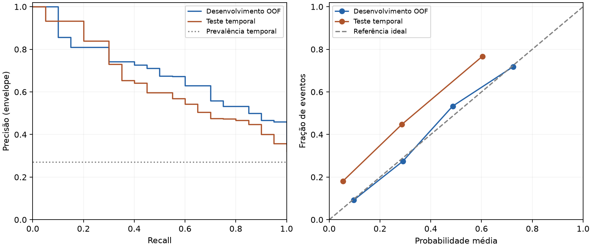

# Relatório de modelagem preditiva

Documento agregado gerado por `python src/modelagem.py`. O registro de abertura bloqueia novas seleções e avaliações. Uma execução posterior apenas verifica a integridade dos artefatos existentes.

## Desenho temporal

Desenvolvimento: 2022→2023, 189 transições e 60 eventos. Teste temporal reservado: 2023→2024, 311 transições e 84 eventos. São elegíveis estudantes sem defasagem na origem e fase de 0 a 7. Alvo 1 indica entrada em defasagem no destino; alvo 0 indica permanência sem defasagem. Desfechos desconhecidos não integram as matrizes supervisionadas. A auditoria de contagens anterior não foi usada para decidir algoritmo, transformações ou limiar.

## Pipeline e configurações

Preditores, na ordem exigida: `ida`, `ieg`, `iaa`, `ips`, `ipv`, `fase_origem`, `defasagem_origem`. A lista fechada exclui identificadores, alvo, campos futuros e administrativos. Os números são imputados por mediana dentro de cada fold; uma coluna totalmente ausente no treino bloqueia o ajuste. Somente a logística padroniza os números. Fase usa one-hot de domínio 0–7, sem categoria descartada; categoria desconhecida gera vetor zero. Nenhuma ausência é convertida em zero. Não há indicadores de ausência: os 189 registros de desenvolvimento estão completos.

Uma configuração por família, fixada antes do teste: Dummy de prevalência; logística regularizada com C=1; árvore com profundidade 3 e mínimo de 15 por folha; floresta com 200 árvores, profundidade 3, mínimo de 10 por folha e max_features=sqrt. A regularização e as folhas mínimas limitam a complexidade em apenas 60 eventos. Não houve busca ampla, balanceamento artificial, ajuste de calibração ou seleção adicional de preditores. Semente: 42.

## Validação interna e seleção

Cinco folds estratificados, com embaralhamento e semente 42, compartilhados pelos quatro modelos. Cada observação recebe uma probabilidade de um ajuste que não a utilizou; todas as transformações pertencem ao pipeline. A tabela usa o limiar próprio de cada candidato, selecionado nas respectivas probabilidades OOF pelo mesmo critério.

| População | n | Eventos | AP | ROC-AUC | Precisão | Recall | F1 | Brier | Sinalizados |
| --- | --- | --- | --- | --- | --- | --- | --- | --- | --- |
| dummy | 189 | 60 | 0.3161 | 0.4969 | 0.3175 | 1.0000 | 0.4819 | 0.2167 | 189 |
| logistica | 189 | 60 | 0.6649 | 0.8142 | 0.5326 | 0.8167 | 0.6447 | 0.1604 | 92 |
| arvore | 189 | 60 | 0.5029 | 0.7290 | 0.4455 | 0.8167 | 0.5765 | 0.1949 | 110 |
| floresta | 189 | 60 | 0.5747 | 0.7665 | 0.4848 | 0.8000 | 0.6038 | 0.1859 | 99 |

| Modelo | Limiar OOF | AP por fold: média ± DP | Brier por fold: média ± DP |
| --- | --- | --- | --- |
| dummy | 0.3158 | 0.3175 ± 0.0038 | 0.2167 ± 0.0014 |
| logistica | 0.2670 | 0.6874 ± 0.0224 | 0.1604 ± 0.0100 |
| arvore | 0.2222 | 0.5027 ± 0.0858 | 0.1949 ± 0.0264 |
| floresta | 0.3070 | 0.5953 ± 0.0402 | 0.1859 ± 0.0053 |

Regra anterior ao teste: Maior AP OOF; empate exato: menor DP de AP nos folds, menor Brier OOF, ordem logistica/arvore/floresta/dummy.

Modelo selecionado: **logistica**. AP OOF 0.6649, contra 0.3161 do Dummy; DP da AP entre folds 0.0224 e Brier OOF 0.1604. A logística é a candidata interpretável de referência, mas a escolha segue o resultado calculado. A estabilidade e a calibração são descritas e entram nos desempates; não se declara superioridade estatística com cinco folds. As configurações completas estão no congelamento.

As médias e desvios de todas as seis métricas, além das matrizes por fold, estão em `metricas_modelagem.json`. AP OOF agregada não é a média das AP dos folds. O Dummy pode apresentar AP OOF diferente da prevalência, pois as prevalências de treino variam ligeiramente entre folds. Métricas de classificação por fold usam o limiar escolhido no OOF completo: sua dispersão é descritiva. A seleção de modelo e limiar reutiliza o OOF; portanto essas métricas internas têm otimismo de seleção e não substituem o teste temporal.

## Limiar e congelamento

p >= limiar; recall >= 0.80; maior precisao; empate: maior recall, depois maior limiar.

Limiar: **0.266966793757**. OOF: precisão 0.5326, recall 0.8167, F1 0.6447; 92 classificados como risco. Matriz [[VN, FP], [FN, VP]]: `[[86, 43], [11, 49]]`.

Configuração gravada antes do ajuste completo e da leitura do teste em `2026-09-18T14:50:56.482500+00:00`. SHA-256 canônico: `85e1e2cd77fa3555f50553078e7dccb72e03152a4c9bb41e293811e99ac87444`. `artifacts/configuracao_congelada.json` contém preditores, pré-processamento, algoritmos e hiperparâmetros, validação, escolha, sensibilidade, métricas OOF, limiares, sementes, versões e hashes das coortes e do código. `artifacts/avaliacao_temporal.json` registra a abertura posterior e os hashes das saídas. Configuração e fontes divergentes causam falha explícita.

## Avaliação temporal única

| População | n | Eventos | AP | ROC-AUC | Precisão | Recall | F1 | Brier | Sinalizados |
| --- | --- | --- | --- | --- | --- | --- | --- | --- | --- |
| Desenvolvimento OOF | 189 | 60 | 0.6649 | 0.8142 | 0.5326 | 0.8167 | 0.6447 | 0.1604 | 92 |
| Teste temporal | 311 | 84 | 0.6211 | 0.8044 | 0.6415 | 0.4048 | 0.4964 | 0.1735 | 53 |

Prevalência no teste: 27.01%; proporção classificada como risco: 17.04%. Matriz [[VN, FP], [FN, VP]]: `[[208, 19], [50, 34]]`. A meta de recall é uma regra de escolha no desenvolvimento, não uma garantia no próximo ano. O resultado temporal não altera o pipeline ou o limiar.

| Métrica | Teste menos OOF | IC 95% no teste | Reamostragens válidas / inválidas |
| --- | --- | --- | --- |
| average_precision | -0.0438 | 0.5194 a 0.7250 | 2000 / 0 |
| roc_auc | -0.0098 | 0.7511 a 0.8536 | 2000 / 0 |
| precisao | 0.1089 | 0.5094 a 0.7675 | 2000 / 0 |
| recall | -0.4119 | 0.3021 a 0.5122 | 2000 / 0 |
| f1 | -0.1484 | 0.3881 a 0.5974 | 2000 / 0 |
| brier | 0.0131 | 0.1409 a 0.2088 | 2000 / 0 |

Bootstrap percentil de 2.000 reamostragens, semente 42, 95%, por transição/aluno do teste, sem estratificação. Pipeline e limiar ficam fixos. Amostras sem duas classes não estimam ROC-AUC; sem eventos não estimam AP/recall; sem sinalizados não estimam precisão. O descarte é por métrica, contado explicitamente. Os intervalos condicionam ao modelo treinado e não incluem incerteza do treino/seleção ou correlação institucional.

## Precisão-recall e calibração

A curva PR publicada usa envelope de precisão em 21 pontos fixos de recall, sem limiares ou probabilidades individuais. A AP oficial é calculada diretamente nas probabilidades, sem integrar esse envelope. Calibração utiliza até cinco faixas uniformes, fundindo adjacentes até ao menos 20 observações; sobra é fundida à última. São diagnósticos descritivos; não se recalibra usando o teste.

| População | n na faixa | Probabilidade média | Fração de eventos |
| --- | --- | --- | --- |
| oof | 76 | 0.0965 | 0.0921 |
| oof | 51 | 0.2900 | 0.2745 |
| oof | 30 | 0.4865 | 0.5333 |
| oof | 32 | 0.7249 | 0.7188 |
| temporal | 243 | 0.0539 | 0.1811 |
| temporal | 38 | 0.2860 | 0.4474 |
| temporal | 30 | 0.6030 | 0.7667 |

## Robustez e cobertura

Os recortes a seguir reutilizam o mesmo modelo avaliado e limiar; não há reajuste nos subgrupos.

| População | n | Eventos | AP | ROC-AUC | Precisão | Recall | F1 | Brier | Sinalizados |
| --- | --- | --- | --- | --- | --- | --- | --- | --- | --- |
| completo | 311 | 84 | 0.6211 | 0.8044 | 0.6415 | 0.4048 | 0.4964 | 0.1735 | 53 |
| casos_completos | 300 | 84 | 0.6230 | 0.7971 | 0.6415 | 0.4048 | 0.4964 | 0.1798 | 53 |
| sem_repetidos | 207 | 76 | 0.7194 | 0.8007 | 0.7317 | 0.3947 | 0.5128 | 0.2251 | 41 |
| repetidos | 104 | 8 | 0.2907 | 0.7513 | 0.3333 | 0.5000 | 0.4000 | 0.0710 | 12 |

O desenvolvimento tem 189 casos completos; sua análise coincide com o OOF principal. A comparação de casos completos no teste muda a amostra, não demonstra isoladamente o efeito da imputação.

| Grupo | Métrica | IC 95% | Válidas / inválidas |
| --- | --- | --- | --- |
| casos_completos | average_precision | 0.5209 a 0.7264 | 2000 / 0 |
| casos_completos | roc_auc | 0.7412 a 0.8480 | 2000 / 0 |
| casos_completos | precisao | 0.5094 a 0.7675 | 2000 / 0 |
| casos_completos | recall | 0.3021 a 0.5122 | 2000 / 0 |
| casos_completos | f1 | 0.3881 a 0.5974 | 2000 / 0 |
| casos_completos | brier | 0.1462 a 0.2155 | 2000 / 0 |
| sem_repetidos | average_precision | 0.6234 a 0.8103 | 2000 / 0 |
| sem_repetidos | roc_auc | 0.7413 a 0.8605 | 2000 / 0 |
| sem_repetidos | precisao | 0.5897 a 0.8710 | 2000 / 0 |
| sem_repetidos | recall | 0.2857 a 0.5068 | 2000 / 0 |
| sem_repetidos | f1 | 0.3999 a 0.6218 | 2000 / 0 |
| sem_repetidos | brier | 0.1802 a 0.2704 | 2000 / 0 |
| repetidos | average_precision | 0.1006 a 0.6993 | 1998 / 2 |
| repetidos | roc_auc | 0.5463 a 0.9279 | 1998 / 2 |
| repetidos | precisao | 0.0833 a 0.6250 | 2000 / 0 |
| repetidos | recall | 0.1429 a 0.8585 | 1998 / 2 |
| repetidos | f1 | 0.1111 a 0.6667 | 2000 / 0 |
| repetidos | brier | 0.0359 a 0.1139 | 2000 / 0 |
| diferenca_sem_repetidos_menos_completo | average_precision | 0.0376 a 0.1608 | 2000 / 0 |
| diferenca_sem_repetidos_menos_completo | roc_auc | -0.0376 a 0.0313 | 2000 / 0 |
| diferenca_sem_repetidos_menos_completo | precisao | 0.0150 a 0.1777 | 2000 / 0 |
| diferenca_sem_repetidos_menos_completo | recall | -0.0494 a 0.0237 | 2000 / 0 |
| diferenca_sem_repetidos_menos_completo | f1 | -0.0280 a 0.0563 | 2000 / 0 |
| diferenca_sem_repetidos_menos_completo | brier | 0.0312 a 0.0722 | 2000 / 0 |

104 pessoas do teste participaram do desenvolvimento e 207 não participaram. A diferença sem repetidos menos teste completo usa reamostragem pareada do teste e reaplicação da máscara em cada amostra. Não é um teste independente de diferença entre populações; há composição e sobreposição entre recortes.

| Métrica | Sem repetidos menos completo |
| --- | --- |
| average_precision | 0.0983 |
| roc_auc | -0.0037 |
| precisao | 0.0902 |
| recall | -0.0100 |
| f1 | 0.0165 |
| brier | 0.0515 |

### Sensibilidade sem defasagem de origem

Definida pelo contrato e ajustada antes da abertura do teste. Usa o mesmo algoritmo/hiperparâmetros vencedor, remove defasagem apenas no ColumnTransformer e escolhe seu próprio limiar com OOF de desenvolvimento. Não participa da escolha do vencedor e não substitui o modelo principal.

| População | n | Eventos | AP | ROC-AUC | Precisão | Recall | F1 | Brier | Sinalizados |
| --- | --- | --- | --- | --- | --- | --- | --- | --- | --- |
| Sem defasagem OOF | 189 | 60 | 0.6295 | 0.7996 | 0.5161 | 0.8000 | 0.6275 | 0.1671 | 93 |
| Sem defasagem temporal | 311 | 84 | 0.6109 | 0.7939 | 0.6275 | 0.3810 | 0.4741 | 0.1753 | 51 |

Limiar da sensibilidade: 0.267512785912.

### Perda de acompanhamento

88 elegíveis de 2023 não foram encontrados em 2024; nenhum alvo foi atribuído. Encontrados sem defasagem futura válida: 0. Comparam-se perfis de origem, sem estimar desempenho nos ausentes.

| Grupo | Preditor | Disponíveis | Ausentes | Média | Mediana |
| --- | --- | --- | --- | --- | --- |
| Sem destino | ida | 88 | 0 | 6.6807 | 7.0000 |
| Sem destino | ieg | 88 | 0 | 8.3307 | 8.4000 |
| Sem destino | iaa | 88 | 0 | 6.6102 | 8.3000 |
| Sem destino | ips | 87 | 1 | 5.3469 | 5.0000 |
| Sem destino | ipv | 88 | 0 | 7.9129 | 8.0450 |
| Sem destino | defasagem_origem | 88 | 0 | 0.0795 | 0.0000 |
| Encontrados | ida | 300 | 11 | 6.9897 | 7.0500 |
| Encontrados | ieg | 300 | 11 | 9.0750 | 9.3000 |
| Encontrados | iaa | 311 | 0 | 7.1730 | 8.5000 |
| Encontrados | ips | 311 | 0 | 4.9268 | 5.0000 |
| Encontrados | ipv | 300 | 11 | 8.2577 | 8.2892 |
| Encontrados | defasagem_origem | 311 | 0 | 0.1222 | 0.0000 |

| Grupo | Fase de origem (células <10 suprimidas) |
| --- | --- |
| sem_destino | {'0': 33, '3': 18, '2': 11, '4': '<10', '1': '<10', '5': '<10', '6': '<10', '7': '<10'} |
| encontrados | {'0': 81, '2': 65, '3': 51, '4': 40, '1': 33, '5': 20, '7': 15, '6': '<10'} |

### Mudança de distribuição

Diferença padronizada = (média teste − média desenvolvimento) / raiz da média das duas variâncias. Usa somente valores observados. Não é teste causal nem critério de nova seleção.

| Preditor | Média desenvolvimento | Média teste | Diferença padronizada | Ausentes desenvolvimento / teste |
| --- | --- | --- | --- | --- |
| ida | 6.7841 | 6.9897 | 0.1379 | 0 / 11 |
| ieg | 8.5460 | 9.0750 | 0.5182 | 0 / 11 |
| iaa | 8.5656 | 7.1730 | -0.5164 | 0 / 0 |
| ips | 6.9487 | 4.9268 | -1.1870 | 0 / 0 |
| ipv | 7.5964 | 8.2577 | 0.7628 | 0 / 11 |
| defasagem_origem | 0.0741 | 0.1222 | 0.1387 | 0 / 0 |

| População | Fases (células <10 suprimidas) |
| --- | --- |
| desenvolvimento | {'0': 54, '3': 47, '2': 30, '1': 21, '4': 17, '5': 15, '7': '<10', '6': '<10'} |
| teste | {'0': 81, '2': 65, '3': 51, '4': 40, '1': 33, '5': 20, '7': 15, '6': '<10'} |

### Equidade descritiva

As coortes aprovadas nao incluem genero, nem nos metadados. Nao se incorpora outra base. Inconsistencias cadastrais ja documentadas limitariam a interpretacao.

Fase é avaliada na origem, com limiar fixo. Exigem-se pelo menos 30 observações e 5 eventos e 5 não eventos por grupo. Outros grupos têm métricas e denominadores detalhados suprimidos. Comparações não demonstram equidade causal.

| População | n | Eventos | AP | ROC-AUC | Precisão | Recall | F1 | Brier | Sinalizados |
| --- | --- | --- | --- | --- | --- | --- | --- | --- | --- |
| Fase 0 | 81 | 53 | 0.8462 | 0.7702 | 0.8462 | 0.4151 | 0.5570 | 0.3870 | 26 |
| Fase 1 | 33 | 16 | 0.7570 | 0.7206 | 0.5882 | 0.6250 | 0.6061 | 0.2491 | 17 |
| Fase 3 | 51 | 6 | 0.1455 | 0.5667 | não estimável | 0.0000 | 0.0000 | 0.1124 | 0 |

| Fase | Estado |
| --- | --- |
| 0 | estimado |
| 1 | estimado |
| 2 | suprimido: n < 30 ou menos de 5 eventos/nao eventos |
| 3 | estimado |
| 4 | suprimido: n < 30 ou menos de 5 eventos/nao eventos |
| 5 | suprimido: n < 30 ou menos de 5 eventos/nao eventos |
| 6 | suprimido: n < 30 ou menos de 5 eventos/nao eventos |
| 7 | suprimido: n < 30 ou menos de 5 eventos/nao eventos |

| Fase | n na faixa | Probabilidade média | Fração de eventos |
| --- | --- | --- | --- |
| 0 | 52 | 0.0755 | 0.5385 |
| 0 | 29 | 0.5170 | 0.8621 |
| 1 | 33 | 0.2839 | 0.4848 |
| 3 | 51 | 0.0521 | 0.1176 |

### Falsos positivos e falsos negativos

Perfis agregados dos erros no teste. Células de fase com menos de 10 são suprimidas. Falsos positivos não significam necessidade pedagógica inexistente; o alvo cobre apenas a entrada em defasagem observada.

| Grupo | Preditor | Disponíveis | Ausentes | Média | Mediana |
| --- | --- | --- | --- | --- | --- |
| falsos_positivos | ida | 19 | 0 | 6.9579 | 7.3000 |
| falsos_positivos | ieg | 19 | 0 | 8.7105 | 8.8000 |
| falsos_positivos | iaa | 19 | 0 | 5.7842 | 8.5000 |
| falsos_positivos | ips | 19 | 0 | 7.1889 | 7.5200 |
| falsos_positivos | ipv | 19 | 0 | 7.7286 | 7.7833 |
| falsos_positivos | defasagem_origem | 19 | 0 | 0.0000 | 0.0000 |
| falsos_negativos | ida | 50 | 0 | 6.8240 | 6.7000 |
| falsos_negativos | ieg | 50 | 0 | 8.9120 | 9.0500 |
| falsos_negativos | iaa | 50 | 0 | 7.0900 | 9.0000 |
| falsos_negativos | ips | 50 | 0 | 4.8674 | 3.7700 |
| falsos_negativos | ipv | 50 | 0 | 8.3329 | 8.3388 |
| falsos_negativos | defasagem_origem | 50 | 0 | 0.0200 | 0.0000 |

## Interpretabilidade

Numericos por um desvio padrao do desenvolvimento; fase one-hot sem referencia descartada, contrastes entre fases sao diferencas entre coeficientes. Associacoes condicionais, nao causais.

| Atributo transformado | coeficientes_log_odds |
| --- | --- |
| fase__fase_origem_3 | -1.1449 |
| numericos__ipv | -1.1333 |
| fase__fase_origem_1 | 1.0620 |
| numericos__defasagem_origem | -0.9485 |
| fase__fase_origem_0 | 0.6882 |
| fase__fase_origem_7 | -0.5959 |
| numericos__ips | 0.4740 |
| fase__fase_origem_6 | -0.4280 |
| numericos__ieg | 0.4051 |
| fase__fase_origem_2 | 0.2712 |
| numericos__ida | -0.2439 |
| fase__fase_origem_5 | 0.1856 |
| fase__fase_origem_4 | -0.0401 |
| numericos__iaa | -0.0225 |

As primeiras linhas têm maior magnitude absoluta no ajuste completo de desenvolvimento. Coeficientes positivos elevam o escore condicional e negativos o reduzem; para árvores, importâncias não fornecem direção. Correlação entre indicadores e a amostra pequena tornam magnitudes e rankings instáveis. Valores de fases pouco observadas não sustentam conclusões específicas.

## Limitações e modelo operacional futuro

Amostra de desenvolvimento pequena (60 eventos), um único corte temporal, perdas de acompanhamento, ausências que surgem apenas no teste, alunos repetidos e possíveis mudanças curriculares limitam generalização. A ausência de gênero nas coortes impede essa auditoria de equidade. Fases 8/9 e registros fora da elegibilidade não são cobertos. AP depende de prevalência e composição; probabilidades não representam diagnóstico. OOF pós-seleção é otimista e os intervalos bootstrap não capturam toda a incerteza. Nenhum resultado estabelece causalidade ou substitui avaliação pedagógica.

`artifacts/modelo_avaliado.joblib` foi ajustado exclusivamente em 2022→2023. O modelo operacional com as duas transições não foi criado. Se for retreinado futuramente, deverá ter identificação própria e manter separadas as métricas oficiais deste modelo avaliado. Aplicação, notebook final e publicação são etapas posteriores.

Referências técnicas: [imputação em pipelines](https://scikit-learn.org/stable/modules/impute.html) e [métricas de classificação](https://scikit-learn.org/stable/modules/model_evaluation.html).
